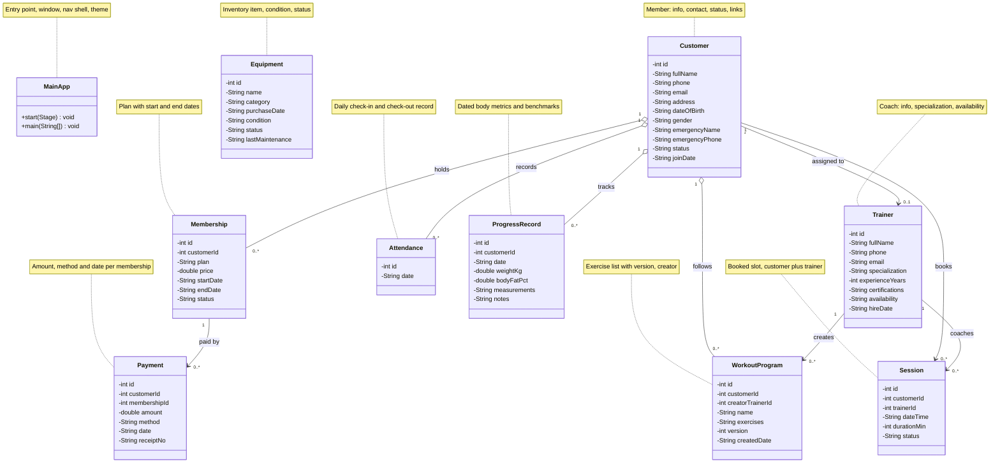
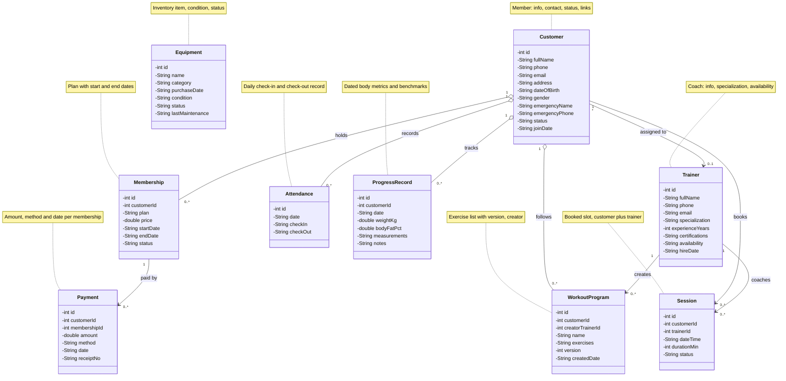

# UML — Gym Management System (JavaFX) — Official submission diagram

> Main diagram first, detailed per-layer zoom-ins below. Planned classes included —
> code follows this design. `m3fx` is an external library dependency, not project code.
> Notation: `-` private, `+` public, `o--` shared aggregation, `..>` dependency,
> `..|>` realization. Every class carries its description inside the diagram.

## Class descriptions

### Entities

| Class | Description |
|---|---|
| `Customer` | Gym member; fields: id, fullName, phone, email, address, dateOfBirth, gender, emergencyName, emergencyPhone, status, joinDate; links to membership, trainer, program |
| `Trainer` | Coach; fields: id, fullName, phone, email, specialization, experienceYears, certifications, availability, hireDate |
| `Membership` | Plan; fields: id, customerId, plan, price, startDate, endDate, status (active, frozen, expired) |
| `WorkoutProgram` | Exercise list; fields: id, customerId, creatorTrainerId, name, exercises, version, createdDate |
| `Session` | Training slot; fields: id, customerId, trainerId, dateTime, durationMin, status |
| `Equipment` | Inventory item; fields: id, name, category, purchaseDate, condition, status, lastMaintenance |
| `Attendance` | One check-in/out record per customer per day |
| `Payment` | fields: id, customerId, membershipId, amount, method, date, receiptNo; linked to a membership |
| `ProgressRecord` | fields: id, customerId, date, weightKg, bodyFatPct, measurements, notes |

### Data access

| Class | Description |
|---|---|
| `DbConnection` | SQLite connection factory; creates `gym.db` and initializes the schema |
| `DaoException` | Unchecked wrapper for `SQLException`; translated to friendly messages upstream |
| `CustomerDao` / `CustomerDaoImpl` | Persist, load and search customers |
| `TrainerDao` / `TrainerDaoImpl` | Persist and load trainers |
| `MembershipDao` / `MembershipDaoImpl` | Persist memberships; query expiring ones for reminders |
| `WorkoutProgramDao` / `WorkoutProgramDaoImpl` | Persist programs; list per customer |
| `SessionDao` / `SessionDaoImpl` | Persist sessions; query by trainer and by day |
| `EquipmentDao` / `EquipmentDaoImpl` | Persist and list equipment |
| `AttendanceDao` / `AttendanceDaoImpl` | Persist check-ins; daily attendance lists |
| `PaymentDao` / `PaymentDaoImpl` | Persist payments; revenue sums over date ranges |
| `ProgressDao` / `ProgressDaoImpl` | Persist metric records; history per customer |

### Services (validation + business rules, no JavaFX, no SQL)

| Class | Description |
|---|---|
| `CustomerService` | Customer validation, search/filter, status rules |
| `TrainerService` | Availability rules, assign/reassign customers |
| `MembershipService` | Sell, renew, freeze, cancel, expiry reminders |
| `WorkoutService` | Program building rules, per-customer versioning |
| `SchedulingService` | Booking plus trainer conflict detection |
| `EquipmentService` | Status transitions and maintenance-log rules |
| `PaymentService` | Balances, receipt data, revenue summary |
| `AttendanceService` | Check-in/out rules, daily report data |
| `ProgressService` | Metric aggregation for charts |

### UI (each controller backed by a matching FXML file)

| Class | Description |
|---|---|
| `MainApp` | Entry point: builds the window, nav shell, theme and overlay layer |
| `DashboardController` | Main dashboard: active members, today's sessions, revenue snapshot |
| `CustomerListController` | Searchable/filterable customer list |
| `CustomerProfileController` | Full profile: info, membership, trainer, program, schedule, progress |
| `TrainerListController` | Trainer roster with availability |
| `TrainerProfileController` | Trainer details, assigned customers, schedule |
| `MembershipController` | Plans; sell, renew, freeze, cancel |
| `WorkoutController` | Program builder and assignment to customers |
| `ScheduleController` | Agenda views and session booking with conflict checks |
| `EquipmentController` | Inventory list, status changes, maintenance log |
| `AttendanceController` | Check-in/out screen and daily report |
| `PaymentController` | Payment recording, receipts, balances |
| `ProgressController` | Body-metric charts per customer |

### Utilities

| Class | Description |
|---|---|
| `Validators` | Phone/email/number/date validation used by services |
| `DateUtils` | Membership periods, session slot math, date formatting |
| `FxUtils` | Friendly dialogs, alerts, scene switching, snackbar helper |
| `ChartUtils` | Progress-chart dataset builders |

---

## Detailed views (per-layer zoom-ins of the diagram above)

### A. Layered architecture

Layer rules: controllers never contain SQL; services and DAOs never import JavaFX.

### B. Domain model zoom-in

### C. DAO layer zoom-in

```mermaid
classDiagram
    direction TB
    class DbConnection {
        +getConnection() Connection
    }
    class DaoException {
        +DaoException(String, Throwable)
    }
    class CustomerDao {
        <<interface>>
        +save(Customer) int
        +findById(int) Customer
        +search(String) List~Customer~
    }
    class CustomerDaoImpl {
        +save(Customer) int
        +findById(int) Customer
        +search(String) List~Customer~
    }
    class TrainerDao {
        <<interface>>
        +save(Trainer) int
        +findById(int) Trainer
        +findAll() List~Trainer~
    }
    class TrainerDaoImpl {
        +save(Trainer) int
        +findById(int) Trainer
        +findAll() List~Trainer~
    }
    class MembershipDao {
        <<interface>>
        +save(Membership) int
        +findExpiring(int) List~Membership~
    }
    class MembershipDaoImpl {
        +save(Membership) int
        +findExpiring(int) List~Membership~
    }
    class WorkoutProgramDao {
        <<interface>>
        +save(WorkoutProgram) int
    }
    class WorkoutProgramDaoImpl {
        +save(WorkoutProgram) int
    }
    class SessionDao {
        <<interface>>
        +save(Session) int
        +findByDay(String) List~Session~
    }
    class SessionDaoImpl {
        +save(Session) int
        +findByDay(String) List~Session~
    }
    class EquipmentDao {
        <<interface>>
        +save(Equipment) int
    }
    class EquipmentDaoImpl {
        +save(Equipment) int
    }
    class AttendanceDao {
        <<interface>>
        +save(Attendance) int
        +findByDay(String) List~Attendance~
    }
    class AttendanceDaoImpl {
        +save(Attendance) int
        +findByDay(String) List~Attendance~
    }
    class PaymentDao {
        <<interface>>
        +save(Payment) int
        +revenueBetween(String, String) double
    }
    class PaymentDaoImpl {
        +save(Payment) int
        +revenueBetween(String, String) double
    }
    class ProgressDao {
        <<interface>>
        +save(ProgressRecord) int
    }
    class ProgressDaoImpl {
        +save(ProgressRecord) int
    }
    CustomerDao <|.. CustomerDaoImpl : implements
    TrainerDao <|.. TrainerDaoImpl : implements
    MembershipDao <|.. MembershipDaoImpl : implements
    WorkoutProgramDao <|.. WorkoutProgramDaoImpl : implements
    SessionDao <|.. SessionDaoImpl : implements
    EquipmentDao <|.. EquipmentDaoImpl : implements
    AttendanceDao <|.. AttendanceDaoImpl : implements
    PaymentDao <|.. PaymentDaoImpl : implements
    ProgressDao <|.. ProgressDaoImpl : implements
    CustomerDaoImpl ..> DbConnection : uses
    TrainerDaoImpl ..> DbConnection : uses
    MembershipDaoImpl ..> DbConnection : uses
    WorkoutProgramDaoImpl ..> DbConnection : uses
    SessionDaoImpl ..> DbConnection : uses
    EquipmentDaoImpl ..> DbConnection : uses
    AttendanceDaoImpl ..> DbConnection : uses
    PaymentDaoImpl ..> DbConnection : uses
    ProgressDaoImpl ..> DbConnection : uses
    note for DbConnection "SQLite factory, creates gym.db, schema"
    note for DaoException "Unchecked SQLException wrapper"
    note for CustomerDao "Contract to save, find, search customers"
    note for CustomerDaoImpl "SQLite implementation, customers"
    note for TrainerDao "Contract to save, find trainers"
    note for TrainerDaoImpl "SQLite implementation, trainers"
    note for MembershipDao "Contract, expiring memberships query"
    note for MembershipDaoImpl "SQLite implementation, memberships"
    note for WorkoutProgramDao "Contract, programs per customer"
    note for WorkoutProgramDaoImpl "SQLite implementation, programs"
    note for SessionDao "Contract, sessions by trainer, day"
    note for SessionDaoImpl "SQLite implementation, sessions"
    note for EquipmentDao "Contract to save, list equipment"
    note for EquipmentDaoImpl "SQLite implementation, equipment"
    note for AttendanceDao "Contract, daily attendance lists"
    note for AttendanceDaoImpl "SQLite implementation, attendance"
    note for PaymentDao "Contract, revenue over date ranges"
    note for PaymentDaoImpl "SQLite implementation, payments"
    note for ProgressDao "Contract, history per customer"
    note for ProgressDaoImpl "SQLite implementation, progress"
```

### D. Service layer zoom-in

```mermaid
classDiagram
    direction TB
    class CustomerService {
        +validate(Customer) List~String~
        +search(String) List~Customer~
    }
    class TrainerService {
        +checkAvailability(int, String) Boolean
        +assignCustomer(int, int) void
    }
    class MembershipService {
        +sell(int, String) Membership
        +renew(int) void
        +freeze(int) void
        +cancel(int) void
        +expiryReminders() List~Membership~
    }
    class WorkoutService {
        +buildProgram(int, String) WorkoutProgram
        +newVersion(int) WorkoutProgram
    }
    class SchedulingService {
        +book(int, int, String) Session
        +detectConflicts(int, String) List~Session~
    }
    class EquipmentService {
        +changeStatus(int, String) void
        +logMaintenance(int, String) void
    }
    class AttendanceService {
        +checkIn(int) Attendance
        +checkOut(int) void
        +dailyReport(String) List~Attendance~
    }
    class PaymentService {
        +record(Payment) int
        +balance(int) double
        +revenueSummary() String
    }
    class ProgressService {
        +aggregate(int) List~ProgressRecord~
    }
    note for CustomerService "Validation, search, status rules"
    note for TrainerService "Availability, assign customers"
    note for MembershipService "Sell, renew, freeze, cancel, reminders"
    note for WorkoutService "Build programs, versioning"
    note for SchedulingService "Booking, conflict detection"
    note for EquipmentService "Status changes, maintenance log"
    note for AttendanceService "Check-in and out, daily report"
    note for PaymentService "Record, balances, revenue summary"
    note for ProgressService "Metric aggregation for charts"
```

### E. Controllers zoom-in

```mermaid
classDiagram
    direction TB
    class MainApp {
        +start(Stage) void
        +main(String[]) void
    }
    class DashboardController {
        +initialize() void
    }
    class CustomerListController {
        +onSearch() void
    }
    class CustomerProfileController {
        +onSave() void
    }
    class TrainerListController {
        +initialize() void
    }
    class TrainerProfileController {
        +onSave() void
    }
    class MembershipController {
        +onSell() void
        +onRenew() void
    }
    class WorkoutController {
        +onBuild() void
    }
    class ScheduleController {
        +onBook() void
    }
    class EquipmentController {
        +onStatusChange() void
    }
    class AttendanceController {
        +onCheckIn() void
    }
    class PaymentController {
        +onRecord() void
    }
    class ProgressController {
        +showProgress(int) void
    }
    MainApp ..> DashboardController : opens
    CustomerListController ..> CustomerProfileController : opens
    TrainerListController ..> TrainerProfileController : opens
    note for MainApp "Entry point, window, nav shell, theme"
    note for DashboardController "Members, sessions, revenue snapshot"
    note for CustomerListController "Searchable customer list"
    note for CustomerProfileController "Full member profile screen"
    note for TrainerListController "Trainer roster, availability"
    note for TrainerProfileController "Trainer details and customers"
    note for MembershipController "Plans, sell, renew, freeze"
    note for WorkoutController "Program builder, assignment"
    note for ScheduleController "Agenda, booking with conflicts"
    note for EquipmentController "Inventory, status, maintenance"
    note for AttendanceController "Check-in screen, daily report"
    note for PaymentController "Record payments, receipts"
    note for ProgressController "Body-metric charts screen"
```

