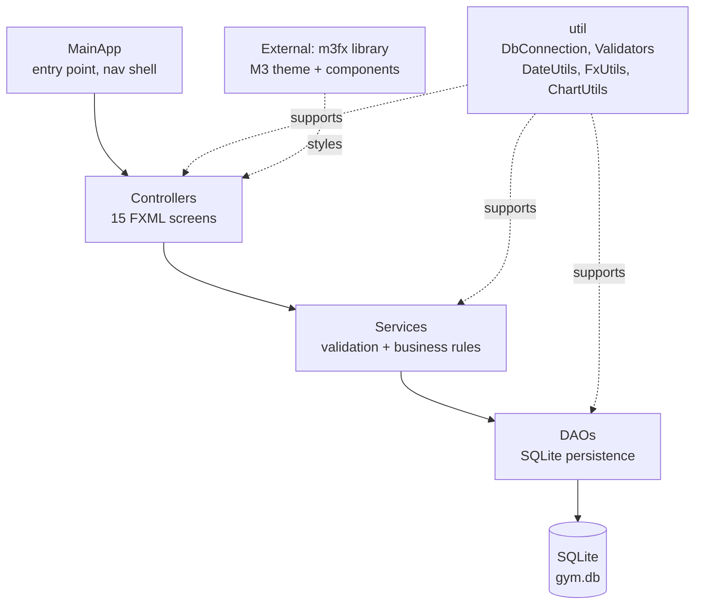

# UML — Gym Management System (JavaFX) — Official submission diagram

> Main diagram first, detailed per-layer zoom-ins below. Planned classes included —
> code follows this design. `m3fx` is an external library dependency, not project code.
> Notation: `-` private, `+` public, `#` protected, `o--` shared aggregation, `..>` dependency,
> `..|>` realization. Every class carries its description inside the diagram.
> Entity getters and setters are omitted to keep the diagram small — every data member
> marked «get/set» has a public getter and setter. Constructors, toString, equals, and
> hashCode are shown.

```mermaid
classDiagram
    direction TB
    class MainApp {
        +start(Stage) void
        +main(String[]) void
    }
    class Customer {
        -int id «get/set»
        -String fullName «get/set»
        -String phone «get/set»
        -String email «get/set»
        -String address «get/set»
        -String dateOfBirth «get/set»
        -String gender «get/set»
        -String emergencyName «get/set»
        -String emergencyPhone «get/set»
        -CustomerStatus status «get/set»
        -String joinDate «get/set»
        -Integer trainerId «get/set»
        +Customer()
        +Customer(int, String, String, String, String, String, String, String, String, CustomerStatus, String, Integer)
        +toString() String
        +equals(Object) boolean
        +hashCode() int
    }
    class Trainer {
        -int id «get/set»
        -String fullName «get/set»
        -String phone «get/set»
        -String email «get/set»
        -String specialization «get/set»
        -int experienceYears «get/set»
        -String certifications «get/set»
        -String hireDate «get/set»
        -double defaultRate «get/set»
        +Trainer()
        +Trainer(int, String, String, String, String, int, String, String, double)
        +toString() String
        +equals(Object) boolean
        +hashCode() int
    }
    class Membership {
        -int id «get/set»
        -int customerId «get/set»
        -PlanType plan «get/set»
        -double price «get/set»
        -String startDate «get/set»
        -String endDate «get/set»
        -MembershipStatus status «get/set»
        +Membership()
        +Membership(int, int, PlanType, double, String, String, MembershipStatus)
        +toString() String
        +equals(Object) boolean
        +hashCode() int
    }
    class WorkoutProgram {
        -int id «get/set»
        -int customerId «get/set»
        -int creatorTrainerId «get/set»
        -String name «get/set»
        -String exercises «get/set»
        -int version «get/set»
        -String createdDate «get/set»
        +WorkoutProgram()
        +WorkoutProgram(int, int, int, String, String, int, String)
        +toString() String
        +equals(Object) boolean
        +hashCode() int
    }
    class Session {
        -int id «get/set»
        -int customerId «get/set»
        -int trainerId «get/set»
        -String dateTime «get/set»
        -int durationMin «get/set»
        -SessionStatus status «get/set»
        -Integer subscriptionId «get/set»
        -double price «get/set»
        -String cancelReason «get/set»
        -String sessionNotes «get/set»
        +Session()
        +Session(int, int, int, String, int, SessionStatus, Integer, double, String, String)
        +toString() String
        +equals(Object) boolean
        +hashCode() int
    }
    class Equipment {
        -int id «get/set»
        -String name «get/set»
        -String category «get/set»
        -String purchaseDate «get/set»
        -EquipmentCondition condition «get/set»
        -EquipmentStatus status «get/set»
        -String lastMaintenance «get/set»
        +Equipment()
        +Equipment(int, String, String, String, EquipmentCondition, EquipmentStatus, String)
        +toString() String
        +equals(Object) boolean
        +hashCode() int
    }
    class Attendance {
        -int id «get/set»
        -int customerId «get/set»
        -String date «get/set»
        -String checkIn «get/set»
        -String checkOut «get/set»
        +Attendance()
        +Attendance(int, int, String, String, String)
        +toString() String
        +equals(Object) boolean
        +hashCode() int
    }
    class Payment {
        -int id «get/set»
        -int customerId «get/set»
        -Integer membershipId «get/set»
        -Integer subscriptionId «get/set»
        -Integer sessionId «get/set»
        -double amount «get/set»
        -PaymentMethod method «get/set»
        -String date «get/set»
        -String receiptNo «get/set»
        -boolean voided «get/set»
        +Payment()
        +Payment(int, int, Integer, Integer, Integer, double, PaymentMethod, String, String, boolean)
        +toString() String
        +equals(Object) boolean
        +hashCode() int
    }
    class ProgressRecord {
        -int id «get/set»
        -int customerId «get/set»
        -String date «get/set»
        -double weightKg «get/set»
        -double bodyFatPct «get/set»
        -String measurements «get/set»
        -String notes «get/set»
        +ProgressRecord()
        +ProgressRecord(int, int, String, double, double, String, String)
        +toString() String
        +equals(Object) boolean
        +hashCode() int
    }
    class MedicalProfile {
        -int id «get/set»
        -int customerId «get/set»
        -String bloodType «get/set»
        -String conditions «get/set»
        -String allergies «get/set»
        -String medications «get/set»
        -String injuries «get/set»
        -String doctorName «get/set»
        -String doctorPhone «get/set»
        -String notes «get/set»
        -String updatedDate «get/set»
        +MedicalProfile()
        +MedicalProfile(int, int, String, String, String, String, String, String, String, String, String)
        +toString() String
        +equals(Object) boolean
        +hashCode() int
    }
    class Administrator {
        -int id «get/set»
        -String fullName «get/set»
        -String username «get/set»
        -String passwordHash «get/set»
        -StaffRole role «get/set»
        -String phone «get/set»
        -String email «get/set»
        -Boolean active «get/set»
        -String createdDate «get/set»
        +Administrator()
        +Administrator(int, String, String, String, StaffRole, String, String, Boolean, String)
        +toString() String
        +equals(Object) boolean
        +hashCode() int
    }
    class TrainerSubscription {
        -int id «get/set»
        -int customerId «get/set»
        -int trainerId «get/set»
        -String startDate «get/set»
        -String endDate «get/set»
        -double rate «get/set»
        -SubscriptionStatus status «get/set»
        +TrainerSubscription()
        +TrainerSubscription(int, int, int, String, String, double, SubscriptionStatus)
        +toString() String
        +equals(Object) boolean
        +hashCode() int
    }
    class TrainerAvailability {
        -int id «get/set»
        -int trainerId «get/set»
        -String date «get/set»
        -String startTime «get/set»
        -String endTime «get/set»
        -int maxCustomers «get/set»
        -AvailabilityStatus status «get/set»
        +TrainerAvailability()
        +TrainerAvailability(int, int, String, String, String, int, AvailabilityStatus)
        +toString() String
        +equals(Object) boolean
        +hashCode() int
    }
    class CustomerStatus {
        <<enumeration>>
        ACTIVE
        INACTIVE
        SUSPENDED
        +values() CustomerStatus[]
        +valueOf(String) CustomerStatus
    }
    class MembershipStatus {
        <<enumeration>>
        ACTIVE
        FROZEN
        EXPIRED
        CANCELLED
        +values() MembershipStatus[]
        +valueOf(String) MembershipStatus
    }
    class PlanType {
        <<enumeration>>
        MONTHLY
        QUARTERLY
        YEARLY
        +values() PlanType[]
        +valueOf(String) PlanType
    }
    class SessionStatus {
        <<enumeration>>
        REQUESTED
        CONFIRMED
        COMPLETED
        CANCELLED
        +values() SessionStatus[]
        +valueOf(String) SessionStatus
    }
    class SubscriptionStatus {
        <<enumeration>>
        ACTIVE
        EXPIRED
        CANCELLED
        +values() SubscriptionStatus[]
        +valueOf(String) SubscriptionStatus
    }
    class AvailabilityStatus {
        <<enumeration>>
        OPEN
        FULL
        CLOSED
        +values() AvailabilityStatus[]
        +valueOf(String) AvailabilityStatus
    }
    class StaffRole {
        <<enumeration>>
        ADMIN
        MANAGER
        STAFF
        +values() StaffRole[]
        +valueOf(String) StaffRole
    }
    class PaymentMethod {
        <<enumeration>>
        CASH
        CARD
        TRANSFER
        +values() PaymentMethod[]
        +valueOf(String) PaymentMethod
    }
    class EquipmentStatus {
        <<enumeration>>
        AVAILABLE
        IN_MAINTENANCE
        RETIRED
        +values() EquipmentStatus[]
        +valueOf(String) EquipmentStatus
    }
    class EquipmentCondition {
        <<enumeration>>
        NEW
        GOOD
        FAIR
        POOR
        +values() EquipmentCondition[]
        +valueOf(String) EquipmentCondition
    }
    Customer "1" o-- "0..*" Membership : holds
    Customer "1" o-- "0..*" WorkoutProgram : follows
    Customer "1" o-- "0..*" Attendance : records
    Customer "1" o-- "0..*" ProgressRecord : tracks
    Customer "*" --> "0..1" Trainer : assigned to
    Customer "1" --> "0..*" Session : books
    Customer "1" *-- "1" MedicalProfile : has
    Customer "1" --> "0..*" TrainerSubscription : subscribes
    Customer "1" --> "0..*" Payment : makes
    Trainer --> MedicalProfile : views
    Trainer "1" --> "0..*" WorkoutProgram : creates
    Trainer "1" --> "0..*" Session : coaches
    Trainer "1" --> "0..*" TrainerSubscription : offers
    Trainer "1" --> "0..*" TrainerAvailability : publishes
    TrainerSubscription "1" o-- "0..*" Session : covers
    Payment "*" --> "0..1" Membership : pays for
    Payment "*" --> "0..1" TrainerSubscription : pays for
    Payment "*" --> "0..1" Session : pays for
    Administrator ..> Customer : manages
    Administrator ..> Trainer : manages
    Administrator ..> Payment : adjusts
    note for MainApp "Entry point, window, nav shell, theme"
    note for Customer "Member: info, contact, status, links"
    note for Trainer "Coach: info, specialization, availability"
    note for Membership "Plan with start and end dates"
    note for WorkoutProgram "Exercise list with version, creator"
    note for Session "Booked slot, customer plus trainer, with cancel reason and notes"
    note for TrainerSubscription "Period engagement at flat trainer rate"
    note for TrainerAvailability "Open days, caps, hourly slots"
    note for Equipment "Inventory item, condition, status"
    note for Attendance "Daily check-in and check-out record with customerId"
    note for Payment "Amount, method and date; at most one of membership, subscription, session; voided flag"
    note for ProgressRecord "Dated body metrics and benchmarks"
    note for MedicalProfile "Blood type, conditions, meds, doctor"
    note for Administrator "Login identity, role, active flag; manages all entities"
    note for CustomerStatus "Active, inactive, suspended"
    note for MembershipStatus "Active, frozen, expired, cancelled"
    note for PlanType "Monthly, quarterly, yearly"
    note for SessionStatus "Requested, confirmed, completed, cancelled"
    note for SubscriptionStatus "Active, expired, cancelled"
    note for AvailabilityStatus "Open, full, closed"
    note for StaffRole "Admin, manager, staff"
    note for PaymentMethod "Cash, card, transfer"
    note for EquipmentStatus "Available, maintenance, retired"
    note for EquipmentCondition "New, good, fair, poor"
```

## Class descriptions

### Entities

| Class | Description |
|---|---|
| `Customer` | Gym member; fields: id, fullName, phone, email, address, dateOfBirth, gender, emergencyName, emergencyPhone, status (enum), joinDate, trainerId (nullable, assigned trainer); links to membership, trainer, program |
| `Trainer` | Coach; fields: id, fullName, phone, email, specialization, experienceYears, certifications, hireDate, defaultRate; bookable slots live in TrainerAvailability |
| `Membership` | Plan; fields: id, customerId, plan (PlanType: monthly, quarterly, yearly), price, startDate, endDate, status (active, frozen, expired, cancelled) |
| `WorkoutProgram` | Exercise list; fields: id, customerId, creatorTrainerId, name, exercises, version, createdDate |
| `Session` | Training slot; fields: id, customerId, trainerId, dateTime, durationMin, status, subscriptionId (nullable), price, cancelReason, sessionNotes |
| `Equipment` | Inventory item; fields: id, name, category, purchaseDate, condition (enum), status (enum), lastMaintenance |
| `Attendance` | One check-in/out record per customer per day; fields: id, customerId, date, checkIn, checkOut |
| `Payment` | fields: id, customerId, membershipId (nullable), subscriptionId (nullable), sessionId (nullable), amount, method, date, receiptNo, voided; linked to at most one of membership, trainer subscription, session |
| `ProgressRecord` | fields: id, customerId, date, weightKg, bodyFatPct, measurements, notes |
| `MedicalProfile` | Blood type, conditions, allergies, medications, injuries, doctor, notes; one per customer |
| `Administrator` | Login identity with role (ADMIN/MANAGER/STAFF); manages all entities via overrides |
| `TrainerSubscription` | Period engagement at flat trainer-set rate; status uses SubscriptionStatus enum |
| `TrainerAvailability` | Open days, daily caps, hourly slots set by trainer; status uses AvailabilityStatus enum |

### Enumerations

| Enum | Literals |
|---|---|
| `CustomerStatus` | ACTIVE, INACTIVE, SUSPENDED |
| `MembershipStatus` | ACTIVE, FROZEN, EXPIRED, CANCELLED |
| `PlanType` | MONTHLY, QUARTERLY, YEARLY |
| `SessionStatus` | REQUESTED, CONFIRMED, COMPLETED, CANCELLED |
| `SubscriptionStatus` | ACTIVE, EXPIRED, CANCELLED |
| `AvailabilityStatus` | OPEN, FULL, CLOSED |
| `StaffRole` | ADMIN, MANAGER, STAFF |
| `PaymentMethod` | CASH, CARD, TRANSFER |
| `EquipmentStatus` | AVAILABLE, IN_MAINTENANCE, RETIRED |
| `EquipmentCondition` | NEW, GOOD, FAIR, POOR |

### Data access

| Class | Description |
|---|---|
| `DbConnection` | SQLite connection factory; creates `gym.db` and initializes the schema |
| `DaoException` | Unchecked wrapper for `SQLException`; translated to friendly messages upstream |
| `CustomerDao` / `CustomerDaoImpl` | Persist, load and search customers; list by assigned trainer |
| `TrainerDao` / `TrainerDaoImpl` | Persist and load trainers |
| `MembershipDao` / `MembershipDaoImpl` | Persist memberships; query expiring ones for reminders |
| `WorkoutProgramDao` / `WorkoutProgramDaoImpl` | Persist programs; list per customer |
| `SessionDao` / `SessionDaoImpl` | Persist sessions; query by trainer, by day, by customer, by status |
| `EquipmentDao` / `EquipmentDaoImpl` | Persist and list equipment |
| `AttendanceDao` / `AttendanceDaoImpl` | Persist check-ins; daily attendance lists; query by customer |
| `PaymentDao` / `PaymentDaoImpl` | Persist payments; revenue sums over date ranges; query by customer |
| `ProgressDao` / `ProgressDaoImpl` | Persist metric records; history per customer |
| `MedicalProfileDao` / `MedicalProfileDaoImpl` | Persist profiles; lookup per customer |
| `AdminDao` / `AdminDaoImpl` | Persist operators; lookup by username |
| `TrainerSubscriptionDao` / `TrainerSubscriptionDaoImpl` | Persist engagements; active lookup |
| `TrainerAvailabilityDao` / `TrainerAvailabilityDaoImpl` | Persist slots, caps, open days; query by trainer and date |

### Services (validation + business rules, no JavaFX, no SQL)

| Class | Description |
|---|---|
| `CustomerService` | Customer validation, search/filter, status rules |
| `TrainerService` | Availability slots and caps (publish, close, cap), rates, assign, medical view |
| `MembershipService` | Sell, renew, freeze, unfreeze, cancel, expiry reminders |
| `WorkoutService` | Program building rules, assignment, per-customer versioning |
| `SchedulingService` | Booking rules (slot, cap, conflicts), session reservation and cancel-with-reason, subscribe, subscription pricing; distinguishes subscription (trainer) vs membership (gym access) |
| `EquipmentService` | Add/edit inventory, status transitions, last-maintenance date |
| `PaymentService` | Balances, receipt data, revenue summary |
| `AttendanceService` | Check-in/out rules, daily report data |
| `ProgressService` | Metric aggregation for charts |
| `MedicalProfileService` | Medical CRUD, lookup by customer |
| `AdminService` | Auth, password reset, staff, reassign/adjust/void overrides; bypasses ownership |

### UI (each controller backed by a matching FXML file)

| Class | Description |
|---|---|
| `MainApp` | Entry point: builds the window, nav shell, theme and overlay layer |
| `LoginController` | Login screen: authenticates admin via AdminService, stores user in SessionContext |
| `DashboardController` | Main dashboard: active members, today's sessions, revenue snapshot, logout |
| `CustomerListController` | Searchable/filterable customer list |
| `CustomerProfileController` | Full profile: info, membership, trainer, program, schedule, progress |
| `TrainerListController` | Trainer roster with availability |
| `TrainerProfileController` | Trainer details, assigned customers, schedule |
| `MembershipController` | Plans; sell, renew, freeze, unfreeze, cancel |
| `WorkoutController` | Program builder and assignment to customers |
| `ScheduleController` | Agenda, booking dialog, session reservation, subscribe-to-trainer flow |
| `AvailabilityController` | Trainer calendar, daily caps, hourly slots |
| `EquipmentController` | Inventory list, add/edit, status changes, maintenance date |
| `AttendanceController` | Check-in/out screen and daily report |
| `PaymentController` | Payment recording, receipts, balances |
| `ProgressController` | Body-metric charts per customer |
| `MedicalProfileController` | Medical profile view/edit per customer |

### Utilities

| Class | Description |
|---|---|
| `Validators` | Phone/email/number/date validation used by services |
| `DateUtils` | Membership periods, session slot math, date formatting |
| `FxUtils` | Friendly dialogs, alerts, scene switching, snackbar helper |
| `ChartUtils` | Progress-chart dataset builders |
| `SessionContext` | Holds the logged-in Administrator for role checks; set/get/clear |
| `PasswordUtils` | PBKDF2 password hashing and verification (Java built-in, no new deps) |

---

## Detailed views (per-layer zoom-ins of the diagram above)

### A. Layered architecture

Layer rules: controllers never contain SQL; services and DAOs never import JavaFX.

### B. Domain model zoom-in

```mermaid
classDiagram
    direction TB
    class Customer {
        -int id «get/set»
        -String fullName «get/set»
        -String phone «get/set»
        -String email «get/set»
        -String address «get/set»
        -String dateOfBirth «get/set»
        -String gender «get/set»
        -String emergencyName «get/set»
        -String emergencyPhone «get/set»
        -CustomerStatus status «get/set»
        -String joinDate «get/set»
        -Integer trainerId «get/set»
        +Customer()
        +Customer(int, String, String, String, String, String, String, String, String, CustomerStatus, String, Integer)
        +toString() String
        +equals(Object) boolean
        +hashCode() int
    }
    class Trainer {
        -int id «get/set»
        -String fullName «get/set»
        -String phone «get/set»
        -String email «get/set»
        -String specialization «get/set»
        -int experienceYears «get/set»
        -String certifications «get/set»
        -String hireDate «get/set»
        -double defaultRate «get/set»
        +Trainer()
        +Trainer(int, String, String, String, String, int, String, String, double)
        +toString() String
        +equals(Object) boolean
        +hashCode() int
    }
    class Membership {
        -int id «get/set»
        -int customerId «get/set»
        -PlanType plan «get/set»
        -double price «get/set»
        -String startDate «get/set»
        -String endDate «get/set»
        -MembershipStatus status «get/set»
        +Membership()
        +Membership(int, int, PlanType, double, String, String, MembershipStatus)
        +toString() String
        +equals(Object) boolean
        +hashCode() int
    }
    class WorkoutProgram {
        -int id «get/set»
        -int customerId «get/set»
        -int creatorTrainerId «get/set»
        -String name «get/set»
        -String exercises «get/set»
        -int version «get/set»
        -String createdDate «get/set»
        +WorkoutProgram()
        +WorkoutProgram(int, int, int, String, String, int, String)
        +toString() String
        +equals(Object) boolean
        +hashCode() int
    }
    class Session {
        -int id «get/set»
        -int customerId «get/set»
        -int trainerId «get/set»
        -String dateTime «get/set»
        -int durationMin «get/set»
        -SessionStatus status «get/set»
        -Integer subscriptionId «get/set»
        -double price «get/set»
        -String cancelReason «get/set»
        -String sessionNotes «get/set»
        +Session()
        +Session(int, int, int, String, int, SessionStatus, Integer, double, String, String)
        +toString() String
        +equals(Object) boolean
        +hashCode() int
    }
    class Equipment {
        -int id «get/set»
        -String name «get/set»
        -String category «get/set»
        -String purchaseDate «get/set»
        -EquipmentCondition condition «get/set»
        -EquipmentStatus status «get/set»
        -String lastMaintenance «get/set»
        +Equipment()
        +Equipment(int, String, String, String, EquipmentCondition, EquipmentStatus, String)
        +toString() String
        +equals(Object) boolean
        +hashCode() int
    }
    class Attendance {
        -int id «get/set»
        -int customerId «get/set»
        -String date «get/set»
        -String checkIn «get/set»
        -String checkOut «get/set»
        +Attendance()
        +Attendance(int, int, String, String, String)
        +toString() String
        +equals(Object) boolean
        +hashCode() int
    }
    class Payment {
        -int id «get/set»
        -int customerId «get/set»
        -Integer membershipId «get/set»
        -Integer subscriptionId «get/set»
        -Integer sessionId «get/set»
        -double amount «get/set»
        -PaymentMethod method «get/set»
        -String date «get/set»
        -String receiptNo «get/set»
        -boolean voided «get/set»
        +Payment()
        +Payment(int, int, Integer, Integer, Integer, double, PaymentMethod, String, String, boolean)
        +toString() String
        +equals(Object) boolean
        +hashCode() int
    }
    class ProgressRecord {
        -int id «get/set»
        -int customerId «get/set»
        -String date «get/set»
        -double weightKg «get/set»
        -double bodyFatPct «get/set»
        -String measurements «get/set»
        -String notes «get/set»
        +ProgressRecord()
        +ProgressRecord(int, int, String, double, double, String, String)
        +toString() String
        +equals(Object) boolean
        +hashCode() int
    }
    class MedicalProfile {
        -int id «get/set»
        -int customerId «get/set»
        -String bloodType «get/set»
        -String conditions «get/set»
        -String allergies «get/set»
        -String medications «get/set»
        -String injuries «get/set»
        -String doctorName «get/set»
        -String doctorPhone «get/set»
        -String notes «get/set»
        -String updatedDate «get/set»
        +MedicalProfile()
        +MedicalProfile(int, int, String, String, String, String, String, String, String, String, String)
        +toString() String
        +equals(Object) boolean
        +hashCode() int
    }
    class Administrator {
        -int id «get/set»
        -String fullName «get/set»
        -String username «get/set»
        -String passwordHash «get/set»
        -StaffRole role «get/set»
        -String phone «get/set»
        -String email «get/set»
        -Boolean active «get/set»
        -String createdDate «get/set»
        +Administrator()
        +Administrator(int, String, String, String, StaffRole, String, String, Boolean, String)
        +toString() String
        +equals(Object) boolean
        +hashCode() int
    }
    class TrainerSubscription {
        -int id «get/set»
        -int customerId «get/set»
        -int trainerId «get/set»
        -String startDate «get/set»
        -String endDate «get/set»
        -double rate «get/set»
        -SubscriptionStatus status «get/set»
        +TrainerSubscription()
        +TrainerSubscription(int, int, int, String, String, double, SubscriptionStatus)
        +toString() String
        +equals(Object) boolean
        +hashCode() int
    }
    class TrainerAvailability {
        -int id «get/set»
        -int trainerId «get/set»
        -String date «get/set»
        -String startTime «get/set»
        -String endTime «get/set»
        -int maxCustomers «get/set»
        -AvailabilityStatus status «get/set»
        +TrainerAvailability()
        +TrainerAvailability(int, int, String, String, String, int, AvailabilityStatus)
        +toString() String
        +equals(Object) boolean
        +hashCode() int
    }
    class CustomerStatus {
        <<enumeration>>
        ACTIVE
        INACTIVE
        SUSPENDED
        +values() CustomerStatus[]
        +valueOf(String) CustomerStatus
    }
    class MembershipStatus {
        <<enumeration>>
        ACTIVE
        FROZEN
        EXPIRED
        CANCELLED
        +values() MembershipStatus[]
        +valueOf(String) MembershipStatus
    }
    class PlanType {
        <<enumeration>>
        MONTHLY
        QUARTERLY
        YEARLY
        +values() PlanType[]
        +valueOf(String) PlanType
    }
    class SessionStatus {
        <<enumeration>>
        REQUESTED
        CONFIRMED
        COMPLETED
        CANCELLED
        +values() SessionStatus[]
        +valueOf(String) SessionStatus
    }
    class SubscriptionStatus {
        <<enumeration>>
        ACTIVE
        EXPIRED
        CANCELLED
        +values() SubscriptionStatus[]
        +valueOf(String) SubscriptionStatus
    }
    class AvailabilityStatus {
        <<enumeration>>
        OPEN
        FULL
        CLOSED
        +values() AvailabilityStatus[]
        +valueOf(String) AvailabilityStatus
    }
    class StaffRole {
        <<enumeration>>
        ADMIN
        MANAGER
        STAFF
        +values() StaffRole[]
        +valueOf(String) StaffRole
    }
    class PaymentMethod {
        <<enumeration>>
        CASH
        CARD
        TRANSFER
        +values() PaymentMethod[]
        +valueOf(String) PaymentMethod
    }
    class EquipmentStatus {
        <<enumeration>>
        AVAILABLE
        IN_MAINTENANCE
        RETIRED
        +values() EquipmentStatus[]
        +valueOf(String) EquipmentStatus
    }
    class EquipmentCondition {
        <<enumeration>>
        NEW
        GOOD
        FAIR
        POOR
        +values() EquipmentCondition[]
        +valueOf(String) EquipmentCondition
    }
    Customer "1" o-- "0..*" Membership : holds
    Customer "1" o-- "0..*" WorkoutProgram : follows
    Customer "1" o-- "0..*" Attendance : records
    Customer "1" o-- "0..*" ProgressRecord : tracks
    Customer "*" --> "0..1" Trainer : assigned to
    Customer "1" --> "0..*" Session : books
    Customer "1" *-- "1" MedicalProfile : has
    Customer "1" --> "0..*" TrainerSubscription : subscribes
    Customer "1" --> "0..*" Payment : makes
    Trainer --> MedicalProfile : views
    Trainer "1" --> "0..*" WorkoutProgram : creates
    Trainer "1" --> "0..*" Session : coaches
    Trainer "1" --> "0..*" TrainerSubscription : offers
    Trainer "1" --> "0..*" TrainerAvailability : publishes
    TrainerSubscription "1" o-- "0..*" Session : covers
    Payment "*" --> "0..1" Membership : pays for
    Payment "*" --> "0..1" TrainerSubscription : pays for
    Payment "*" --> "0..1" Session : pays for
    note for Customer "Member: info, contact, status, links"
    note for Trainer "Coach: info, specialization, availability"
    note for Membership "Plan with start and end dates"
    note for WorkoutProgram "Exercise list with version, creator"
    note for Session "Booked slot with cancel reason and notes"
    note for TrainerSubscription "Period engagement at flat trainer rate"
    note for TrainerAvailability "Open days, caps, hourly slots"
    note for Equipment "Inventory item, condition, status"
    note for Attendance "Daily check-in/out record with customerId"
    note for Payment "Amount, method, date; at most one of membership, subscription, session; voided flag"
    note for ProgressRecord "Dated body metrics and benchmarks"
    note for MedicalProfile "Blood type, conditions, meds, doctor"
    note for Administrator "Login identity, role, active flag"
    note for CustomerStatus "Active, inactive, suspended"
    note for MembershipStatus "Active, frozen, expired, cancelled"
    note for PlanType "Monthly, quarterly, yearly"
    note for SessionStatus "Requested, confirmed, completed, cancelled"
    note for SubscriptionStatus "Active, expired, cancelled"
    note for AvailabilityStatus "Open, full, closed"
    note for StaffRole "Admin, manager, staff"
    note for PaymentMethod "Cash, card, transfer"
    note for EquipmentStatus "Available, maintenance, retired"
    note for EquipmentCondition "New, good, fair, poor"
```

### C. DAO layer zoom-in

```mermaid
classDiagram
    direction TB
    class DbConnection {
        +getConnection() Connection
        +initializeSchema() void
    }
    class DaoException {
        -String message
        -Throwable cause
        +DaoException(String, Throwable)
        +getMessage() String
        +getCause() Throwable
    }
    class CustomerDao {
        <<interface>>
        +save(Customer) int
        +findById(int) Customer
        +search(String) List~Customer~
        +findAll() List~Customer~
        +update(Customer) void
        +delete(int) void
        +findByStatus(CustomerStatus) List~Customer~
        +findByTrainer(int) List~Customer~
    }
    class CustomerDaoImpl {
        +save(Customer) int
        +findById(int) Customer
        +search(String) List~Customer~
        +findAll() List~Customer~
        +update(Customer) void
        +delete(int) void
        +findByStatus(CustomerStatus) List~Customer~
        +findByTrainer(int) List~Customer~
    }
    class TrainerDao {
        <<interface>>
        +save(Trainer) int
        +findById(int) Trainer
        +findAll() List~Trainer~
        +update(Trainer) void
        +delete(int) void
    }
    class TrainerDaoImpl {
        +save(Trainer) int
        +findById(int) Trainer
        +findAll() List~Trainer~
        +update(Trainer) void
        +delete(int) void
    }
    class MembershipDao {
        <<interface>>
        +save(Membership) int
        +findExpiring(int) List~Membership~
        +findById(int) Membership
        +findAll() List~Membership~
        +update(Membership) void
        +delete(int) void
        +findByCustomer(int) List~Membership~
    }
    class MembershipDaoImpl {
        +save(Membership) int
        +findExpiring(int) List~Membership~
        +findById(int) Membership
        +findAll() List~Membership~
        +update(Membership) void
        +delete(int) void
        +findByCustomer(int) List~Membership~
    }
    class WorkoutProgramDao {
        <<interface>>
        +save(WorkoutProgram) int
        +findById(int) WorkoutProgram
        +findAll() List~WorkoutProgram~
        +update(WorkoutProgram) void
        +delete(int) void
        +findByCustomer(int) List~WorkoutProgram~
    }
    class WorkoutProgramDaoImpl {
        +save(WorkoutProgram) int
        +findById(int) WorkoutProgram
        +findAll() List~WorkoutProgram~
        +update(WorkoutProgram) void
        +delete(int) void
        +findByCustomer(int) List~WorkoutProgram~
    }
    class SessionDao {
        <<interface>>
        +save(Session) int
        +findByDay(String) List~Session~
        +findById(int) Session
        +findAll() List~Session~
        +update(Session) void
        +delete(int) void
        +findByStatus(SessionStatus) List~Session~
        +findByCustomer(int) List~Session~
        +findByTrainer(int) List~Session~
        +findByTrainerAndDay(int, String) List~Session~
    }
    class SessionDaoImpl {
        +save(Session) int
        +findByDay(String) List~Session~
        +findById(int) Session
        +findAll() List~Session~
        +update(Session) void
        +delete(int) void
        +findByStatus(SessionStatus) List~Session~
        +findByCustomer(int) List~Session~
        +findByTrainer(int) List~Session~
        +findByTrainerAndDay(int, String) List~Session~
    }
    class EquipmentDao {
        <<interface>>
        +save(Equipment) int
        +findById(int) Equipment
        +findAll() List~Equipment~
        +update(Equipment) void
        +delete(int) void
    }
    class EquipmentDaoImpl {
        +save(Equipment) int
        +findById(int) Equipment
        +findAll() List~Equipment~
        +update(Equipment) void
        +delete(int) void
    }
    class AttendanceDao {
        <<interface>>
        +save(Attendance) int
        +findByDay(String) List~Attendance~
        +findById(int) Attendance
        +findAll() List~Attendance~
        +update(Attendance) void
        +delete(int) void
        +findByCustomer(int) List~Attendance~
    }
    class AttendanceDaoImpl {
        +save(Attendance) int
        +findByDay(String) List~Attendance~
        +findById(int) Attendance
        +findAll() List~Attendance~
        +update(Attendance) void
        +delete(int) void
        +findByCustomer(int) List~Attendance~
    }
    class PaymentDao {
        <<interface>>
        +save(Payment) int
        +revenueBetween(String, String) double
        +findById(int) Payment
        +findAll() List~Payment~
        +update(Payment) void
        +delete(int) void
        +findByCustomer(int) List~Payment~
    }
    class PaymentDaoImpl {
        +save(Payment) int
        +revenueBetween(String, String) double
        +findById(int) Payment
        +findAll() List~Payment~
        +update(Payment) void
        +delete(int) void
        +findByCustomer(int) List~Payment~
    }
    class ProgressDao {
        <<interface>>
        +save(ProgressRecord) int
        +findById(int) ProgressRecord
        +findAll() List~ProgressRecord~
        +update(ProgressRecord) void
        +delete(int) void
        +findByCustomer(int) List~ProgressRecord~
    }
    class ProgressDaoImpl {
        +save(ProgressRecord) int
        +findById(int) ProgressRecord
        +findAll() List~ProgressRecord~
        +update(ProgressRecord) void
        +delete(int) void
        +findByCustomer(int) List~ProgressRecord~
    }
    class MedicalProfileDao {
        <<interface>>
        +save(MedicalProfile) int
        +findByCustomer(int) MedicalProfile
        +findById(int) MedicalProfile
        +findAll() List~MedicalProfile~
        +update(MedicalProfile) void
        +delete(int) void
    }
    class MedicalProfileDaoImpl {
        +save(MedicalProfile) int
        +findByCustomer(int) MedicalProfile
        +findById(int) MedicalProfile
        +findAll() List~MedicalProfile~
        +update(MedicalProfile) void
        +delete(int) void
    }
    class AdminDao {
        <<interface>>
        +save(Administrator) int
        +findByUsername(String) Administrator
        +findById(int) Administrator
        +findAll() List~Administrator~
        +update(Administrator) void
        +delete(int) void
    }
    class AdminDaoImpl {
        +save(Administrator) int
        +findByUsername(String) Administrator
        +findById(int) Administrator
        +findAll() List~Administrator~
        +update(Administrator) void
        +delete(int) void
    }
    class TrainerSubscriptionDao {
        <<interface>>
        +save(TrainerSubscription) int
        +findActive(int, String) TrainerSubscription
        +findById(int) TrainerSubscription
        +findAll() List~TrainerSubscription~
        +update(TrainerSubscription) void
        +delete(int) void
        +findByCustomer(int) List~TrainerSubscription~
        +findByTrainer(int) List~TrainerSubscription~
    }
    class TrainerSubscriptionDaoImpl {
        +save(TrainerSubscription) int
        +findActive(int, String) TrainerSubscription
        +findById(int) TrainerSubscription
        +findAll() List~TrainerSubscription~
        +update(TrainerSubscription) void
        +delete(int) void
        +findByCustomer(int) List~TrainerSubscription~
        +findByTrainer(int) List~TrainerSubscription~
    }
    class TrainerAvailabilityDao {
        <<interface>>
        +save(TrainerAvailability) int
        +openSlots(int, String) List~TrainerAvailability~
        +findById(int) TrainerAvailability
        +findAll() List~TrainerAvailability~
        +update(TrainerAvailability) void
        +delete(int) void
        +findByTrainerAndDate(int, String) TrainerAvailability
    }
    class TrainerAvailabilityDaoImpl {
        +save(TrainerAvailability) int
        +openSlots(int, String) List~TrainerAvailability~
        +findById(int) TrainerAvailability
        +findAll() List~TrainerAvailability~
        +update(TrainerAvailability) void
        +delete(int) void
        +findByTrainerAndDate(int, String) TrainerAvailability
    }
    CustomerDao <|.. CustomerDaoImpl : implements
    TrainerDao <|.. TrainerDaoImpl : implements
    MembershipDao <|.. MembershipDaoImpl : implements
    WorkoutProgramDao <|.. WorkoutProgramDaoImpl : implements
    SessionDao <|.. SessionDaoImpl : implements
    EquipmentDao <|.. EquipmentDaoImpl : implements
    AttendanceDao <|.. AttendanceDaoImpl : implements
    PaymentDao <|.. PaymentDaoImpl : implements
    ProgressDao <|.. ProgressDaoImpl : implements
    MedicalProfileDao <|.. MedicalProfileDaoImpl : implements
    AdminDao <|.. AdminDaoImpl : implements
    TrainerSubscriptionDao <|.. TrainerSubscriptionDaoImpl : implements
    TrainerAvailabilityDao <|.. TrainerAvailabilityDaoImpl : implements
    CustomerDaoImpl ..> DbConnection : uses
    TrainerDaoImpl ..> DbConnection : uses
    MembershipDaoImpl ..> DbConnection : uses
    WorkoutProgramDaoImpl ..> DbConnection : uses
    SessionDaoImpl ..> DbConnection : uses
    EquipmentDaoImpl ..> DbConnection : uses
    AttendanceDaoImpl ..> DbConnection : uses
    PaymentDaoImpl ..> DbConnection : uses
    ProgressDaoImpl ..> DbConnection : uses
    MedicalProfileDaoImpl ..> DbConnection : uses
    AdminDaoImpl ..> DbConnection : uses
    TrainerSubscriptionDaoImpl ..> DbConnection : uses
    TrainerAvailabilityDaoImpl ..> DbConnection : uses
    note for DbConnection "SQLite factory, creates gym.db, schema"
    note for DaoException "Unchecked SQLException wrapper"
    note for CustomerDao "Contract to save, find, search customers"
    note for CustomerDaoImpl "SQLite implementation, customers"
    note for TrainerDao "Contract to save, find trainers"
    note for TrainerDaoImpl "SQLite implementation, trainers"
    note for MembershipDao "Contract, expiring memberships query"
    note for MembershipDaoImpl "SQLite implementation, memberships"
    note for WorkoutProgramDao "Contract, programs per customer"
    note for WorkoutProgramDaoImpl "SQLite implementation, programs"
    note for SessionDao "Contract: by trainer, day, customer, status"
    note for SessionDaoImpl "SQLite implementation, sessions"
    note for EquipmentDao "Contract to save, list equipment"
    note for EquipmentDaoImpl "SQLite implementation, equipment"
    note for AttendanceDao "Contract, daily attendance, by customer"
    note for AttendanceDaoImpl "SQLite implementation, attendance"
    note for PaymentDao "Contract, revenue ranges, by customer"
    note for PaymentDaoImpl "SQLite implementation, payments"
    note for ProgressDao "Contract, history per customer"
    note for ProgressDaoImpl "SQLite implementation, progress"
    note for MedicalProfileDao "Contract, profile per customer"
    note for MedicalProfileDaoImpl "SQLite implementation, medical"
    note for AdminDao "Contract, lookup by username"
    note for AdminDaoImpl "SQLite implementation, admins"
    note for TrainerSubscriptionDao "Contract, engagements, by customer/trainer"
    note for TrainerSubscriptionDaoImpl "SQLite implementation, subscriptions"
    note for TrainerAvailabilityDao "Contract, slots, caps, by trainer+date"
    note for TrainerAvailabilityDaoImpl "SQLite implementation, availability"
```

### D. Service layer zoom-in

```mermaid
classDiagram
    direction TB
    class CustomerService {
        +validate(Customer) List~String~
        +search(String) List~Customer~
        +findAll() List~Customer~
        +findById(int) Customer
        +save(Customer) int
        +update(Customer) void
        +delete(int) void
        +changeStatus(int, CustomerStatus) void
        +findByTrainer(int) List~Customer~
    }
    class TrainerService {
        +assignCustomer(int, int) void
        +viewMedicalProfile(int, int) MedicalProfile
        +setRate(int, double) void
        +publishSlot(int, String, String, String, int) void
        +closeSlot(int) void
        +setDailyCap(int, String, int) void
        +openSlots(int, String) List~TrainerAvailability~
        +findAll() List~Trainer~
        +findById(int) Trainer
        +save(Trainer) int
        +update(Trainer) void
        +delete(int) void
    }
    class MembershipService {
        +sell(int, PlanType) Membership
        +renew(int) void
        +freeze(int) void
        +unfreeze(int) void
        +cancel(int) void
        +expiryReminders() List~Membership~
        +findAll() List~Membership~
        +findByCustomer(int) List~Membership~
    }
    class WorkoutService {
        +buildProgram(int, int, String, String) WorkoutProgram
        +assign(int, int) void
        +newVersion(int) WorkoutProgram
        +findByCustomer(int) List~WorkoutProgram~
    }
    class SchedulingService {
        +book(int, int, String) Session
        +detectConflicts(int, String) List~Session~
        +subscribe(int, int, String, String, double) TrainerSubscription
        +subscriptionPrice(int) double
        +requestSession(int, int, String) Session
        +confirmSession(int) void
        +cancelSession(int, String) void
        +completeSession(int) void
        +reserveSession(int, int, String) Session
        +getAvailableSlots(int, String) List~TrainerAvailability~
        +getCustomerSessions(int) List~Session~
        +getTrainerSessions(int) List~Session~
    }
    class EquipmentService {
        +save(Equipment) int
        +update(Equipment) void
        +changeStatus(int, EquipmentStatus) void
        +logMaintenance(int, String) void
        +findAll() List~Equipment~
    }
    class AttendanceService {
        +checkIn(int) Attendance
        +checkOut(int) void
        +dailyReport(String) List~Attendance~
        +findByCustomer(int) List~Attendance~
    }
    class PaymentService {
        +record(Payment) int
        +balance(int) double
        +revenueSummary() String
        +findByCustomer(int) List~Payment~
    }
    class ProgressService {
        +aggregate(int) List~ProgressRecord~
        +save(ProgressRecord) int
        +findByCustomer(int) List~ProgressRecord~
    }
    class MedicalProfileService {
        +save(MedicalProfile) int
        +update(MedicalProfile) void
        +getByCustomer(int) MedicalProfile
    }
    class AdminService {
        +authenticate(String, String) Administrator
        +resetPassword(String) void
        +saveStaff(Administrator) int
        +reassignTrainer(int, int) void
        +adjustPayment(int, double) void
        +voidRecord(String, int) void
    }
    class Validators {
        +validPhone(String) Boolean
        +validEmail(String) Boolean
        +validDate(String) Boolean
        +validNumber(String) Boolean
    }
    class PasswordUtils {
        +hash(String) String
        +verify(String, String) boolean
    }
    class DateUtils {
        +addMonths(String, int) String
        +overlappingSlots(String, String, String, String) Boolean
        +formatDate(String) String
        +isBeforeNow(String) Boolean
    }
    class ChartUtils {
        +weightSeries(int) List~ProgressRecord~
        +revenueSeries(String, String) List~Double~
    }
    CustomerService ..> CustomerDao : persists via
    CustomerService ..> Validators : validates with
    TrainerService ..> TrainerDao : persists via
    TrainerService ..> MedicalProfileDao : reads profiles from
    TrainerService ..> TrainerAvailabilityDao : persists slots via
    MembershipService ..> MembershipDao : persists via
    MembershipService ..> DateUtils : dates with
    WorkoutService ..> WorkoutProgramDao : persists via
    SchedulingService ..> SessionDao : persists via
    SchedulingService ..> TrainerAvailabilityDao : checks slots from
    SchedulingService ..> TrainerSubscriptionDao : reads subs from
    SchedulingService ..> DateUtils : dates with
    EquipmentService ..> EquipmentDao : persists via
    AttendanceService ..> AttendanceDao : persists via
    PaymentService ..> PaymentDao : persists via
    ProgressService ..> ProgressDao : persists via
    ProgressService ..> ChartUtils : charts with
    MedicalProfileService ..> MedicalProfileDao : persists via
    AdminService ..> AdminDao : persists via
    AdminService ..> PasswordUtils : hashes with
    note for CustomerService "Validation, search, status rules"
    note for TrainerService "Availability, assign, medical view"
    note for MembershipService "Sell, renew, freeze, unfreeze, cancel, reminders"
    note for WorkoutService "Build programs, assign, versioning"
    note for SchedulingService "Booking, conflicts, reservation, cancel with reason, subscribe"
    note for EquipmentService "Add/edit equipment, status changes, maintenance date"
    note for AttendanceService "Check-in and out, daily report"
    note for PaymentService "Record, balances, revenue summary"
    note for ProgressService "Metric aggregation for charts"
    note for MedicalProfileService "Medical CRUD, lookup by customer"
    note for AdminService "Authenticate, manage staff, overrides"
    note for Validators "Phone, email, date, number checks"
    note for PasswordUtils "PBKDF2 hash and verify, no external deps"
    note for DateUtils "Periods, slots, overlap, formatting"
    note for ChartUtils "Weight and revenue series"
```

### E. Controllers zoom-in

```mermaid
classDiagram
    direction TB
    class MainApp {
        +start(Stage) void
        +main(String[]) void
    }
    class LoginController {
        +initialize() void
        +onLogin() void
        +onForgotPassword() void
    }
    class DashboardController {
        +initialize() void
        +refreshData() void
        +onLogout() void
    }
    class CustomerListController {
        +onSearch() void
        +initialize() void
        +onDelete(int) void
        +onAdd() void
    }
    class CustomerProfileController {
        +onSave() void
        +initialize() void
        +showCustomer(int) void
    }
    class TrainerListController {
        +initialize() void
        +onDelete(int) void
        +onAdd() void
    }
    class TrainerProfileController {
        +onSave() void
        +initialize() void
        +showTrainer(int) void
    }
    class MembershipController {
        +onSell() void
        +onRenew() void
        +onFreeze() void
        +onCancel() void
        +initialize() void
    }
    class WorkoutController {
        +onBuild() void
        +onAssign() void
        +initialize() void
    }
    class ScheduleController {
        +onBook() void
        +onReserve() void
        +onCancel() void
        +showAvailableTrainers() void
        +showTrainerSlots(int) void
        +initialize() void
    }
    class AvailabilityController {
        +setCalendar(int, String) void
        +setDailyCap(int, String, int) void
        +setSlots(int, String, String) void
        +initialize() void
    }
    class EquipmentController {
        +onStatusChange() void
        +onLogMaintenance() void
        +initialize() void
    }
    class AttendanceController {
        +onCheckIn() void
        +onCheckOut() void
        +initialize() void
    }
    class PaymentController {
        +onRecord() void
        +initialize() void
    }
    class ProgressController {
        +showProgress(int) void
        +onSaveRecord() void
        +initialize() void
    }
    class MedicalProfileController {
        +showProfile(int) void
        +onSave() void
        +initialize() void
    }
    class FxUtils {
        +info(String) void
        +confirm(String) Boolean
        +error(String) void
        +switchScene(String) void
        +snackbar(String) void
    }
    class SessionContext {
        -Administrator current
        +set(Administrator) void
        +get() Administrator
        +clear() void
    }
    MainApp ..> LoginController : opens
    LoginController ..> AdminService : authenticates via
    LoginController ..> SessionContext : stores user
    LoginController ..> DashboardController : opens on success
    MainApp ..> DashboardController : opens
    DashboardController ..> SessionContext : clears on logout
    DashboardController ..> CustomerService : reads from
    DashboardController ..> PaymentService : reads from
    DashboardController ..> SchedulingService : reads from
    CustomerListController ..> CustomerService : uses
    CustomerListController ..> CustomerProfileController : opens
    CustomerProfileController ..> CustomerService : saves via
    TrainerListController ..> TrainerService : uses
    TrainerListController ..> TrainerProfileController : opens
    TrainerProfileController ..> TrainerService : saves via
    MembershipController ..> MembershipService : uses
    WorkoutController ..> WorkoutService : uses
    ScheduleController ..> SchedulingService : uses
    AvailabilityController ..> TrainerService : uses
    EquipmentController ..> EquipmentService : uses
    AttendanceController ..> AttendanceService : uses
    AttendanceController ..> FxUtils : dialogs with
    PaymentController ..> PaymentService : uses
    ProgressController ..> ProgressService : uses
    MedicalProfileController ..> MedicalProfileService : uses
    note for MainApp "Entry point, window, nav shell, theme"
    note for LoginController "Admin login screen"
    note for DashboardController "Members, sessions, revenue snapshot"
    note for CustomerListController "Searchable customer list"
    note for CustomerProfileController "Full member profile screen"
    note for TrainerListController "Trainer roster, availability"
    note for TrainerProfileController "Trainer details and customers"
    note for MembershipController "Plans, sell, renew, freeze, cancel"
    note for WorkoutController "Program builder, assignment"
    note for ScheduleController "Agenda, booking, reservation, conflicts"
    note for AvailabilityController "Calendar, caps, slots UI"
    note for EquipmentController "Inventory, status, maintenance"
    note for AttendanceController "Check-in screen, daily report"
    note for PaymentController "Record payments, receipts"
    note for ProgressController "Body-metric charts screen"
    note for MedicalProfileController "Medical profile view and edit"
    note for FxUtils "Dialogs, confirms, error alerts, scene switch"
    note for SessionContext "Holds logged-in admin; role checks read it"
```

