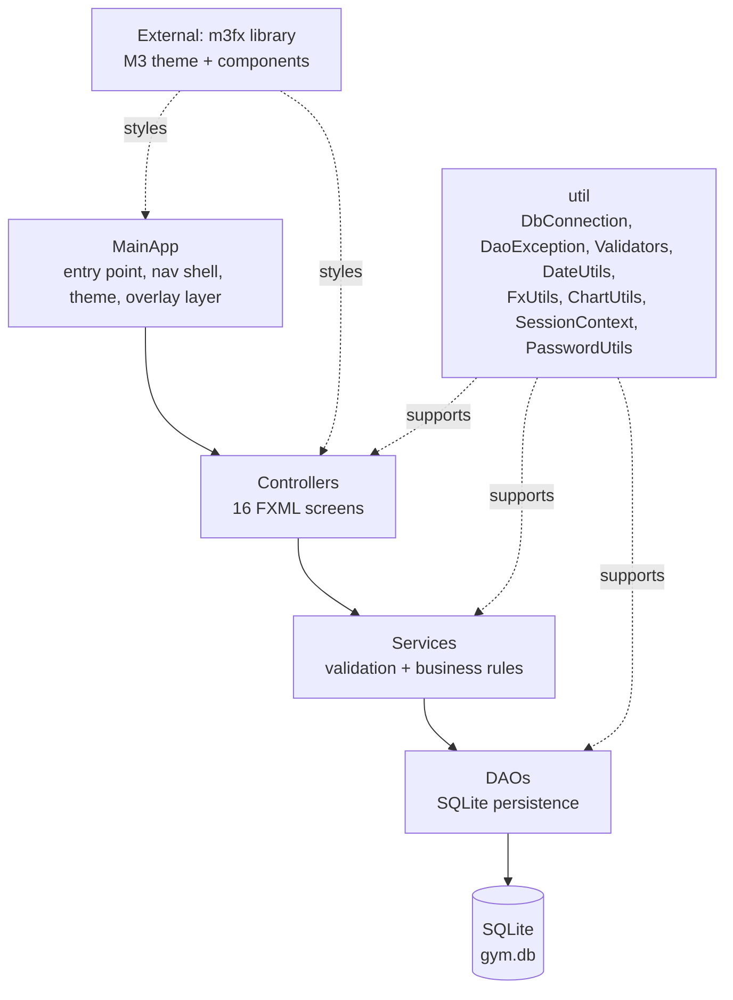

# UML — Gym Management System (JavaFX)

> **Status: design specification, not a description of shipped code.** This document is the agreed
> target design. As of this revision the repository contains the `m3fx` library, a component
> showcase (`fxml/main.fxml`, no controller) and `com.gym.MainApp` — the classes below are *planned*.
> See `docs/COVERAGE.md` for what is actually built.
>
> **One master diagram, then five per-layer zoom-ins** (architecture, data access, services,
> controllers, utilities). Each class is drawn exactly once in full; the zoom-ins show layer members
> and wiring. `docs/UML_TEAM.md` holds ownership, not a second copy of the diagrams.
>
> Notation:
> `-` private · `+` public · `-->` association · `o--` shared aggregation · `*--` composition ·
> `..>` dependency · `<|..` realization (drawn from the implementer side).
>
> Diagram-wide conventions:
> - **Arrow direction:** the class that *holds the foreign key* points at the referenced class.
> - **Boxed `Integer`/`Long`/`Boolean` marks a nullable column; primitives mark NOT NULL.**
> - **Money is `BigDecimal`** — never `double`.
> - **Dates are ISO-8601 strings**: `yyyy-MM-dd` for dates, `HH:mm` for times,
>   `yyyy-MM-dd HH:mm` for date-times. ISO-8601 sorts lexicographically in the same order as
>   chronologically, which is what lets `findByDay`, `findExpiring` and `revenueBetween` compare
>   strings directly. `DateUtils` owns every parse and format.
> - Entity getters and setters are omitted to keep the diagram small — every data member marked
>   «get/set» has a public getter and setter. Enum `values()`/`valueOf(...)` are implicit in Java
>   and are not shown.
> - `m3fx` is an external library dependency, not project code.

## 1. Main diagram (domain model)

```mermaid
classDiagram
    direction TB
    class Customer {
        -int id «get/set»
        -String fullName «get/set»
        -String phone «get/set»
        -String email «get/set»
        -String address «get/set»
        -String dateOfBirth «get/set»
        -String gender «get/set»
        -String emergencyName «get/set»
        -String emergencyPhone «get/set»
        -CustomerStatus status «get/set»
        -String joinDate «get/set»
        -Integer trainerId «get/set»
        +Customer()
        +Customer(int, String, String, String, String, String, String, String, String, CustomerStatus, String, Integer)
        +toString() String
        +equals(Object) boolean
        +hashCode() int
    }
    class Trainer {
        -int id «get/set»
        -String fullName «get/set»
        -String phone «get/set»
        -String email «get/set»
        -String specialization «get/set»
        -int experienceYears «get/set»
        -String certifications «get/set»
        -String hireDate «get/set»
        -BigDecimal hourlyRate «get/set»
        +Trainer()
        +Trainer(int, String, String, String, String, int, String, String, BigDecimal)
        +toString() String
        +equals(Object) boolean
        +hashCode() int
    }
    class Membership {
        -int id «get/set»
        -int customerId «get/set»
        -PlanType plan «get/set»
        -BigDecimal price «get/set»
        -String startDate «get/set»
        -String endDate «get/set»
        -MembershipStatus status «get/set»
        -int frozenDays «get/set»
        +Membership()
        +Membership(int, int, PlanType, BigDecimal, String, String, MembershipStatus, int)
        +toString() String
        +equals(Object) boolean
        +hashCode() int
    }
    class WorkoutProgram {
        -int id «get/set»
        -int customerId «get/set»
        -int creatorTrainerId «get/set»
        -String name «get/set»
        -String exercises «get/set»
        -int version «get/set»
        -String createdDate «get/set»
        +WorkoutProgram()
        +WorkoutProgram(int, int, int, String, String, int, String)
        +toString() String
        +equals(Object) boolean
        +hashCode() int
    }
    class Session {
        -int id «get/set»
        -int customerId «get/set»
        -int trainerId «get/set»
        -String date «get/set»
        -String startTime «get/set»
        -int durationMin «get/set»
        -SessionStatus status «get/set»
        -Integer availabilityId «get/set»
        -Integer subscriptionId «get/set»
        -BigDecimal price «get/set»
        -String cancelReason «get/set»
        -String sessionNotes «get/set»
        +Session()
        +Session(int, int, int, String, String, int, SessionStatus, Integer, Integer, BigDecimal, String, String)
        +toString() String
        +equals(Object) boolean
        +hashCode() int
    }
    class Equipment {
        -int id «get/set»
        -String name «get/set»
        -String category «get/set»
        -String purchaseDate «get/set»
        -EquipmentCondition condition «get/set»
        -EquipmentStatus status «get/set»
        -String lastMaintenance «get/set»
        +Equipment()
        +Equipment(int, String, String, String, EquipmentCondition, EquipmentStatus, String)
        +toString() String
        +equals(Object) boolean
        +hashCode() int
    }
    class Attendance {
        -int id «get/set»
        -int customerId «get/set»
        -String date «get/set»
        -String checkIn «get/set»
        -String checkOut «get/set»
        +Attendance()
        +Attendance(int, int, String, String, String)
        +toString() String
        +equals(Object) boolean
        +hashCode() int
    }
    class Payment {
        -int id «get/set»
        -int customerId «get/set»
        -Integer membershipId «get/set»
        -Integer subscriptionId «get/set»
        -Integer sessionId «get/set»
        -BigDecimal amount «get/set»
        -PaymentMethod method «get/set»
        -String date «get/set»
        -String receiptNo «get/set»
        -boolean voided «get/set»
        +Payment()
        +forMembership(int, int, BigDecimal, PaymentMethod, String, String) Payment
        +forSubscription(int, int, BigDecimal, PaymentMethod, String, String) Payment
        +forSession(int, int, BigDecimal, PaymentMethod, String, String) Payment
        +toString() String
        +equals(Object) boolean
        +hashCode() int
    }
    class ProgressRecord {
        -int id «get/set»
        -int customerId «get/set»
        -String date «get/set»
        -double weightKg «get/set»
        -double bodyFatPct «get/set»
        -String measurements «get/set»
        -Double targetWeightKg «get/set»
        -String notes «get/set»
        +ProgressRecord()
        +ProgressRecord(int, int, String, double, double, String, Double, String)
        +toString() String
        +equals(Object) boolean
        +hashCode() int
    }
    class MedicalProfile {
        -int id «get/set»
        -int customerId «get/set»
        -String bloodType «get/set»
        -String conditions «get/set»
        -String allergies «get/set»
        -String medications «get/set»
        -String injuries «get/set»
        -String doctorName «get/set»
        -String doctorPhone «get/set»
        -String notes «get/set»
        -String updatedDate «get/set»
        +MedicalProfile()
        +MedicalProfile(int, int, String, String, String, String, String, String, String, String, String)
        +toString() String
        +equals(Object) boolean
        +hashCode() int
    }
    class Administrator {
        -int id «get/set»
        -String fullName «get/set»
        -String username «get/set»
        -String passwordHash «get/set»
        -StaffRole role «get/set»
        -String phone «get/set»
        -String email «get/set»
        -boolean active «get/set»
        -String createdDate «get/set»
        +Administrator()
        +Administrator(int, String, String, String, StaffRole, String, String, boolean, String)
        +toString() String
        +equals(Object) boolean
        +hashCode() int
    }
    class TrainerSubscription {
        -int id «get/set»
        -int customerId «get/set»
        -int trainerId «get/set»
        -String startDate «get/set»
        -String endDate «get/set»
        -BigDecimal ratePerPeriod «get/set»
        -SubscriptionStatus status «get/set»
        +TrainerSubscription()
        +TrainerSubscription(int, int, int, String, String, BigDecimal, SubscriptionStatus)
        +toString() String
        +equals(Object) boolean
        +hashCode() int
    }
    class TrainerAvailability {
        -int id «get/set»
        -int trainerId «get/set»
        -String date «get/set»
        -String startTime «get/set»
        -String endTime «get/set»
        -int maxCustomers «get/set»
        -AvailabilityStatus status «get/set»
        +TrainerAvailability()
        +TrainerAvailability(int, int, String, String, String, int, AvailabilityStatus)
        +toString() String
        +equals(Object) boolean
        +hashCode() int
    }
    class CustomerStatus {
        <<enumeration>>
        ACTIVE
        INACTIVE
        SUSPENDED
    }
    class MembershipStatus {
        <<enumeration>>
        ACTIVE
        FROZEN
        EXPIRED
        CANCELLED
    }
    class PlanType {
        <<enumeration>>
        MONTHLY
        QUARTERLY
        YEARLY
    }
    class SessionStatus {
        <<enumeration>>
        REQUESTED
        CONFIRMED
        COMPLETED
        NO_SHOW
        CANCELLED
    }
    class SubscriptionStatus {
        <<enumeration>>
        ACTIVE
        EXPIRED
        CANCELLED
    }
    class AvailabilityStatus {
        <<enumeration>>
        OPEN
        FULL
        CLOSED
    }
    class StaffRole {
        <<enumeration>>
        ADMIN
        MANAGER
        STAFF
    }
    class PaymentMethod {
        <<enumeration>>
        CASH
        CARD
        TRANSFER
    }
    class EquipmentStatus {
        <<enumeration>>
        AVAILABLE
        IN_MAINTENANCE
        RETIRED
    }
    class EquipmentCondition {
        <<enumeration>>
        NEW
        GOOD
        FAIR
        POOR
    }
    Membership "0..*" --> "1" Customer : belongs to
    WorkoutProgram "0..*" --> "1" Customer : follows
    Attendance "0..*" --> "1" Customer : records
    ProgressRecord "0..*" --> "1" Customer : tracks
    Session "0..*" --> "1" Customer : booked by
    Customer "0..*" --> "0..1" Trainer : assigned to
    Payment "0..*" --> "1" Customer : paid by
    WorkoutProgram "0..*" --> "1" Trainer : created by
    Session "0..*" --> "1" Trainer : coached by
    TrainerAvailability "0..*" --> "1" Trainer : published by
    Session "0..*" --> "0..1" TrainerAvailability : fits in
    TrainerSubscription "0..*" --> "1" Customer : covers
    TrainerSubscription "0..*" --> "1" Trainer : engages
    Session "0..*" --> "0..1" TrainerSubscription : covered by
    MedicalProfile "0..1" --> "1" Customer : describes
    Payment "0..*" --> "0..1" Membership : pays for
    Payment "0..*" --> "0..1" TrainerSubscription : pays for
    Payment "0..*" --> "0..1" Session : pays for
    note for Customer "Member: info, contact, status, links."
    note for Trainer "Coach: info, specialization, availability, hourlyRate."
    note for Membership "Plan with start and end dates. price is BigDecimal; no double money."
    note for WorkoutProgram "Exercise list with version and creator. version is unique per customer."
    note for Session "Booked slot with cancel reason and notes. price must be 0 when subscriptionId is set."
    note for Equipment "Standalone inventory catalogue: no FK to any other entity. Inventory item, condition, status."
    note for Attendance "One check-in/out record per customer per day (enforced by AttendanceDao.findByCustomerAndDay)."
    note for Payment "Amount, method and date. Exactly one of membershipId, subscriptionId, sessionId is set (XOR); voided payments are excluded from every revenue and balance query."
    note for ProgressRecord "Dated body metrics and benchmarks (targetWeightKg)."
    note for MedicalProfile "Blood type, conditions, meds, doctor. At most one per customer, created on demand."
    note for Administrator "Login identity, role, active flag. authenticate() rejects active == false. Role ADMIN may mutate every entity through AdminService."
    note for TrainerSubscription "Period engagement at a flat trainer rate. Sessions it covers must have price 0 so they are not billed twice."
    note for TrainerAvailability "One hourly slot per row: open day, time window, per-slot customer cap."
    note for CustomerStatus "ACTIVE, INACTIVE, SUSPENDED"
    note for MembershipStatus "ACTIVE, FROZEN, EXPIRED, CANCELLED. FROZEN is set by freeze(); EXPIRED is derived from endDate and never set by hand."
    note for PlanType "MONTHLY, QUARTERLY, YEARLY"
    note for SessionStatus "REQUESTED, CONFIRMED, COMPLETED, NO_SHOW, CANCELLED. Legal transitions are enforced by SchedulingService.canTransition."
    note for SubscriptionStatus "ACTIVE, EXPIRED, CANCELLED. EXPIRED is derived from endDate; CANCELLED is set by cancelSubscription."
    note for AvailabilityStatus "OPEN, FULL, CLOSED. FULL is derived (bookedCount >= maxCustomers); only OPEN and CLOSED are set by hand."
    note for StaffRole "ADMIN, MANAGER, STAFF"
    note for PaymentMethod "CASH, CARD, TRANSFER"
    note for EquipmentStatus "AVAILABLE, IN_MAINTENANCE, RETIRED"
    note for EquipmentCondition "NEW, GOOD, FAIR, POOR"
    note for Customer "trainerId is the assigned trainer and is authoritative for medical access and the trainer's roster; TrainerSubscription records only the paid engagement period."
    note for WorkoutProgram "A trainer may be removed while their programs remain, so 'created by' is an association, not composition."
```

## 2. Layered architecture

Layer rules:
- Controllers never contain SQL and never touch a DAO directly — always through a service.
- Services and DAOs never import JavaFX. `FxUtils` is the only JavaFX-aware utility and only
  controllers depend on it.
- `DaoException` is thrown by every `*DaoImpl`, caught in the controller, and shown with
  `FxUtils.error(getMessage())`. Services never format a message for display.

Startup and session flow (the boundary path, shown here because `MainApp` and `SessionContext`
are the two classes that sit outside the four layers):

1. `MainApp.start(Stage)` applies the theme (`M3Stylesheets.applyTo`), builds the nav shell and
   overlay layer, and opens `LoginController`.
2. `LoginController.onLogin()` calls `AdminService.authenticate(username, password)`, which returns
   `null` for an unknown username, a wrong password, or `Administrator.active == false`.
3. On success `LoginController` stores the returned `Administrator` in `SessionContext` and opens
   `DashboardController`; `SessionContext.requireRole(StaffRole.ADMIN)` then gates `StaffController`.
4. `DashboardController.onLogout()` calls `SessionContext.clear()` and returns to `LoginController`.
   `MainApp` clears it again on exit as a safety net.

## 3. Data access layer

```mermaid
classDiagram
    direction TB
    class DbConnection {
        <<interface>>
        +getConnection() Connection
        +initializeSchema() void
    }
    class SqliteDbConnection {
        +getConnection() Connection
        +initializeSchema() void
    }
    class DaoException {
        -String message
        -Throwable cause
        +DaoException(String, Throwable)
        +getMessage() String
        +getCause() Throwable
    }
    class CustomerDao {
        <<interface>>
        +save(Customer) int
        +findById(int) Customer
        +search(String) List~Customer~
        +findAll() List~Customer~
        +update(Customer) void
        +delete(int) void
        +findByStatus(CustomerStatus) List~Customer~
        +findByTrainer(int) List~Customer~
    }
    class CustomerDaoImpl {
        +save(Customer) int
        +findById(int) Customer
        +search(String) List~Customer~
        +findAll() List~Customer~
        +update(Customer) void
        +delete(int) void
        +findByStatus(CustomerStatus) List~Customer~
        +findByTrainer(int) List~Customer~
    }
    class TrainerDao {
        <<interface>>
        +save(Trainer) int
        +findById(int) Trainer
        +findAll() List~Trainer~
        +update(Trainer) void
        +delete(int) void
    }
    class TrainerDaoImpl {
        +save(Trainer) int
        +findById(int) Trainer
        +findAll() List~Trainer~
        +update(Trainer) void
        +delete(int) void
    }
    class MembershipDao {
        <<interface>>
        +save(Membership) int
        +findExpiring(int) List~Membership~
        +findById(int) Membership
        +findAll() List~Membership~
        +update(Membership) void
        +delete(int) void
        +findByCustomer(int) List~Membership~
        +findByStatus(MembershipStatus) List~Membership~
    }
    class MembershipDaoImpl {
        +save(Membership) int
        +findExpiring(int) List~Membership~
        +findById(int) Membership
        +findAll() List~Membership~
        +update(Membership) void
        +delete(int) void
        +findByCustomer(int) List~Membership~
        +findByStatus(MembershipStatus) List~Membership~
    }
    class WorkoutProgramDao {
        <<interface>>
        +save(WorkoutProgram) int
        +findById(int) WorkoutProgram
        +findAll() List~WorkoutProgram~
        +update(WorkoutProgram) void
        +delete(int) void
        +findByCustomer(int) List~WorkoutProgram~
        +findLatestVersion(int) int
    }
    class WorkoutProgramDaoImpl {
        +save(WorkoutProgram) int
        +findById(int) WorkoutProgram
        +findAll() List~WorkoutProgram~
        +update(WorkoutProgram) void
        +delete(int) void
        +findByCustomer(int) List~WorkoutProgram~
        +findLatestVersion(int) int
    }
    class SessionDao {
        <<interface>>
        +save(Session) int
        +findByDay(String) List~Session~
        +findById(int) Session
        +findAll() List~Session~
        +update(Session) void
        +delete(int) void
        +findByStatus(SessionStatus) List~Session~
        +findByCustomer(int) List~Session~
        +findByCustomerAndDay(int, String) List~Session~
        +findByTrainerAndDay(int, String) List~Session~
        +countByAvailability(int) int
    }
    class SessionDaoImpl {
        +save(Session) int
        +findByDay(String) List~Session~
        +findById(int) Session
        +findAll() List~Session~
        +update(Session) void
        +delete(int) void
        +findByStatus(SessionStatus) List~Session~
        +findByCustomer(int) List~Session~
        +findByCustomerAndDay(int, String) List~Session~
        +findByTrainerAndDay(int, String) List~Session~
        +countByAvailability(int) int
    }
    class EquipmentDao {
        <<interface>>
        +save(Equipment) int
        +findById(int) Equipment
        +findAll() List~Equipment~
        +update(Equipment) void
        +delete(int) void
        +findByStatus(EquipmentStatus) List~Equipment~
        +findByCondition(EquipmentCondition) List~Equipment~
    }
    class EquipmentDaoImpl {
        +save(Equipment) int
        +findById(int) Equipment
        +findAll() List~Equipment~
        +update(Equipment) void
        +delete(int) void
        +findByStatus(EquipmentStatus) List~Equipment~
        +findByCondition(EquipmentCondition) List~Equipment~
    }
    class AttendanceDao {
        <<interface>>
        +save(Attendance) int
        +findByDay(String) List~Attendance~
        +findById(int) Attendance
        +findAll() List~Attendance~
        +update(Attendance) void
        +delete(int) void
        +findByCustomer(int) List~Attendance~
        +findByCustomerAndDay(int, String) Attendance
    }
    class AttendanceDaoImpl {
        +save(Attendance) int
        +findByDay(String) List~Attendance~
        +findById(int) Attendance
        +findAll() List~Attendance~
        +update(Attendance) void
        +delete(int) void
        +findByCustomer(int) List~Attendance~
        +findByCustomerAndDay(int, String) Attendance
    }
    class PaymentDao {
        <<interface>>
        +save(Payment) int
        +revenueBetween(String, String) BigDecimal
        +findById(int) Payment
        +findAll() List~Payment~
        +update(Payment) void
        +delete(int) void
        +findByCustomer(int) List~Payment~
        +findByReceipt(String) Payment
        +findByMethod(PaymentMethod) List~Payment~
    }
    class PaymentDaoImpl {
        +save(Payment) int
        +revenueBetween(String, String) BigDecimal
        +findById(int) Payment
        +findAll() List~Payment~
        +update(Payment) void
        +delete(int) void
        +findByCustomer(int) List~Payment~
        +findByReceipt(String) Payment
        +findByMethod(PaymentMethod) List~Payment~
    }
    class ProgressDao {
        <<interface>>
        +save(ProgressRecord) int
        +findById(int) ProgressRecord
        +findAll() List~ProgressRecord~
        +update(ProgressRecord) void
        +delete(int) void
        +findByCustomer(int) List~ProgressRecord~
    }
    class ProgressDaoImpl {
        +save(ProgressRecord) int
        +findById(int) ProgressRecord
        +findAll() List~ProgressRecord~
        +update(ProgressRecord) void
        +delete(int) void
        +findByCustomer(int) List~ProgressRecord~
    }
    class MedicalProfileDao {
        <<interface>>
        +save(MedicalProfile) int
        +findByCustomer(int) MedicalProfile
        +findById(int) MedicalProfile
        +findAll() List~MedicalProfile~
        +update(MedicalProfile) void
        +delete(int) void
    }
    class MedicalProfileDaoImpl {
        +save(MedicalProfile) int
        +findByCustomer(int) MedicalProfile
        +findById(int) MedicalProfile
        +findAll() List~MedicalProfile~
        +update(MedicalProfile) void
        +delete(int) void
    }
    class AdminDao {
        <<interface>>
        +save(Administrator) int
        +findByUsername(String) Administrator
        +findById(int) Administrator
        +findAll() List~Administrator~
        +update(Administrator) void
        +delete(int) void
        +findByRole(StaffRole) List~Administrator~
    }
    class AdminDaoImpl {
        +save(Administrator) int
        +findByUsername(String) Administrator
        +findById(int) Administrator
        +findAll() List~Administrator~
        +update(Administrator) void
        +delete(int) void
        +findByRole(StaffRole) List~Administrator~
    }
    class TrainerSubscriptionDao {
        <<interface>>
        +save(TrainerSubscription) int
        +findActive(int, int, String) TrainerSubscription
        +findById(int) TrainerSubscription
        +findAll() List~TrainerSubscription~
        +update(TrainerSubscription) void
        +delete(int) void
        +findByCustomer(int) List~TrainerSubscription~
        +findByTrainer(int) List~TrainerSubscription~
    }
    class TrainerSubscriptionDaoImpl {
        +save(TrainerSubscription) int
        +findActive(int, int, String) TrainerSubscription
        +findById(int) TrainerSubscription
        +findAll() List~TrainerSubscription~
        +update(TrainerSubscription) void
        +delete(int) void
        +findByCustomer(int) List~TrainerSubscription~
        +findByTrainer(int) List~TrainerSubscription~
    }
    class TrainerAvailabilityDao {
        <<interface>>
        +save(TrainerAvailability) int
        +findOpenSlots(int, String) List~TrainerAvailability~
        +findById(int) TrainerAvailability
        +findAll() List~TrainerAvailability~
        +update(TrainerAvailability) void
        +delete(int) void
        +findByTrainerAndDate(int, String) List~TrainerAvailability~
    }
    class TrainerAvailabilityDaoImpl {
        +save(TrainerAvailability) int
        +findOpenSlots(int, String) List~TrainerAvailability~
        +findById(int) TrainerAvailability
        +findAll() List~TrainerAvailability~
        +update(TrainerAvailability) void
        +delete(int) void
        +findByTrainerAndDate(int, String) List~TrainerAvailability~
    }
    SqliteDbConnection <|.. DbConnection : implements
    CustomerDao <|.. CustomerDaoImpl : implements
    TrainerDao <|.. TrainerDaoImpl : implements
    MembershipDao <|.. MembershipDaoImpl : implements
    WorkoutProgramDao <|.. WorkoutProgramDaoImpl : implements
    SessionDao <|.. SessionDaoImpl : implements
    EquipmentDao <|.. EquipmentDaoImpl : implements
    AttendanceDao <|.. AttendanceDaoImpl : implements
    PaymentDao <|.. PaymentDaoImpl : implements
    ProgressDao <|.. ProgressDaoImpl : implements
    MedicalProfileDao <|.. MedicalProfileDaoImpl : implements
    AdminDao <|.. AdminDaoImpl : implements
    TrainerSubscriptionDao <|.. TrainerSubscriptionDaoImpl : implements
    TrainerAvailabilityDao <|.. TrainerAvailabilityDaoImpl : implements
    CustomerDaoImpl ..> DbConnection : uses
    TrainerDaoImpl ..> DbConnection : uses
    MembershipDaoImpl ..> DbConnection : uses
    WorkoutProgramDaoImpl ..> DbConnection : uses
    SessionDaoImpl ..> DbConnection : uses
    EquipmentDaoImpl ..> DbConnection : uses
    AttendanceDaoImpl ..> DbConnection : uses
    PaymentDaoImpl ..> DbConnection : uses
    ProgressDaoImpl ..> DbConnection : uses
    MedicalProfileDaoImpl ..> DbConnection : uses
    AdminDaoImpl ..> DbConnection : uses
    TrainerSubscriptionDaoImpl ..> DbConnection : uses
    TrainerAvailabilityDaoImpl ..> DbConnection : uses
    note for DbConnection "Interface: DAOs depend on this, never on the SQLite factory."
    note for SqliteDbConnection "SQLite factory, creates gym.db, initialises the schema. Single seam for changing the database."
    note for DaoException "Unchecked SQLException wrapper. Thrown by every DaoImpl; caught in the controller and shown with FxUtils.error(getMessage())."
    note for CustomerDao "Contract to save, find, search customers"
    note for CustomerDaoImpl "SQLite implementation, customers"
    note for TrainerDao "Contract to save, find trainers"
    note for TrainerDaoImpl "SQLite implementation, trainers"
    note for MembershipDao "Contract, expiring memberships and status queries"
    note for MembershipDaoImpl "SQLite implementation, memberships"
    note for WorkoutProgramDao "Contract, programs per customer, latest version"
    note for WorkoutProgramDaoImpl "SQLite implementation, programs"
    note for SessionDao "Contract: by day, customer, trainer+day, status; slot occupancy count"
    note for SessionDaoImpl "SQLite implementation, sessions"
    note for EquipmentDao "Contract to save, list equipment by status and condition"
    note for EquipmentDaoImpl "SQLite implementation, equipment"
    note for AttendanceDao "Contract, daily attendance, by customer, one-row-per-day lookup"
    note for AttendanceDaoImpl "SQLite implementation, attendance"
    note for PaymentDao "Contract, revenue ranges (voided excluded), by customer, by receipt, by method"
    note for PaymentDaoImpl "SQLite implementation, payments"
    note for ProgressDao "Contract, history per customer"
    note for ProgressDaoImpl "SQLite implementation, progress"
    note for MedicalProfileDao "Contract, profile per customer"
    note for MedicalProfileDaoImpl "SQLite implementation, medical"
    note for AdminDao "Contract, lookup by username and role"
    note for AdminDaoImpl "SQLite implementation, admins"
    note for TrainerSubscriptionDao "Contract, engagements, by customer, by trainer, active lookup"
    note for TrainerSubscriptionDaoImpl "SQLite implementation, subscriptions"
    note for TrainerAvailabilityDao "Contract, slots by trainer+date, open slots only"
    note for TrainerAvailabilityDaoImpl "SQLite implementation, availability"
```

## 4. Service layer (validation + business rules, no JavaFX, no SQL)

```mermaid
classDiagram
    direction TB
    class CustomerService {
        +validate(Customer) List~String~
        +search(String) List~Customer~
        +findAll() List~Customer~
        +findById(int) Customer
        +save(Customer) int
        +update(Customer) void
        +changeStatus(int, CustomerStatus) void
        +findByTrainer(int) List~Customer~
    }
    class TrainerService {
        +assignCustomer(int customerId, int trainerId) void
        +revokeMedicalAccess(int customerId, int trainerId) void
        +setRate(int trainerId, BigDecimal hourlyRate) void
        +publishSlot(int trainerId, String date, String startTime, String endTime, int maxCustomers) TrainerAvailability
        +closeSlot(int availabilityId) void
        +setDailyCap(int trainerId, String date, int maxCustomersPerSlot) void
        +findOpenSlots(int trainerId, String date) List~TrainerAvailability~
        +findAll() List~Trainer~
        +findById(int) Trainer
        +save(Trainer) int
        +update(Trainer) void
    }
    class MembershipService {
        +sell(int customerId, PlanType plan) Membership
        +renew(int membershipId) void
        +freeze(int membershipId) void
        +unfreeze(int membershipId) void
        +cancel(int membershipId) void
        +expireOverdue() int
        +expiryReminders(int withinDays) List~Membership~
        +findAll() List~Membership~
        +findByCustomer(int) List~Membership~
    }
    class WorkoutService {
        +buildProgram(int customerId, int trainerId, String name, String exercises) WorkoutProgram
        +reassign(int programId, int customerId) void
        +newVersion(int programId) WorkoutProgram
        +findByCustomer(int) List~WorkoutProgram~
    }
    class SchedulingService {
        +bookOpenSlot(int customerId, int availabilityId, String date, String startTime) Session
        +requestOutsideSlots(int customerId, int trainerId, String date, String startTime) Session
        +adminReserve(int customerId, int trainerId, String date, String startTime) Session
        +bookedCount(int availabilityId) int
        +isSlotFull(int availabilityId) boolean
        +detectConflicts(int customerId, int trainerId, String date, String startTime) List~Session~
        +canTransition(SessionStatus from, SessionStatus to) boolean
        +confirmSession(int sessionId) void
        +cancelSession(int sessionId, String reason) void
        +completeSession(int sessionId, String sessionNotes) void
        +markNoShow(int sessionId) void
        +getAvailableSlots(int trainerId, String date) List~TrainerAvailability~
        +getCustomerSessions(int) List~Session~
        +getTrainerSessions(int) List~Session~
        +subscribe(int customerId, int trainerId, String startDate, String endDate) TrainerSubscription
        +activeSubscription(int customerId, int trainerId) TrainerSubscription
        +subscriptionPrice(int trainerId) BigDecimal
        +renewSubscription(int subscriptionId, String newEndDate) void
        +cancelSubscription(int subscriptionId) void
        +coveredBySubscription(Session) boolean
        +expireOverdueSubscriptions() int
    }
    class EquipmentService {
        +save(Equipment) int
        +update(Equipment) void
        +changeStatus(int equipmentId, EquipmentStatus status) void
        +changeCondition(int equipmentId, EquipmentCondition condition) void
        +logMaintenance(int equipmentId, String date) void
        +findAll() List~Equipment~
        +findByStatus(EquipmentStatus) List~Equipment~
    }
    class AttendanceService {
        +checkIn(int customerId, String date, String time) Attendance
        +checkOut(int customerId, String date, String time) void
        +dailyReport(String date) List~Attendance~
        +findByCustomer(int) List~Attendance~
    }
    class PaymentService {
        +record(Payment) int
        +validLink(Payment) boolean
        +voidPayment(int paymentId, String reason) void
        +balance(int customerId) BigDecimal
        +revenueBetween(String from, String to) BigDecimal
        +findByCustomer(int) List~Payment~
        +findByReceipt(String receiptNo) Payment
    }
    class ProgressService {
        +save(ProgressRecord) int
        +findByCustomer(int) List~ProgressRecord~
        +series(int customerId, String metric) List~Double~
        +targetWeight(int customerId) Double
    }
    class MedicalProfileService {
        +save(MedicalProfile) int
        +update(MedicalProfile) void
        +getByCustomer(int customerId) MedicalProfile
        +getForTrainer(int customerId, int trainerId) MedicalProfile
    }
    class AdminService {
        +authenticate(String username, String password) Administrator
        +resetPassword(int adminId, String newPassword) void
        +saveStaff(Administrator) int
        +findByRole(StaffRole) List~Administrator~
        +reassignTrainer(int customerId, int trainerId) void
        +adjustPayment(int paymentId, BigDecimal newAmount, String reason) void
        +voidRecord(String entityName, int id, String reason) void
        +deleteCustomer(int customerId) void
        +deleteTrainer(int trainerId) void
    }
    CustomerService ..> CustomerDao : persists via
    CustomerService ..> Validators : validates with
    TrainerService ..> TrainerDao : persists via
    TrainerService ..> TrainerAvailabilityDao : persists slots via
    TrainerService ..> DateUtils : dates with
    MembershipService ..> MembershipDao : persists via
    MembershipService ..> CustomerDao : reads owner from
    MembershipService ..> DateUtils : dates with
    WorkoutService ..> WorkoutProgramDao : persists via
    WorkoutService ..> CustomerDao : validates assignment with
    WorkoutService ..> TrainerDao : validates creator with
    SchedulingService ..> SessionDao : persists via
    SchedulingService ..> TrainerAvailabilityDao : checks slots from
    SchedulingService ..> TrainerSubscriptionDao : reads subs from
    SchedulingService ..> CustomerDao : reads customers from
    SchedulingService ..> TrainerDao : reads trainers from
    SchedulingService ..> DateUtils : dates with
    EquipmentService ..> EquipmentDao : persists via
    AttendanceService ..> AttendanceDao : persists via
    AttendanceService ..> CustomerDao : validates status with
    AttendanceService ..> MembershipDao : validates eligibility with
    PaymentService ..> PaymentDao : persists via
    PaymentService ..> CustomerDao : reads payer from
    PaymentService ..> MembershipDao : prices against
    PaymentService ..> SessionDao : prices against
    ProgressService ..> ProgressDao : persists via
    ProgressService ..> ChartUtils : charts with
    MedicalProfileService ..> MedicalProfileDao : persists via
    MedicalProfileService ..> CustomerDao : checks ownership with
    AdminService ..> AdminDao : persists via
    AdminService ..> PasswordUtils : hashes with
    AdminService ..> CustomerDao : overrides with
    AdminService ..> PaymentDao : overrides with
    AdminService ..> TrainerDao : overrides with
    note for CustomerService "Validation, search, status rules"
    note for TrainerService "Availability, assign, rates, slot publishing. publishSlot creates one hourly slot; the cap is per slot."
    note for MembershipService "Sell, renew, freeze, unfreeze, cancel, expire sweep, reminders. freeze stores frozenDays; unfreeze shifts endDate forward by it."
    note for WorkoutService "Build programs, reassign, versioning. reassign overwrites customerId and requires an existing customer."
    note for SchedulingService "bookOpenSlot requires AvailabilityStatus.OPEN, bookedCount < maxCustomers, no trainer conflict and no customer conflict. requestOutsideSlots yields REQUESTED; adminReserve ignores slot rules. Cancel up to 2h before start is free; later cancels are still CANCELLED with the reason recorded."
    note for EquipmentService "Add/edit equipment, status and condition transitions, maintenance date"
    note for AttendanceService "Check-in and out, daily report. checkIn requires CustomerStatus.ACTIVE and a Membership with status ACTIVE and endDate >= today; a second check-in on the same day returns the existing row."
    note for PaymentService "Record, balances, revenue by range. revenueBetween and balance exclude voided == true. validLink enforces the membership/subscription/session XOR."
    note for ProgressService "Metric access for charts. series returns values ascending by date."
    note for MedicalProfileService "Medical CRUD, lookup by customer. getForTrainer rejects a trainer who is not the customer's assigned trainer."
    note for AdminService "Authenticate (rejects active == false), password reset, staff management, reassign/adjust/void overrides, admin-only hard deletes that refuse while references exist"
```

## 5. Controllers (each backed by a matching FXML file)

`MainApp` is declared in §1 because it is the entry point rather than a screen; it appears in this
diagram only as the edge that opens the first screen.

```mermaid
classDiagram
    direction TB
    class LoginController {
        +initialize() void
        +onLogin() void
        +onForgotPassword() void
    }
    class DashboardController {
        +initialize() void
        +refreshData() void
        +onLogout() void
    }
    class CustomerListController {
        +initialize() void
        +onSearch() void
        +onAdd() void
        +onDelete(int customerId) void
    }
    class CustomerProfileController {
        +initialize() void
        +showCustomer(int customerId) void
        +onSave() void
    }
    class TrainerListController {
        +initialize() void
        +onAdd() void
        +onDelete(int trainerId) void
    }
    class TrainerProfileController {
        +initialize() void
        +showTrainer(int trainerId) void
        +onSave() void
    }
    class MembershipController {
        +initialize() void
        +onSell() void
        +onRenew() void
        +onFreeze() void
        +onUnfreeze() void
        +onCancel() void
    }
    class WorkoutController {
        +initialize() void
        +onBuild() void
        +onReassign() void
    }
    class ScheduleController {
        +initialize() void
        +onBook() void
        +onRequest() void
        +onReserve() void
        +onCancel() void
        +showAvailableTrainers() void
        +showTrainerSlots(int trainerId) void
    }
    class AvailabilityController {
        +initialize() void
        +setCalendar(int trainerId, String date) void
        +setSlots(int trainerId, String date, String startTime) void
        +setSlotCap(int availabilityId, int maxCustomers) void
    }
    class EquipmentController {
        +initialize() void
        +onAdd() void
        +onStatusChange(int equipmentId, EquipmentStatus status) void
        +onLogMaintenance(int equipmentId, String date) void
    }
    class AttendanceController {
        +initialize() void
        +onCheckIn(int customerId) void
        +onCheckOut(int customerId) void
    }
    class PaymentController {
        +initialize() void
        +onRecord() void
        +onVoid(int paymentId) void
        +showReceipt(String receiptNo) void
    }
    class ProgressController {
        +initialize() void
        +showProgress(int customerId) void
        +onSaveRecord() void
    }
    class MedicalProfileController {
        +initialize() void
        +showProfile(int customerId) void
        +onSave() void
    }
    class StaffController {
        +initialize() void
        +onAddStaff() void
        +onResetPassword(int adminId) void
        +onReassign() void
        +onAdjustPayment(int paymentId) void
    }
    MainApp ..> LoginController : opens
    MainApp ..> DashboardController : opens after login
    LoginController ..> AdminService : authenticates via
    LoginController ..> SessionContext : stores user
    LoginController ..> DashboardController : opens on success
    DashboardController ..> SessionContext : clears on logout
    DashboardController ..> CustomerService : reads from
    DashboardController ..> PaymentService : reads from
    DashboardController ..> SchedulingService : reads from
    DashboardController ..> EquipmentService : reads from
    CustomerListController ..> CustomerService : uses
    CustomerListController ..> CustomerProfileController : opens
    CustomerProfileController ..> CustomerService : saves via
    CustomerProfileController ..> MembershipService : reads plans from
    CustomerProfileController ..> MedicalProfileService : reads profile from
    TrainerListController ..> TrainerService : uses
    TrainerListController ..> TrainerProfileController : opens
    TrainerProfileController ..> TrainerService : saves via
    TrainerProfileController ..> CustomerService : reads roster from
    MembershipController ..> MembershipService : uses
    WorkoutController ..> WorkoutService : uses
    ScheduleController ..> SchedulingService : uses
    AvailabilityController ..> TrainerService : uses
    EquipmentController ..> EquipmentService : uses
    AttendanceController ..> AttendanceService : uses
    PaymentController ..> PaymentService : uses
    ProgressController ..> ProgressService : uses
    MedicalProfileController ..> MedicalProfileService : uses
    StaffController ..> AdminService : uses
    StaffController ..> SessionContext : requires ADMIN role
    note for MainApp "Entry point: builds the window, nav shell, theme and overlay layer."
    note for LoginController "Admin login screen"
    note for DashboardController "Members, sessions, revenue snapshot"
    note for CustomerListController "Searchable customer list"
    note for CustomerProfileController "Full member profile screen"
    note for TrainerListController "Trainer roster, availability"
    note for TrainerProfileController "Trainer details and assigned customers"
    note for MembershipController "Plans, sell, renew, freeze, unfreeze, cancel"
    note for WorkoutController "Program builder, reassignment"
    note for ScheduleController "Agenda, booking, request, reservation, cancel with reason"
    note for AvailabilityController "Calendar, per-slot caps, slot publishing"
    note for EquipmentController "Inventory, status, condition, maintenance"
    note for AttendanceController "Check-in and out screen, daily report"
    note for PaymentController "Record and void payments, receipts"
    note for ProgressController "Body-metric charts screen"
    note for MedicalProfileController "Medical profile view and edit"
    note for StaffController "Staff management and admin overrides; requires StaffRole.ADMIN"
```

## 6. Utilities

```mermaid
classDiagram
    direction TB
    class DbConnection {
        <<interface>>
        +getConnection() Connection
        +initializeSchema() void
    }
    class SqliteDbConnection {
        +getConnection() Connection
        +initializeSchema() void
    }
    class DaoException {
        -String message
        -Throwable cause
        +getMessage() String
        +getCause() Throwable
    }
    class Validators {
        +validPhone(String) boolean$
        +validEmail(String) boolean$
        +validDate(String) boolean$
        +validNumber(String) boolean$
    }
    class DateUtils {
        +addMonths(String, int) String$
        +overlappingSlots(String, String, String, String) boolean$
        +formatDate(String) String$
        +formatDateTime(String, String) String$
        +isBeforeNow(String, String) boolean$
        +hoursUntil(String, String) long$
    }
    class PasswordUtils {
        +hash(String) String$
        +verify(String, String) boolean$
    }
    class ChartUtils {
        +weightSeries(List~ProgressRecord~) List~Double~
        +revenueSeries(List~BigDecimal~ values, List~String~ dates) List~Double~
    }
    class SessionContext {
        -Object current
        +set(Object) void
        +get() Object
        +requireRole(StaffRole) void
        +clear() void
    }
    class FxUtils {
        +info(String) void$
        +confirm(String) boolean$
        +error(String) void$
        +switchScene(String) void$
        +snackbar(String) void$
    }
    FxUtils ..> DaoException : renders message of
    note for DbConnection "Interface: DAO impls depend on this, never on the SQLite factory."
    note for SqliteDbConnection "SQLite factory, creates gym.db, initialises the schema."
    note for DaoException "Unchecked SQLException wrapper; only FxUtils turns it into a message."
    note for Validators "Phone, email, date, number checks. All static; entity-free so the swing branch reuses it as-is."
    note for DateUtils "Periods, slots, overlap, formatting. Owns every date parse and format; static."
    note for PasswordUtils "PBKDF2 hash and verify, no external deps; static."
    note for ChartUtils "Formatting only: takes already-fetched values, does no DAO work. Static."
    note for SessionContext "Session-scoped holder for the signed-in account. Typed as Object so the util layer stays domain-free; the typed view is the startup flow in section 2. Static mutable state, deliberately FX-thread confined and cleared on logout."
    note for FxUtils "Dialogs, confirms, error alerts, scene switch, snackbar. The only JavaFX-aware utility; only controllers depend on it."
```

---

## Class descriptions

### Entities

| Class | Description |
|---|---|
| `Customer` | Gym member; fields: id, fullName, phone, email, address, dateOfBirth, gender, emergencyName, emergencyPhone, status (enum), joinDate, trainerId (nullable, assigned trainer); links to membership, trainer, program |
| `Trainer` | Coach; fields: id, fullName, phone, email, specialization, experienceYears, certifications, hireDate, hourlyRate; bookable slots live in TrainerAvailability |
| `Membership` | Plan; fields: id, customerId, plan (PlanType: monthly, quarterly, yearly), price, startDate, endDate, status (active, frozen, expired, cancelled), frozenDays |
| `WorkoutProgram` | Exercise list; fields: id, customerId, creatorTrainerId, name, exercises, version, createdDate |
| `Session` | Training slot; fields: id, customerId, trainerId, date, startTime, durationMin, status, availabilityId (nullable slot), subscriptionId (nullable), price, cancelReason, sessionNotes |
| `Equipment` | Standalone inventory item; fields: id, name, category, purchaseDate, condition (enum), status (enum), lastMaintenance. No foreign key to any other entity. |
| `Attendance` | One check-in/out record per customer per day; fields: id, customerId, date, checkIn, checkOut |
| `Payment` | fields: id, customerId, membershipId (nullable), subscriptionId (nullable), sessionId (nullable), amount, method, date, receiptNo, voided; exactly one of membership, trainer subscription, session |
| `ProgressRecord` | fields: id, customerId, date, weightKg, bodyFatPct, measurements, targetWeightKg (nullable), notes |
| `MedicalProfile` | Blood type, conditions, allergies, medications, injuries, doctor, notes; at most one per customer, created on demand |
| `Administrator` | Login identity with role (ADMIN/MANAGER/STAFF); may mutate all entities through AdminService |
| `TrainerSubscription` | Period engagement at a flat trainer-set rate; status uses SubscriptionStatus enum |
| `TrainerAvailability` | One hourly slot per row: date, startTime, endTime, maxCustomers, status. A trainer may publish several per day. |

### Enumerations

| Enum | Literals |
|---|---|
| `CustomerStatus` | ACTIVE, INACTIVE, SUSPENDED |
| `MembershipStatus` | ACTIVE, FROZEN, EXPIRED, CANCELLED |
| `PlanType` | MONTHLY, QUARTERLY, YEARLY |
| `SessionStatus` | REQUESTED, CONFIRMED, COMPLETED, NO_SHOW, CANCELLED |
| `SubscriptionStatus` | ACTIVE, EXPIRED, CANCELLED |
| `AvailabilityStatus` | OPEN, FULL, CLOSED |
| `StaffRole` | ADMIN, MANAGER, STAFF |
| `PaymentMethod` | CASH, CARD, TRANSFER |
| `EquipmentStatus` | AVAILABLE, IN_MAINTENANCE, RETIRED |
| `EquipmentCondition` | NEW, GOOD, FAIR, POOR |

`FULL`, `EXPIRED` and the two `CANCELLED` literals are the only ones with a non-obvious producer:
`FULL` is derived from occupancy, `MembershipStatus.EXPIRED` and `SubscriptionStatus.EXPIRED` are
derived from the end date, and both `CANCELLED` literals are set by an explicit cancel operation.

### Data access

| Class | Description |
|---|---|
| `DbConnection` | Interface for the SQLite connection factory; DAOs depend on this, not on the implementation |
| `SqliteDbConnection` | Implements `DbConnection`; creates `gym.db` and initializes the schema |
| `DaoException` | Unchecked wrapper for `SQLException`; translated to friendly messages in the controller via `FxUtils` |
| `CustomerDao` / `CustomerDaoImpl` | Persist, load and search customers; list by assigned trainer and by status |
| `TrainerDao` / `TrainerDaoImpl` | Persist and load trainers |
| `MembershipDao` / `MembershipDaoImpl` | Persist memberships; query expiring ones for reminders; query by status |
| `WorkoutProgramDao` / `WorkoutProgramDaoImpl` | Persist programs; list per customer; latest version per customer |
| `SessionDao` / `SessionDaoImpl` | Persist sessions; query by day, customer, customer+day, trainer+day, status; count occupancy of a slot |
| `EquipmentDao` / `EquipmentDaoImpl` | Persist and list equipment; query by status and condition |
| `AttendanceDao` / `AttendanceDaoImpl` | Persist check-ins; daily attendance lists; query by customer; one-row-per-day lookup |
| `PaymentDao` / `PaymentDaoImpl` | Persist payments; revenue sums over date ranges (voided excluded); query by customer, receipt number, method |
| `ProgressDao` / `ProgressDaoImpl` | Persist metric records; history per customer |
| `MedicalProfileDao` / `MedicalProfileDaoImpl` | Persist profiles; lookup per customer |
| `AdminDao` / `AdminDaoImpl` | Persist operators; lookup by username and by role |
| `TrainerSubscriptionDao` / `TrainerSubscriptionDaoImpl` | Persist engagements; active lookup; query by customer and trainer |
| `TrainerAvailabilityDao` / `TrainerAvailabilityDaoImpl` | Persist slots, caps, open days; query open slots by trainer and date |

### Services (validation + business rules, no JavaFX, no SQL)

| Class | Description |
|---|---|
| `CustomerService` | Customer validation, search/filter, status rules |
| `TrainerService` | Availability slots and caps (publish, close, cap), rates, assign, revoke medical access |
| `MembershipService` | Sell, renew, freeze, unfreeze, cancel, overdue expiry sweep, expiry reminders |
| `WorkoutService` | Program building rules, reassignment, per-customer versioning |
| `SchedulingService` | Booking rules (slot open, cap, trainer and customer conflicts), request/reserve, session state transitions, cancel-with-reason, subscribe and subscription lifecycle; distinguishes subscription (trainer) from membership (gym access) |
| `EquipmentService` | Add/edit inventory, status and condition transitions, last-maintenance date |
| `PaymentService` | Recording, link validation, voiding, balances, receipt lookup, revenue by range |
| `AttendanceService` | Check-in/out rules, eligibility checks, daily report data |
| `ProgressService` | Metric access for charts |
| `MedicalProfileService` | Medical CRUD, lookup by customer, assigned-trainer access check |
| `AdminService` | Auth (rejects inactive accounts), password reset, staff, reassign/adjust/void overrides, admin-only hard deletes; bypasses ownership |

### UI (each controller backed by a matching FXML file)

| Class | Description |
|---|---|
| `MainApp` | Entry point: builds the window, nav shell, theme and overlay layer |
| `LoginController` | Login screen: authenticates admin via AdminService, stores user in SessionContext |
| `DashboardController` | Main dashboard: active members, today's sessions, revenue snapshot, logout |
| `CustomerListController` | Searchable/filterable customer list |
| `CustomerProfileController` | Full profile: info, membership, trainer, program, schedule, progress |
| `TrainerListController` | Trainer roster with availability |
| `TrainerProfileController` | Trainer details, assigned customers, schedule |
| `MembershipController` | Plans; sell, renew, freeze, unfreeze, cancel |
| `WorkoutController` | Program builder and reassignment |
| `ScheduleController` | Agenda, booking dialog, session request/reservation, subscribe-to-trainer flow |
| `AvailabilityController` | Trainer calendar, per-slot caps, hourly slot publishing |
| `EquipmentController` | Inventory list, add/edit, status and condition changes, maintenance date |
| `AttendanceController` | Check-in/out screen and daily report |
| `PaymentController` | Payment recording, voiding, receipts, balances |
| `ProgressController` | Body-metric charts per customer |
| `MedicalProfileController` | Medical profile view/edit per customer |
| `StaffController` | Staff management and admin overrides (ADMIN role only) |

### Utilities

| Class | Description |
|---|---|
| `Validators` | Phone/email/number/date validation used by services; static, entity-free |
| `DateUtils` | Membership periods, session slot math, date formatting; owns every parse |
| `PasswordUtils` | PBKDF2 password hashing and verification (Java built-in, no new deps) |
| `ChartUtils` | Progress and revenue chart dataset formatting; no DAO access |
| `SessionContext` | Holds the logged-in Administrator for role checks; set/get/requireRole/clear |
| `FxUtils` | Friendly dialogs, alerts, scene switching, snackbar helper; the only JavaFX-aware utility |

---

## Business rules

Agreed decisions that the diagrams alone cannot express. Every owner implements these identically.
(Team ownership split lives in `docs/UML_TEAM.md`.)

| # | Rule |
|---|---|
| 1 | `bookOpenSlot` = customer books a published `OPEN` slot → `CONFIRMED`. `requestOutsideSlots` = requested outside published slots → `REQUESTED`, trainer confirms. `adminReserve` = admin override that ignores slot rules. Default `durationMin` = 60. |
| 2 | `SessionStatus.NO_SHOW` exists and matters for trainer statistics; `markNoShow` sets it. |
| 3 | A customer may have **zero or one** medical profile; it is created on demand, not at registration. |
| 4 | "Delete" for `Customer`/`Trainer` means set `INACTIVE` / end active records. Hard `delete(int)` is admin-only, lives on `AdminService`, and refuses while references exist. `schema.sql` uses no FK cascades. |
| 5 | `checkIn` requires `CustomerStatus.ACTIVE` and a `Membership` with status `ACTIVE` and `endDate >= today`. A second check-in on the same day returns the existing row instead of inserting. |
| 6 | `PaymentService.balance(int)` = sum of unpaid items: memberships sold without a matching non-voided payment, plus subscription and ad-hoc session prices without payments. Voided payments never count. |
| 7 | `freeze(int)` stores `frozenDays`; `unfreeze(int)` shifts `endDate` forward by that period and clears the counter. |
| 8 | A trainer may publish several hourly `TrainerAvailability` slots per day; `findByTrainerAndDate` returns a list. `maxCustomers` is the cap **per slot**; `setDailyCap` applies one value across a day's slots. |
| 9 | Dates are `yyyy-MM-dd`, `Session` times are `HH:mm`, and `DateUtils` owns parsing so `findByDay` and `overlappingSlots` agree. |
| 10 | Cancelling a session up to 2h before start is free; later cancellations are still marked `CANCELLED` with the reason recorded. `DateUtils.hoursUntil` backs the check. |
| 11 | A session covered by a subscription must have `price == 0`; `coveredBySubscription` is the guard and prevents double billing. |
| 12 | Exactly one of `membershipId`, `subscriptionId`, `sessionId` is set on a `Payment`; `validLink` rejects anything else and `record` calls it. |
| 13 | `AvailabilityStatus.FULL` and both `EXPIRED` literals are derived state — recomputed on read, never set by hand. Only `OPEN`/`CLOSED` and the `CANCELLED` literals are set explicitly. |
| 14 | A `SUSPENDED` customer implies their memberships are frozen. |
| 15 | `Customer.trainerId` is the assigned trainer and is authoritative for the trainer's roster and medical access. `TrainerSubscription` records only the paid engagement period. |
| 16 | `StaffRole.ADMIN` is required for every `AdminService` operation; `authenticate` rejects `active == false`, and `SessionContext.requireRole` gates the UI. |

---

## Notes on scope

- **`Equipment` is a standalone aggregate.** Its DAO takes no foreign key and no other entity joins to
  it, so it is drawn in the main diagram as a declared class with no relationships — the same shape a
  class has in any static structure diagram when nothing references it. Recording per-item maintenance
  history would need a new `MaintenanceRecord` entity (deliberately out of scope for T1).
- **Enumerations are leaf types.** They appear as attribute types and never own relationships, so the
  diagram shows them declared but unconnected. Each is reachable from at least one service operation
  (`findByStatus`, `findByCondition`, `findByMethod`, `findByRole`, `activeSubscription`).
- **`m3fx` provides the theme and components**, not the domain. `M3Stylesheets.applyTo(scene, theme)`
  is public API; the overlay layer used by dialogs and snackbars currently lives in
  `io.m3fx.controls.internal` and is not exported — `MainApp` will need a public entry point for it.
