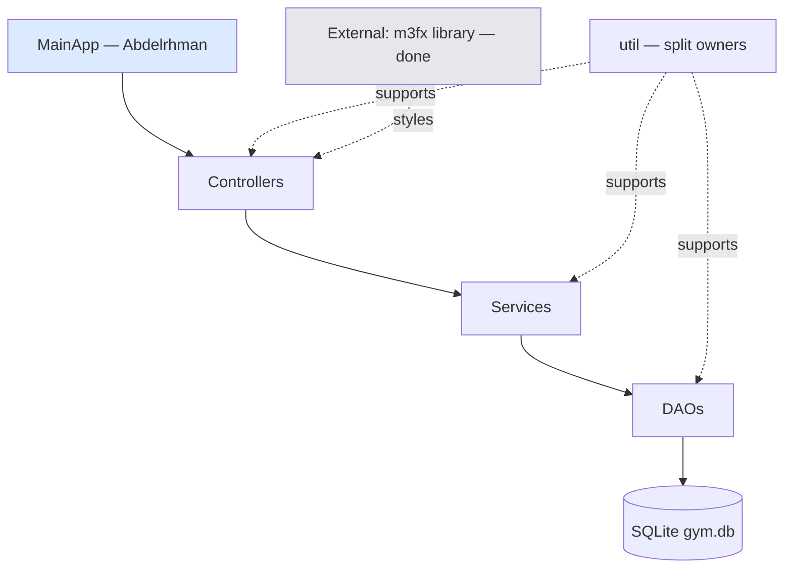

# UML — Team version (INTERNAL, not for submission)

> Same diagrams as `docs/UML.md`, color-coded per owner. Legend:
> blue = Abdelrhman · green = Ziad · amber = Yousef · violet = Abdel Raouf
> (applied via `classDef` fills in the rendered diagram).
> Notation: `-` private, `+` public, `o--` shared aggregation, `..>` dependency,
> `..|>` realization. Every class carries its description inside the diagram.

## 1. Layered architecture

## 2. Main diagram (domain story on one screen)

```mermaid
classDiagram
    direction TB
    class MainApp {
        <<Abdelrhman>>
        +start(Stage) void
        +main(String[]) void
    }
    class Customer {
        <<Abdelrhman>>
        -int id
        -String fullName
        -String phone
        -String email
        -String address
        -String dateOfBirth
        -String gender
        -String emergencyName
        -String emergencyPhone
        -String status
        -String joinDate
    }
    class Trainer {
        <<Ziad>>
        -int id
        -String fullName
        -String phone
        -String email
        -String specialization
        -int experienceYears
        -String certifications
        -String availability
        -String hireDate
        -double defaultRate
    }
    class Membership {
        <<Ziad>>
        -int id
        -int customerId
        -String plan
        -double price
        -String startDate
        -String endDate
        -String status
    }
    class WorkoutProgram {
        <<Yousef>>
        -int id
        -int customerId
        -int creatorTrainerId
        -String name
        -String exercises
        -int version
        -String createdDate
    }
    class Session {
        <<Yousef>>
        -int id
        -int customerId
        -int trainerId
        -String dateTime
        -int durationMin
        -String status
        -int subscriptionId
        -double price
    }
    class Equipment {
        <<Yousef>>
        -int id
        -String name
        -String category
        -String purchaseDate
        -String condition
        -String status
        -String lastMaintenance
    }
    class Attendance {
        <<Abdel Raouf>>
        -int id
        -String date
    }
    class Payment {
        <<Abdel Raouf>>
        -int id
        -int customerId
        -int membershipId
        -double amount
        -String method
        -String date
        -String receiptNo
    }
    class ProgressRecord {
        <<Abdel Raouf>>
        -int id
        -int customerId
        -String date
        -double weightKg
        -double bodyFatPct
        -String measurements
        -String notes
    }
    Customer "1" o-- "0..*" Membership : holds
    Customer "1" o-- "0..*" WorkoutProgram : follows
    Customer "1" o-- "0..*" Attendance : records
    Customer "1" o-- "0..*" ProgressRecord : tracks
    Customer "*" --> "0..1" Trainer : assigned to
    Membership "1" --> "0..*" Payment : paid by
    Trainer "1" --> "0..*" WorkoutProgram : creates
    Customer "1" --> "0..*" Session : books
    Trainer "1" --> "0..*" Session : coaches
    Customer "1" *-- "1" MedicalProfile : has
    Trainer --> MedicalProfile : views
    Customer "1" --> "0..*" TrainerSubscription : subscribes
    Trainer "1" --> "0..*" TrainerSubscription : offers
    TrainerSubscription "1" o-- "0..*" Session : covers
    Trainer "1" --> "0..*" TrainerAvailability : publishes
    note for MainApp "Entry point, window, nav shell, theme"
    note for Customer "Member: info, contact, status, links"
    note for Trainer "Coach: info, specialization, availability"
    note for Membership "Plan with start and end dates"
    note for WorkoutProgram "Exercise list with version, creator"
    class TrainerSubscription {
        <<Yousef>>
        -int id
        -int customerId
        -int trainerId
        -String startDate
        -String endDate
        -double rate
        -String status
    }
    class TrainerAvailability {
        <<Yousef>>
        -int id
        -int trainerId
        -String date
        -String startTime
        -String endTime
        -int maxCustomers
        -String status
    }
    note for Session "Booked slot, customer plus trainer"
    note for TrainerSubscription "Period engagement at flat trainer rate"
    note for TrainerAvailability "Open days, caps, hourly slots"
    class TrainerSubscription:::yousef
    class TrainerAvailability:::yousef
    note for Equipment "Inventory item, condition, status"
    note for Attendance "Daily check-in and check-out record"
    note for Payment "Amount, method and date per membership"
    class MedicalProfile {
        <<Abdelrhman>>
        -int id
        -int customerId
        -String bloodType
        -String conditions
        -String allergies
        -String medications
        -String injuries
        -String doctorName
        -String doctorPhone
        -String notes
        -String updatedDate
    }
    class Administrator {
        <<Abdelrhman>>
        -int id
        -String fullName
        -String username
        -String passwordHash
        -String role
        -String phone
        -String email
        -Boolean active
        -String createdDate
    }
    note for ProgressRecord "Dated body metrics and benchmarks"
    note for MedicalProfile "Blood type, conditions, meds, doctor"
    note for Administrator "Login identity, role, active flag"
    class MedicalProfile:::abdel
    class Administrator:::abdel
    classDef abdel fill:#dbeafe
    classDef ziad fill:#dcfce7
    classDef yousef fill:#fef3c7
    classDef raouf fill:#ede9fe
    class MainApp:::abdel
    class Customer:::abdel
    class Trainer:::ziad
    class Membership:::ziad
    class WorkoutProgram:::yousef
    class Session:::yousef
    class Equipment:::yousef
    class Attendance:::raouf
    class Payment:::raouf
    class ProgressRecord:::raouf
```

## 3. Domain model

```mermaid
classDiagram
    direction TB
    class Customer {
        <<Abdelrhman>>
        -int id
        -String fullName
        -String phone
        -String email
        -String address
        -String dateOfBirth
        -String gender
        -String emergencyName
        -String emergencyPhone
        -String status
        -String joinDate
    }
    class Trainer {
        <<Ziad>>
        -int id
        -String fullName
        -String phone
        -String email
        -String specialization
        -int experienceYears
        -String certifications
        -String availability
        -String hireDate
        -double defaultRate
    }
    class Membership {
        <<Ziad>>
        -int id
        -int customerId
        -String plan
        -double price
        -String startDate
        -String endDate
        -String status
    }
    class WorkoutProgram {
        <<Yousef>>
        -int id
        -int customerId
        -int creatorTrainerId
        -String name
        -String exercises
        -int version
        -String createdDate
    }
    class Session {
        <<Yousef>>
        -int id
        -int customerId
        -int trainerId
        -String dateTime
        -int durationMin
        -String status
        -int subscriptionId
        -double price
    }
    class Equipment {
        <<Yousef>>
        -int id
        -String name
        -String category
        -String purchaseDate
        -String condition
        -String status
        -String lastMaintenance
    }
    class Attendance {
        <<Abdel Raouf>>
        -int id
        -String date
        -String checkIn
        -String checkOut
    }
    class Payment {
        <<Abdel Raouf>>
        -int id
        -int customerId
        -int membershipId
        -double amount
        -String method
        -String date
        -String receiptNo
    }
    class ProgressRecord {
        <<Abdel Raouf>>
        -int id
        -int customerId
        -String date
        -double weightKg
        -double bodyFatPct
        -String measurements
        -String notes
    }
    Customer "1" o-- "0..*" Membership : holds
    Customer "1" o-- "0..*" WorkoutProgram : follows
    Customer "1" o-- "0..*" Attendance : records
    Customer "1" o-- "0..*" ProgressRecord : tracks
    Customer "*" --> "0..1" Trainer : assigned to
    Membership "1" --> "0..*" Payment : paid by
    Trainer "1" --> "0..*" WorkoutProgram : creates
    Customer "1" --> "0..*" Session : books
    Trainer "1" --> "0..*" Session : coaches
    Customer "1" *-- "1" MedicalProfile : has
    Trainer --> MedicalProfile : views
    Customer "1" --> "0..*" TrainerSubscription : subscribes
    Trainer "1" --> "0..*" TrainerSubscription : offers
    TrainerSubscription "1" o-- "0..*" Session : covers
    Trainer "1" --> "0..*" TrainerAvailability : publishes
    note for Customer "Member: info, contact, status, links"
    note for Trainer "Coach: info, specialization, availability"
    note for Membership "Plan with start and end dates"
    note for WorkoutProgram "Exercise list with version, creator"
    class TrainerSubscription {
        <<Yousef>>
        -int id
        -int customerId
        -int trainerId
        -String startDate
        -String endDate
        -double rate
        -String status
    }
    class TrainerAvailability {
        <<Yousef>>
        -int id
        -int trainerId
        -String date
        -String startTime
        -String endTime
        -int maxCustomers
        -String status
    }
    note for Session "Booked slot, customer plus trainer"
    note for TrainerSubscription "Period engagement at flat trainer rate"
    note for TrainerAvailability "Open days, caps, hourly slots"
    class TrainerSubscription:::yousef
    class TrainerAvailability:::yousef
    note for Equipment "Inventory item, condition, status"
    note for Attendance "Daily check-in and check-out record"
    note for Payment "Amount, method and date per membership"
    class MedicalProfile {
        <<Abdelrhman>>
        -int id
        -int customerId
        -String bloodType
        -String conditions
        -String allergies
        -String medications
        -String injuries
        -String doctorName
        -String doctorPhone
        -String notes
        -String updatedDate
    }
    class Administrator {
        <<Abdelrhman>>
        -int id
        -String fullName
        -String username
        -String passwordHash
        -String role
        -String phone
        -String email
        -Boolean active
        -String createdDate
    }
    note for ProgressRecord "Dated body metrics and benchmarks"
    note for MedicalProfile "Blood type, conditions, meds, doctor"
    note for Administrator "Login identity, role, active flag"
    class MedicalProfile:::abdel
    class Administrator:::abdel
    classDef abdel fill:#dbeafe
    classDef ziad fill:#dcfce7
    classDef yousef fill:#fef3c7
    classDef raouf fill:#ede9fe
    class Customer:::abdel
    class Trainer:::ziad
    class Membership:::ziad
    class WorkoutProgram:::yousef
    class Session:::yousef
    class Equipment:::yousef
    class Attendance:::raouf
    class Payment:::raouf
    class ProgressRecord:::raouf
```

## 4. DAO layer

```mermaid
classDiagram
    direction TB
    class DbConnection {
        <<Abdelrhman>>
        +getConnection() Connection
    }
    class DaoException {
        <<Abdelrhman>>
        +DaoException(String, Throwable)
    }
    class CustomerDao {
        <<Abdelrhman>>
        <<interface>>
        +save(Customer) int
        +findById(int) Customer
        +search(String) List~Customer~
    }
    class CustomerDaoImpl {
        <<Abdelrhman>>
        +save(Customer) int
        +findById(int) Customer
        +search(String) List~Customer~
    }
    class TrainerDao {
        <<Ziad>>
        <<interface>>
        +save(Trainer) int
        +findById(int) Trainer
        +findAll() List~Trainer~
    }
    class TrainerDaoImpl {
        <<Ziad>>
        +save(Trainer) int
        +findById(int) Trainer
        +findAll() List~Trainer~
    }
    class MembershipDao {
        <<Ziad>>
        <<interface>>
        +save(Membership) int
        +findExpiring(int) List~Membership~
    }
    class MembershipDaoImpl {
        <<Ziad>>
        +save(Membership) int
        +findExpiring(int) List~Membership~
    }
    class WorkoutProgramDao {
        <<Yousef>>
        <<interface>>
        +save(WorkoutProgram) int
    }
    class WorkoutProgramDaoImpl {
        <<Yousef>>
        +save(WorkoutProgram) int
    }
    class SessionDao {
        <<Yousef>>
        <<interface>>
        +save(Session) int
        +findByDay(String) List~Session~
    }
    class SessionDaoImpl {
        <<Yousef>>
        +save(Session) int
        +findByDay(String) List~Session~
    }
    class EquipmentDao {
        <<Yousef>>
        <<interface>>
        +save(Equipment) int
    }
    class EquipmentDaoImpl {
        <<Yousef>>
        +save(Equipment) int
    }
    class AttendanceDao {
        <<Abdel Raouf>>
        <<interface>>
        +save(Attendance) int
        +findByDay(String) List~Attendance~
    }
    class AttendanceDaoImpl {
        <<Abdel Raouf>>
        +save(Attendance) int
        +findByDay(String) List~Attendance~
    }
    class PaymentDao {
        <<Abdel Raouf>>
        <<interface>>
        +save(Payment) int
        +revenueBetween(String, String) double
    }
    class PaymentDaoImpl {
        <<Abdel Raouf>>
        +save(Payment) int
        +revenueBetween(String, String) double
    }
    class ProgressDao {
        <<Abdel Raouf>>
        <<interface>>
        +save(ProgressRecord) int
    }
    class ProgressDaoImpl {
        <<Abdel Raouf>>
        +save(ProgressRecord) int
    }
    class MedicalProfileDao {
        <<Abdelrhman>>
        <<interface>>
        +save(MedicalProfile) int
        +findByCustomer(int) MedicalProfile
    }
    class MedicalProfileDaoImpl {
        <<Abdelrhman>>
        +save(MedicalProfile) int
        +findByCustomer(int) MedicalProfile
    }
    class AdminDao {
        <<Abdelrhman>>
        <<interface>>
        +save(Administrator) int
        +findByUsername(String) Administrator
    }
    class AdminDaoImpl {
        <<Abdelrhman>>
        +save(Administrator) int
        +findByUsername(String) Administrator
    }
    class TrainerSubscriptionDao {
        <<Yousef>>
        <<interface>>
        +save(TrainerSubscription) int
        +findActive(int, String) TrainerSubscription
    }
    class TrainerSubscriptionDaoImpl {
        <<Yousef>>
        +save(TrainerSubscription) int
        +findActive(int, String) TrainerSubscription
    }
    class TrainerAvailabilityDao {
        <<Yousef>>
        <<interface>>
        +save(TrainerAvailability) int
        +openSlots(int, String) List~TrainerAvailability~
    }
    class TrainerAvailabilityDaoImpl {
        <<Yousef>>
        +save(TrainerAvailability) int
        +openSlots(int, String) List~TrainerAvailability~
    }
    CustomerDao <|.. CustomerDaoImpl : implements
    TrainerDao <|.. TrainerDaoImpl : implements
    MembershipDao <|.. MembershipDaoImpl : implements
    WorkoutProgramDao <|.. WorkoutProgramDaoImpl : implements
    SessionDao <|.. SessionDaoImpl : implements
    EquipmentDao <|.. EquipmentDaoImpl : implements
    AttendanceDao <|.. AttendanceDaoImpl : implements
    PaymentDao <|.. PaymentDaoImpl : implements
    ProgressDao <|.. ProgressDaoImpl : implements
    MedicalProfileDao <|.. MedicalProfileDaoImpl : implements
    AdminDao <|.. AdminDaoImpl : implements
    CustomerDaoImpl ..> DbConnection : uses
    TrainerDaoImpl ..> DbConnection : uses
    MembershipDaoImpl ..> DbConnection : uses
    WorkoutProgramDaoImpl ..> DbConnection : uses
    SessionDaoImpl ..> DbConnection : uses
    EquipmentDaoImpl ..> DbConnection : uses
    AttendanceDaoImpl ..> DbConnection : uses
    PaymentDaoImpl ..> DbConnection : uses
    ProgressDaoImpl ..> DbConnection : uses
    MedicalProfileDaoImpl ..> DbConnection : uses
    AdminDaoImpl ..> DbConnection : uses
    TrainerSubscriptionDao <|.. TrainerSubscriptionDaoImpl : implements
    TrainerAvailabilityDao <|.. TrainerAvailabilityDaoImpl : implements
    TrainerSubscriptionDaoImpl ..> DbConnection : uses
    TrainerAvailabilityDaoImpl ..> DbConnection : uses
    note for DbConnection "SQLite factory, creates gym.db, schema"
    note for DaoException "Unchecked SQLException wrapper"
    note for CustomerDao "Contract to save, find, search customers"
    note for CustomerDaoImpl "SQLite implementation, customers"
    note for TrainerDao "Contract to save, find trainers"
    note for TrainerDaoImpl "SQLite implementation, trainers"
    note for MembershipDao "Contract, expiring memberships query"
    note for MembershipDaoImpl "SQLite implementation, memberships"
    note for WorkoutProgramDao "Contract, programs per customer"
    note for WorkoutProgramDaoImpl "SQLite implementation, programs"
    note for SessionDao "Contract, sessions by trainer, day"
    note for SessionDaoImpl "SQLite implementation, sessions"
    note for EquipmentDao "Contract to save, list equipment"
    note for EquipmentDaoImpl "SQLite implementation, equipment"
    note for AttendanceDao "Contract, daily attendance lists"
    note for AttendanceDaoImpl "SQLite implementation, attendance"
    note for PaymentDao "Contract, revenue over date ranges"
    note for PaymentDaoImpl "SQLite implementation, payments"
    note for ProgressDao "Contract, history per customer"
    note for ProgressDaoImpl "SQLite implementation, progress"
    note for MedicalProfileDao "Contract, profile per customer"
    note for MedicalProfileDaoImpl "SQLite implementation, medical"
    note for AdminDao "Contract, lookup by username"
    note for AdminDaoImpl "SQLite implementation, admins"
    note for TrainerSubscriptionDao "Contract, engagements and active lookup"
    note for TrainerSubscriptionDaoImpl "SQLite implementation, subscriptions"
    note for TrainerAvailabilityDao "Contract, slots, caps, open days"
    note for TrainerAvailabilityDaoImpl "SQLite implementation, availability"
    class TrainerSubscriptionDao:::yousef
    class TrainerSubscriptionDaoImpl:::yousef
    class TrainerAvailabilityDao:::yousef
    class TrainerAvailabilityDaoImpl:::yousef
    class MedicalProfileDao:::abdel
    class MedicalProfileDaoImpl:::abdel
    class AdminDao:::abdel
    class AdminDaoImpl:::abdel
    classDef abdel fill:#dbeafe
    classDef ziad fill:#dcfce7
    classDef yousef fill:#fef3c7
    classDef raouf fill:#ede9fe
    class DbConnection:::abdel
    class DaoException:::abdel
    class CustomerDao:::abdel
    class CustomerDaoImpl:::abdel
    class TrainerDao:::ziad
    class TrainerDaoImpl:::ziad
    class MembershipDao:::ziad
    class MembershipDaoImpl:::ziad
    class WorkoutProgramDao:::yousef
    class WorkoutProgramDaoImpl:::yousef
    class SessionDao:::yousef
    class SessionDaoImpl:::yousef
    class EquipmentDao:::yousef
    class EquipmentDaoImpl:::yousef
    class AttendanceDao:::raouf
    class AttendanceDaoImpl:::raouf
    class PaymentDao:::raouf
    class PaymentDaoImpl:::raouf
    class ProgressDao:::raouf
    class ProgressDaoImpl:::raouf
```

## 5. Service layer

```mermaid
classDiagram
    direction TB
    class CustomerService {
        <<Abdelrhman>>
        +validate(Customer) List~String~
        +search(String) List~Customer~
    }
    class TrainerService {
        <<Ziad>>
        +checkAvailability(int, String) Boolean
        +assignCustomer(int, int) void
        +viewMedicalProfile(int, int) MedicalProfile
        +setAvailability(int, String) void
        +setRate(int, double) void
    }
    class MembershipService {
        <<Ziad>>
        +sell(int, String) Membership
        +renew(int) void
        +freeze(int) void
        +cancel(int) void
        +expiryReminders() List~Membership~
    }
    class WorkoutService {
        <<Yousef>>
        +buildProgram(int, String) WorkoutProgram
        +newVersion(int) WorkoutProgram
    }
    class SchedulingService {
        <<Yousef>>
        +book(int, int, String) Session
        +detectConflicts(int, String) List~Session~
        +subscribe(int, int, String, String, double) TrainerSubscription
        +subscriptionPrice(int) double
    }
    class EquipmentService {
        <<Yousef>>
        +changeStatus(int, String) void
        +logMaintenance(int, String) void
    }
    class AttendanceService {
        <<Abdel Raouf>>
        +checkIn(int) Attendance
        +checkOut(int) void
        +dailyReport(String) List~Attendance~
    }
    class PaymentService {
        <<Abdel Raouf>>
        +record(Payment) int
        +balance(int) double
        +revenueSummary() String
    }
    class ProgressService {
        <<Abdel Raouf>>
        +aggregate(int) List~ProgressRecord~
    }
    class MedicalProfileService {
        <<Abdelrhman>>
        +save(MedicalProfile) int
        +getByCustomer(int) MedicalProfile
    }
    class AdminService {
        <<Abdelrhman>>
        +authenticate(String, String) Administrator
        +saveStaff(Administrator) int
        +editAny(String, int) void
        +reassignTrainer(int, int) void
        +adjustPayment(int, double) void
        +voidRecord(String, int) void
    }
    note for CustomerService "Validation, search, status rules"
    note for TrainerService "Availability, assign, medical view"
    note for MembershipService "Sell, renew, freeze, cancel, reminders"
    note for WorkoutService "Build programs, versioning"
    note for SchedulingService "Booking, conflict detection"
    note for EquipmentService "Status changes, maintenance log"
    note for AttendanceService "Check-in and out, daily report"
    note for PaymentService "Record, balances, revenue summary"
    note for ProgressService "Metric aggregation for charts"
    note for MedicalProfileService "Medical CRUD, lookup by customer"
    note for AdminService "Authenticate, manage staff"
    class MedicalProfileService:::abdel
    class AdminService:::abdel
    classDef abdel fill:#dbeafe
    classDef ziad fill:#dcfce7
    classDef yousef fill:#fef3c7
    classDef raouf fill:#ede9fe
    class CustomerService:::abdel
    class TrainerService:::ziad
    class MembershipService:::ziad
    class WorkoutService:::yousef
    class SchedulingService:::yousef
    class EquipmentService:::yousef
    class AttendanceService:::raouf
    class PaymentService:::raouf
    class ProgressService:::raouf
```

## 6. Controllers

```mermaid
classDiagram
    direction TB
    class MainApp {
        <<Abdelrhman>>
        +start(Stage) void
        +main(String[]) void
    }
    class DashboardController {
        <<Abdel Raouf>>
        +initialize() void
    }
    class CustomerListController {
        <<Abdelrhman>>
        +initialize() void
        +onSearch() void
    }
    class CustomerProfileController {
        <<Abdelrhman>>
        +showCustomer(int) void
        +onSave() void
    }
    class TrainerListController {
        <<Ziad>>
        +initialize() void
    }
    class TrainerProfileController {
        <<Ziad>>
        +showTrainer(int) void
        +onSave() void
    }
    class MembershipController {
        <<Ziad>>
        +onSell() void
        +onRenew() void
        +onFreeze() void
    }
    class WorkoutController {
        <<Yousef>>
        +onBuild() void
        +onAssign() void
    }
    class ScheduleController {
        <<Yousef>>
        +onBook() void
    }
    class AvailabilityController {
        <<Ziad>>
        +setCalendar(int, String) void
        +setDailyCap(int, String, int) void
        +setSlots(int, String, String) void
    }
    class EquipmentController {
        <<Yousef>>
        +onStatusChange() void
    }
    class AttendanceController {
        <<Abdel Raouf>>
        +onCheckIn() void
        +onCheckOut() void
    }
    class PaymentController {
        <<Abdel Raouf>>
        +onRecord() void
    }
    class ProgressController {
        <<Abdel Raouf>>
        +showProgress(int) void
    }
    MainApp ..> DashboardController : opens
    CustomerListController ..> CustomerProfileController : opens
    TrainerListController ..> TrainerProfileController : opens
    note for MainApp "Entry point, window, nav shell, theme"
    note for DashboardController "Members, sessions, revenue snapshot"
    note for CustomerListController "Searchable customer list"
    note for CustomerProfileController "Full member profile screen"
    note for TrainerListController "Trainer roster, availability"
    note for TrainerProfileController "Trainer details and customers"
    note for MembershipController "Plans, sell, renew, freeze"
    note for WorkoutController "Program builder, assignment"
    note for ScheduleController "Agenda, booking with conflicts"
    note for AvailabilityController "Calendar, caps, slots UI"
    class AvailabilityController:::ziad
    note for EquipmentController "Inventory, status, maintenance"
    note for AttendanceController "Check-in screen, daily report"
    note for PaymentController "Record payments, receipts"
    note for ProgressController "Body-metric charts screen"
    classDef abdel fill:#dbeafe
    classDef ziad fill:#dcfce7
    classDef yousef fill:#fef3c7
    classDef raouf fill:#ede9fe
    class MainApp:::abdel
    class DashboardController:::raouf
    class CustomerListController:::abdel
    class CustomerProfileController:::abdel
    class TrainerListController:::ziad
    class TrainerProfileController:::ziad
    class MembershipController:::ziad
    class WorkoutController:::yousef
    class ScheduleController:::yousef
    class EquipmentController:::yousef
    class AttendanceController:::raouf
    class PaymentController:::raouf
    class ProgressController:::raouf
```

## 7. Who does what (checklist)

| Area | Owner | Status |
|---|---|---|
| Foundation: `DbConnection`, `DaoException`, `Validators`, `FxUtils`, `MainApp` shell, m3fx already built | Abdelrhman | In progress |
| `Customer` + DAO + service + list/profile screens | Abdelrhman | To do |
| `Trainer`, `Membership` + DAOs + services + screens | Ziad | To do |
| `WorkoutProgram`, `Session`, `Equipment` + DAOs + services + screens; `DateUtils` | Yousef | To do |
| `Attendance`, `Payment`, `ProgressRecord` + DAOs + services + screens; dashboard; `ChartUtils` | Abdel Raouf | To do |
| `TrainerSubscription` + availability stack (entities, DAOs, booking rules) | Yousef | To Do |
| `AvailabilityController` screen + admin override methods | Ziad (screen), Abdelrhman (overrides) | To Do |
| `MedicalProfile` stack (entity, DAO, service) + trainer medical view support | Abdelrhman (+ Ziad view method) | To do |
| `Administrator` stack (entity, DAO, `AdminService`) — foundation, no login UI | Abdelrhman | To do |

Rules: JavaFX-first per vertical slice, then each owner ports their own modules to the `swing` branch. Update the Status column as work moves.
