# UML — Team version (INTERNAL, not for submission)

> **This file no longer duplicates the class diagrams.** They used to be copied here verbatim with
> colour added, which is how `PlanType`'s accessors drifted from `PlanType` to `String` and how six
> enum notes went missing. The master diagrams now live in **`docs/UML.md` only** — one copy each:
>
> | Diagram | Where | Was also here as |
> |---|---|---|
> | Main domain model | `UML.md` §1 | §2 "Main diagram" |
> | Layered architecture | `UML.md` §2 | §1 |
> | Data access | `UML.md` §3 | §4 |
> | Service layer | `UML.md` §5 | §5 |
> | Controllers | `UML.md` §5 | §6 |
> | Utilities | `UML.md` §6 | — |
>
> What stays here: **who owns what** (below), and the ownership overlay for slide decks.
> Agreed business rules moved to `UML.md` → "Business rules" so the submitted document states them.

## Ownership legend

blue = Abdelrhman · green = Ziad · amber = Yousef · violet = Abdel Raouf

## Ownership overlay (domain model)

Colour-only view of `UML.md` §1. No members are repeated here, so it cannot drift.

```mermaid
classDiagram
    direction TB
    class MainApp
    class Customer
    class Trainer
    class Membership
    class WorkoutProgram
    class Session
    class Equipment
    class Attendance
    class Payment
    class ProgressRecord
    class MedicalProfile
    class Administrator
    class TrainerSubscription
    class TrainerAvailability
    class CustomerStatus
    class MembershipStatus
    class PlanType
    class SessionStatus
    class SubscriptionStatus
    class AvailabilityStatus
    class StaffRole
    class PaymentMethod
    class EquipmentStatus
    class EquipmentCondition
    classDef abdel fill:#dbeafe
    classDef ziad fill:#dcfce7
    classDef yousef fill:#fef3c7
    classDef raouf fill:#ede9fe
    class MainApp:::abdel
    class Customer:::abdel
    class MedicalProfile:::abdel
    class Administrator:::abdel
    class CustomerStatus:::abdel
    class MembershipStatus:::ziad
    class PlanType:::ziad
    class Trainer:::ziad
    class Membership:::ziad
    class WorkoutProgram:::yousef
    class Session:::yousef
    class Equipment:::yousef
    class SessionStatus:::yousef
    class SubscriptionStatus:::yousef
    class AvailabilityStatus:::yousef
    class TrainerSubscription:::yousef
    class TrainerAvailability:::yousef
    class Attendance:::raouf
    class Payment:::raouf
    class ProgressRecord:::raouf
    class StaffRole:::raouf
    class PaymentMethod:::raouf
    class EquipmentStatus:::raouf
    class EquipmentCondition:::raouf
```

Shared enumerations (`CustomerStatus` with Abdelrhman, `StaffRole`/`PaymentMethod`/
`EquipmentStatus`/`EquipmentCondition` with Abdel Raouf) are owned by whoever first needs them;
add a literal only after telling the other three.

## Layer ownership

| Layer | Owner | Notes |
|---|---|---|
| `util/DbConnection`, `SqliteDbConnection`, `DaoException`, `Validators`, `SessionContext`, `PasswordUtils` | Abdelrhman | Foundation — everyone blocks on this in Week 1 |
| `util/FxUtils` | Abdelrhman | The only JavaFX-aware utility |
| `util/DateUtils` | Yousef | Date parsing and slot math |
| `util/ChartUtils` | Abdel Raouf | Formatting only — no DAO access |
| `model`, `dao`, `service`, `controller` for each area | see the tables below | One owner per vertical slice |
| `MainApp` shell + m3fx wiring | Abdelrhman | m3fx itself is already built |

## Who does what (checklist)

| Area | Owner | Status |
|---|---|---|
| Foundation: `DbConnection`, `SqliteDbConnection`, `DaoException`, `Validators`, `FxUtils`, `SessionContext`, `PasswordUtils`, `MainApp` shell, m3fx already built | Abdelrhman | In progress |
| `Customer` (+ trainerId) + DAO + service + list/profile screens | Abdelrhman | To do |
| `Trainer`, `Membership` (+ `PlanType` enum) + DAOs + services + screens | Ziad | To do |
| `WorkoutProgram`, `Session`, `Equipment` + DAOs + services + screens; `DateUtils` | Yousef | To do |
| `Attendance`, `Payment` (nullable links + voided) + DAOs + services + screens; dashboard; `ChartUtils` | Abdel Raouf | To do |
| `TrainerSubscription` + availability stack (entities, DAOs, booking rules) | Yousef | To do |
| `AvailabilityController` screen + admin override methods | Ziad (screen), Abdelrhman (overrides) | To do |
| `StaffController` screen + admin overrides | Abdelrhman | To do |
| `MedicalProfile` stack (entity, DAO, service, controller) + trainer medical view support | Abdelrhman (+ Ziad view method) | To do |
| `Administrator` stack (entity, DAO, `AdminService`, `LoginController`) | Abdelrhman | To do |
| Session reservation flow (reserve, availability check, cancel with reason) | Yousef (`SchedulingService` + `ScheduleController`) | To do |

Rules: JavaFX-first per vertical slice, then each owner ports their own modules to the `swing`
branch. Update the Status column as work moves. `swing` currently has **no `.java` files** — the
port has not started, so the branch README claim "keep entities identical" is still untested.

## Open business-rule decisions

**Resolved — all sixteen now live in `docs/UML.md` → "Business rules".** Do not re-decide them here;
change them there so the submitted document and the team stay in sync. The section below is kept
only as a pointer so anyone with the old link lands somewhere useful.

| Was | Now |
|---|---|
| `book` vs `requestSession` vs `reserveSession` | `UML.md` rule 1 |
| `SessionStatus.NO_SHOW` | rule 2 |
| `Customer *-- MedicalProfile` mandatory? | rule 3 |
| Meaning of "delete" | rule 4 |
| `checkIn` requires ACTIVE membership? | rule 5 |
| `balance(int)` definition | rule 6 |
| Does `freeze` pause `endDate`? | rule 7 |
| Several slots per day or one window? | rule 8 |
| Date/time format standard | rule 9 |
| Session cancellation window | rule 10 |
| Covered session pricing | rule 11 |
| Payment link XOR | rule 12 |
| Derived enum literals | rule 13 |
| Suspended customer vs frozen membership | rule 14 |
| Which trainer link is authoritative | rule 15 |
| Role enforcement | rule 16 |

Two rules changed behaviour relative to the old table, and both are now in `UML.md`:

- **Rule 3** accepted `0..1` for `MedicalProfile` (it was already drawn `*-- "1"` in the diagram).
- **Rule 8** resolves the "daily cap vs per-slot cap" contradiction: `maxCustomers` is per slot, and
  `setDailyCap` applies one value across a day's slots. `TrainerAvailabilityDao.findByTrainerAndDate`
  returns a **list**, not a single row.
