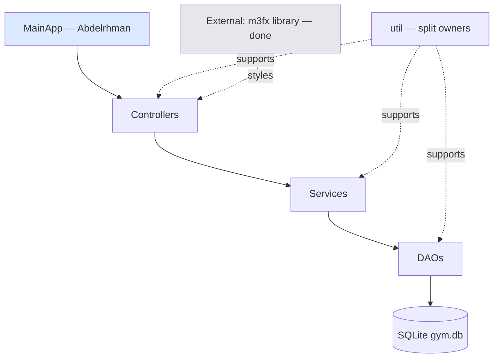
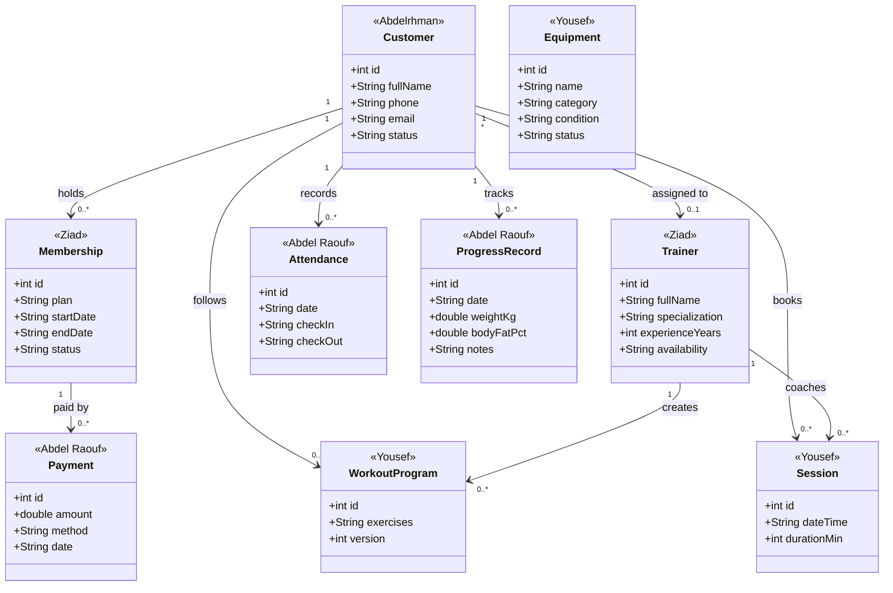
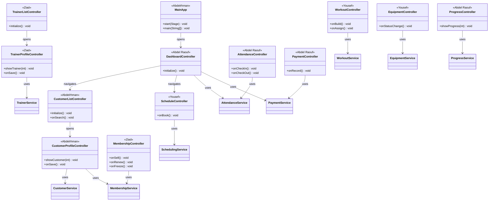

# UML — Team version (INTERNAL, not for submission)

> Same diagrams as `docs/UML.md`, color-coded per owner. Legend:
> Abdelrhman · Ziad · Yousef · Abdel Raouf
> (blue / green / amber / violet in the rendered diagram).

## 1. Layered architecture

## 2. Domain model

## 3. DAO layer

```mermaid
classDiagram
    class DbConnection {
        <<Abdelrhman>>
        +getConnection() Connection
        +initSchema() void
    }
    class DaoException {
        <<Abdelrhman>>
        +DaoException(String, Throwable)
    }
    class CustomerDao {
        <<Abdelrhman>>
        <<interface>>
        +save(Customer) int
        +findById(int) Customer
        +findAll() List
        +search(String) List
    }
    class CustomerDaoImpl {
        <<Abdelrhman>>
        +save(Customer) int
        +findById(int) Customer
        +findAll() List
        +search(String) List
    }
    class TrainerDao {
        <<Ziad>>
        <<interface>>
        +save(Trainer) int
        +findById(int) Trainer
        +findAll() List
    }
    class TrainerDaoImpl {
        <<Ziad>>
        +save(Trainer) int
        +findById(int) Trainer
        +findAll() List
    }
    class MembershipDao {
        <<Ziad>>
        <<interface>>
        +save(Membership) int
        +findExpiring(int) List
    }
    class MembershipDaoImpl {
        <<Ziad>>
        +save(Membership) int
        +findExpiring(int) List
    }
    class WorkoutProgramDao {
        <<Yousef>>
        <<interface>>
        +save(WorkoutProgram) int
        +findByCustomer(int) List
    }
    class WorkoutProgramDaoImpl {
        <<Yousef>>
        +save(WorkoutProgram) int
        +findByCustomer(int) List
    }
    class SessionDao {
        <<Yousef>>
        <<interface>>
        +save(Session) int
        +findByTrainer(int) List
        +findByDay(String) List
    }
    class SessionDaoImpl {
        <<Yousef>>
        +save(Session) int
        +findByTrainer(int) List
        +findByDay(String) List
    }
    class EquipmentDao {
        <<Yousef>>
        <<interface>>
        +save(Equipment) int
        +findAll() List
    }
    class EquipmentDaoImpl {
        <<Yousef>>
        +save(Equipment) int
        +findAll() List
    }
    class AttendanceDao {
        <<Abdel Raouf>>
        <<interface>>
        +save(Attendance) int
        +findByDay(String) List
    }
    class AttendanceDaoImpl {
        <<Abdel Raouf>>
        +save(Attendance) int
        +findByDay(String) List
    }
    class PaymentDao {
        <<Abdel Raouf>>
        <<interface>>
        +save(Payment) int
        +revenueBetween(String, String) double
    }
    class PaymentDaoImpl {
        <<Abdel Raouf>>
        +save(Payment) int
        +revenueBetween(String, String) double
    }
    class ProgressDao {
        <<Abdel Raouf>>
        <<interface>>
        +save(ProgressRecord) int
        +findByCustomer(int) List
    }
    class ProgressDaoImpl {
        <<Abdel Raouf>>
        +save(ProgressRecord) int
        +findByCustomer(int) List
    }
    CustomerDao <|.. CustomerDaoImpl : implements
    TrainerDao <|.. TrainerDaoImpl : implements
    MembershipDao <|.. MembershipDaoImpl : implements
    WorkoutProgramDao <|.. WorkoutProgramDaoImpl : implements
    SessionDao <|.. SessionDaoImpl : implements
    EquipmentDao <|.. EquipmentDaoImpl : implements
    AttendanceDao <|.. AttendanceDaoImpl : implements
    PaymentDao <|.. PaymentDaoImpl : implements
    ProgressDao <|.. ProgressDaoImpl : implements
    CustomerDaoImpl --> DbConnection : uses
    TrainerDaoImpl --> DbConnection : uses
    MembershipDaoImpl --> DbConnection : uses
    WorkoutProgramDaoImpl --> DbConnection : uses
    SessionDaoImpl --> DbConnection : uses
    EquipmentDaoImpl --> DbConnection : uses
    AttendanceDaoImpl --> DbConnection : uses
    PaymentDaoImpl --> DbConnection : uses
    ProgressDaoImpl --> DbConnection : uses
    classDef abdel fill:#dbeafe
    classDef ziad fill:#dcfce7
    classDef yousef fill:#fef3c7
    classDef raouf fill:#ede9fe
    class DbConnection:::abdel
    class DaoException:::abdel
    class CustomerDao:::abdel
    class CustomerDaoImpl:::abdel
    class TrainerDao:::ziad
    class TrainerDaoImpl:::ziad
    class MembershipDao:::ziad
    class MembershipDaoImpl:::ziad
    class WorkoutProgramDao:::yousef
    class WorkoutProgramDaoImpl:::yousef
    class SessionDao:::yousef
    class SessionDaoImpl:::yousef
    class EquipmentDao:::yousef
    class EquipmentDaoImpl:::yousef
    class AttendanceDao:::raouf
    class AttendanceDaoImpl:::raouf
    class PaymentDao:::raouf
    class PaymentDaoImpl:::raouf
    class ProgressDao:::raouf
    class ProgressDaoImpl:::raouf
```

## 4. Service layer

```mermaid
classDiagram
    class CustomerService {
        <<Abdelrhman>>
        +validate(Customer) List
        +search(String) List
        +setStatus(int, String) void
    }
    class TrainerService {
        <<Ziad>>
        +checkAvailability(int, String) bool
        +assignCustomer(int, int) void
    }
    class MembershipService {
        <<Ziad>>
        +sell(int, String) Membership
        +renew(int) void
        +freeze(int) void
        +cancel(int) void
        +expiryReminders() List
    }
    class WorkoutService {
        <<Yousef>>
        +buildProgram(int, String) WorkoutProgram
        +newVersion(int) WorkoutProgram
    }
    class SchedulingService {
        <<Yousef>>
        +book(int, int, String) Session
        +detectConflicts(int, String) List
    }
    class EquipmentService {
        <<Yousef>>
        +changeStatus(int, String) void
        +logMaintenance(int, String) void
    }
    class AttendanceService {
        <<Abdel Raouf>>
        +checkIn(int) Attendance
        +checkOut(int) void
        +dailyReport(String) List
    }
    class PaymentService {
        <<Abdel Raouf>>
        +record(Payment) int
        +balance(int) double
        +revenueSummary() String
    }
    class ProgressService {
        <<Abdel Raouf>>
        +aggregate(int) List
        +chartData(int) List
    }
    CustomerService --> CustomerDao : uses
    TrainerService --> TrainerDao : uses
    MembershipService --> MembershipDao : uses
    WorkoutService --> WorkoutProgramDao : uses
    SchedulingService --> SessionDao : uses
    EquipmentService --> EquipmentDao : uses
    AttendanceService --> AttendanceDao : uses
    PaymentService --> PaymentDao : uses
    ProgressService --> ProgressDao : uses
    MembershipService --> PaymentDao : uses
    SchedulingService --> TrainerDao : uses
    classDef abdel fill:#dbeafe
    classDef ziad fill:#dcfce7
    classDef yousef fill:#fef3c7
    classDef raouf fill:#ede9fe
    class CustomerService:::abdel
    class TrainerService:::ziad
    class MembershipService:::ziad
    class WorkoutService:::yousef
    class SchedulingService:::yousef
    class EquipmentService:::yousef
    class AttendanceService:::raouf
    class PaymentService:::raouf
    class ProgressService:::raouf
```

## 5. Controllers

## 6. Who does what (checklist)

| Area | Owner | Status |
|---|---|---|
| Foundation: `DbConnection`, `DaoException`, `Validators`, `FxUtils`, `MainApp` shell, m3fx already built | Abdelrhman | In progress |
| `Customer` + DAO + service + list/profile screens | Abdelrhman | To do |
| `Trainer`, `Membership` + DAOs + services + screens | Ziad | To do |
| `WorkoutProgram`, `Session`, `Equipment` + DAOs + services + screens; `DateUtils` | Yousef | To do |
| `Attendance`, `Payment`, `ProgressRecord` + DAOs + services + screens; dashboard; `ChartUtils` | Abdel Raouf | To do |

Rules: JavaFX-first per vertical slice, then each owner ports their own modules to the `swing` branch. Update the Status column as work moves.
