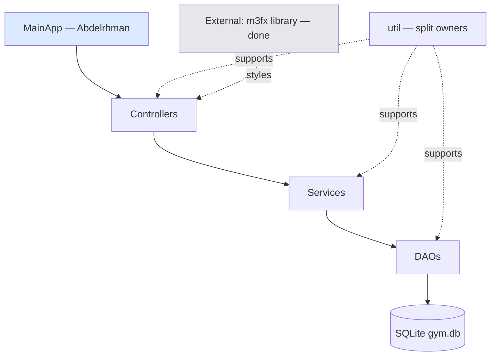

# UML — Team version (INTERNAL, not for submission)

> Same diagrams as `docs/UML.md`, color-coded per owner. Legend:
> blue = Abdelrhman · green = Ziad · amber = Yousef · violet = Abdel Raouf
> (applied via `classDef` fills in the rendered diagram).
> Notation: `-` private, `+` public, `o--` shared aggregation, `..>` dependency,
> `..|>` realization. Every class carries its description inside the diagram.
> All entity methods (getters, setters, constructors, toString, equals, hashCode) are shown.

## 1. Layered architecture



## 2. Main diagram (domain story on one screen)

```mermaid
classDiagram
    direction TB
    class MainApp {
        <<Abdelrhman>>
        +start(Stage) void
        +main(String[]) void
    }
    class Customer {
        <<Abdelrhman>>
        -int id
        -String fullName
        -String phone
        -String email
        -String address
        -String dateOfBirth
        -String gender
        -String emergencyName
        -String emergencyPhone
        -CustomerStatus status
        -String joinDate
        +Customer()
        +Customer(int, String, String, String, String, String, String, String, String, CustomerStatus, String)
        +getId() int
        +setId(int) void
        +getFullName() String
        +setFullName(String) void
        +getPhone() String
        +setPhone(String) void
        +getEmail() String
        +setEmail(String) void
        +getAddress() String
        +setAddress(String) void
        +getDateOfBirth() String
        +setDateOfBirth(String) void
        +getGender() String
        +setGender(String) void
        +getEmergencyName() String
        +setEmergencyName(String) void
        +getEmergencyPhone() String
        +setEmergencyPhone(String) void
        +getStatus() CustomerStatus
        +setStatus(CustomerStatus) void
        +getJoinDate() String
        +setJoinDate(String) void
        +toString() String
        +equals(Object) boolean
        +hashCode() int
    }
    class Trainer {
        <<Ziad>>
        -int id
        -String fullName
        -String phone
        -String email
        -String specialization
        -int experienceYears
        -String certifications
        -String availability
        -String hireDate
        -double defaultRate
        +Trainer()
        +Trainer(int, String, String, String, String, int, String, String, String, double)
        +getId() int
        +setId(int) void
        +getFullName() String
        +setFullName(String) void
        +getPhone() String
        +setPhone(String) void
        +getEmail() String
        +setEmail(String) void
        +getSpecialization() String
        +setSpecialization(String) void
        +getExperienceYears() int
        +setExperienceYears(int) void
        +getCertifications() String
        +setCertifications(String) void
        +getAvailability() String
        +setAvailability(String) void
        +getHireDate() String
        +setHireDate(String) void
        +getDefaultRate() double
        +setDefaultRate(double) void
        +toString() String
        +equals(Object) boolean
        +hashCode() int
    }
    class Membership {
        <<Ziad>>
        -int id
        -int customerId
        -String plan
        -double price
        -String startDate
        -String endDate
        -MembershipStatus status
        +Membership()
        +Membership(int, int, String, double, String, String, MembershipStatus)
        +getId() int
        +setId(int) void
        +getCustomerId() int
        +setCustomerId(int) void
        +getPlan() String
        +setPlan(String) void
        +getPrice() double
        +setPrice(double) void
        +getStartDate() String
        +setStartDate(String) void
        +getEndDate() String
        +setEndDate(String) void
        +getStatus() MembershipStatus
        +setStatus(MembershipStatus) void
        +toString() String
        +equals(Object) boolean
        +hashCode() int
    }
    class WorkoutProgram {
        <<Yousef>>
        -int id
        -int customerId
        -int creatorTrainerId
        -String name
        -String exercises
        -int version
        -String createdDate
        +WorkoutProgram()
        +WorkoutProgram(int, int, int, String, String, int, String)
        +getId() int
        +setId(int) void
        +getCustomerId() int
        +setCustomerId(int) void
        +getCreatorTrainerId() int
        +setCreatorTrainerId(int) void
        +getName() String
        +setName(String) void
        +getExercises() String
        +setExercises(String) void
        +getVersion() int
        +setVersion(int) void
        +getCreatedDate() String
        +setCreatedDate(String) void
        +toString() String
        +equals(Object) boolean
        +hashCode() int
    }
    class Session {
        <<Yousef>>
        -int id
        -int customerId
        -int trainerId
        -String dateTime
        -int durationMin
        -SessionStatus status
        -Integer subscriptionId
        -double price
        -String cancelReason
        -String sessionNotes
        +Session()
        +Session(int, int, int, String, int, SessionStatus, Integer, double, String, String)
        +getId() int
        +setId(int) void
        +getCustomerId() int
        +setCustomerId(int) void
        +getTrainerId() int
        +setTrainerId(int) void
        +getDateTime() String
        +setDateTime(String) void
        +getDurationMin() int
        +setDurationMin(int) void
        +getStatus() SessionStatus
        +setStatus(SessionStatus) void
        +getSubscriptionId() Integer
        +setSubscriptionId(Integer) void
        +getPrice() double
        +setPrice(double) void
        +getCancelReason() String
        +setCancelReason(String) void
        +getSessionNotes() String
        +setSessionNotes(String) void
        +toString() String
        +equals(Object) boolean
        +hashCode() int
    }
    class Equipment {
        <<Yousef>>
        -int id
        -String name
        -String category
        -String purchaseDate
        -EquipmentCondition condition
        -EquipmentStatus status
        -String lastMaintenance
        +Equipment()
        +Equipment(int, String, String, String, EquipmentCondition, EquipmentStatus, String)
        +getId() int
        +setId(int) void
        +getName() String
        +setName(String) void
        +getCategory() String
        +setCategory(String) void
        +getPurchaseDate() String
        +setPurchaseDate(String) void
        +getCondition() EquipmentCondition
        +setCondition(EquipmentCondition) void
        +getStatus() EquipmentStatus
        +setStatus(EquipmentStatus) void
        +getLastMaintenance() String
        +setLastMaintenance(String) void
        +toString() String
        +equals(Object) boolean
        +hashCode() int
    }
    class Attendance {
        <<Abdel Raouf>>
        -int id
        -int customerId
        -String date
        -String checkIn
        -String checkOut
        +Attendance()
        +Attendance(int, int, String, String, String)
        +getId() int
        +setId(int) void
        +getCustomerId() int
        +setCustomerId(int) void
        +getDate() String
        +setDate(String) void
        +getCheckIn() String
        +setCheckIn(String) void
        +getCheckOut() String
        +setCheckOut(String) void
        +toString() String
        +equals(Object) boolean
        +hashCode() int
    }
    class Payment {
        <<Abdel Raouf>>
        -int id
        -int customerId
        -int membershipId
        -double amount
        -PaymentMethod method
        -String date
        -String receiptNo
        +Payment()
        +Payment(int, int, int, double, PaymentMethod, String, String)
        +getId() int
        +setId(int) void
        +getCustomerId() int
        +setCustomerId(int) void
        +getMembershipId() int
        +setMembershipId(int) void
        +getAmount() double
        +setAmount(double) void
        +getMethod() PaymentMethod
        +setMethod(PaymentMethod) void
        +getDate() String
        +setDate(String) void
        +getReceiptNo() String
        +setReceiptNo(String) void
        +toString() String
        +equals(Object) boolean
        +hashCode() int
    }
    class ProgressRecord {
        <<Abdel Raouf>>
        -int id
        -int customerId
        -String date
        -double weightKg
        -double bodyFatPct
        -String measurements
        -String notes
        +ProgressRecord()
        +ProgressRecord(int, int, String, double, double, String, String)
        +getId() int
        +setId(int) void
        +getCustomerId() int
        +setCustomerId(int) void
        +getDate() String
        +setDate(String) void
        +getWeightKg() double
        +setWeightKg(double) void
        +getBodyFatPct() double
        +setBodyFatPct(double) void
        +getMeasurements() String
        +setMeasurements(String) void
        +getNotes() String
        +setNotes(String) void
        +toString() String
        +equals(Object) boolean
        +hashCode() int
    }
    class MedicalProfile {
        <<Abdelrhman>>
        -int id
        -int customerId
        -String bloodType
        -String conditions
        -String allergies
        -String medications
        -String injuries
        -String doctorName
        -String doctorPhone
        -String notes
        -String updatedDate
        +MedicalProfile()
        +MedicalProfile(int, int, String, String, String, String, String, String, String, String, String)
        +getId() int
        +setId(int) void
        +getCustomerId() int
        +setCustomerId(int) void
        +getBloodType() String
        +setBloodType(String) void
        +getConditions() String
        +setConditions(String) void
        +getAllergies() String
        +setAllergies(String) void
        +getMedications() String
        +setMedications(String) void
        +getInjuries() String
        +setInjuries(String) void
        +getDoctorName() String
        +setDoctorName(String) void
        +getDoctorPhone() String
        +setDoctorPhone(String) void
        +getNotes() String
        +setNotes(String) void
        +getUpdatedDate() String
        +setUpdatedDate(String) void
        +toString() String
        +equals(Object) boolean
        +hashCode() int
    }
    class Administrator {
        <<Abdelrhman>>
        -int id
        -String fullName
        -String username
        -String passwordHash
        -StaffRole role
        -String phone
        -String email
        -Boolean active
        -String createdDate
        +Administrator()
        +Administrator(int, String, String, String, StaffRole, String, String, Boolean, String)
        +getId() int
        +setId(int) void
        +getFullName() String
        +setFullName(String) void
        +getUsername() String
        +setUsername(String) void
        +getPasswordHash() String
        +setPasswordHash(String) void
        +getRole() StaffRole
        +setRole(StaffRole) void
        +getPhone() String
        +setPhone(String) void
        +getEmail() String
        +setEmail(String) void
        +getActive() Boolean
        +setActive(Boolean) void
        +getCreatedDate() String
        +setCreatedDate(String) void
        +toString() String
        +equals(Object) boolean
        +hashCode() int
    }
    class TrainerSubscription {
        <<Yousef>>
        -int id
        -int customerId
        -int trainerId
        -String startDate
        -String endDate
        -double rate
        -SubscriptionStatus status
        +TrainerSubscription()
        +TrainerSubscription(int, int, int, String, String, double, SubscriptionStatus)
        +getId() int
        +setId(int) void
        +getCustomerId() int
        +setCustomerId(int) void
        +getTrainerId() int
        +setTrainerId(int) void
        +getStartDate() String
        +setStartDate(String) void
        +getEndDate() String
        +setEndDate(String) void
        +getRate() double
        +setRate(double) void
        +getStatus() SubscriptionStatus
        +setStatus(SubscriptionStatus) void
        +toString() String
        +equals(Object) boolean
        +hashCode() int
    }
    class TrainerAvailability {
        <<Yousef>>
        -int id
        -int trainerId
        -String date
        -String startTime
        -String endTime
        -int maxCustomers
        -AvailabilityStatus status
        +TrainerAvailability()
        +TrainerAvailability(int, int, String, String, String, int, AvailabilityStatus)
        +getId() int
        +setId(int) void
        +getTrainerId() int
        +setTrainerId(int) void
        +getDate() String
        +setDate(String) void
        +getStartTime() String
        +setStartTime(String) void
        +getEndTime() String
        +setEndTime(String) void
        +getMaxCustomers() int
        +setMaxCustomers(int) void
        +getStatus() AvailabilityStatus
        +setStatus(AvailabilityStatus) void
        +toString() String
        +equals(Object) boolean
        +hashCode() int
    }
    class CustomerStatus {
        <<enumeration>>
        ACTIVE
        INACTIVE
        SUSPENDED
        +values() CustomerStatus[]
        +valueOf(String) CustomerStatus
    }
    class MembershipStatus {
        <<enumeration>>
        ACTIVE
        FROZEN
        EXPIRED
        CANCELLED
        +values() MembershipStatus[]
        +valueOf(String) MembershipStatus
    }
    class SessionStatus {
        <<enumeration>>
        REQUESTED
        CONFIRMED
        COMPLETED
        CANCELLED
        +values() SessionStatus[]
        +valueOf(String) SessionStatus
    }
    class SubscriptionStatus {
        <<enumeration>>
        ACTIVE
        EXPIRED
        CANCELLED
        +values() SubscriptionStatus[]
        +valueOf(String) SubscriptionStatus
    }
    class AvailabilityStatus {
        <<enumeration>>
        OPEN
        FULL
        CLOSED
        +values() AvailabilityStatus[]
        +valueOf(String) AvailabilityStatus
    }
    class StaffRole {
        <<enumeration>>
        ADMIN
        MANAGER
        STAFF
        +values() StaffRole[]
        +valueOf(String) StaffRole
    }
    class PaymentMethod {
        <<enumeration>>
        CASH
        CARD
        TRANSFER
        +values() PaymentMethod[]
        +valueOf(String) PaymentMethod
    }
    class EquipmentStatus {
        <<enumeration>>
        AVAILABLE
        IN_MAINTENANCE
        RETIRED
        +values() EquipmentStatus[]
        +valueOf(String) EquipmentStatus
    }
    class EquipmentCondition {
        <<enumeration>>
        NEW
        GOOD
        FAIR
        POOR
        +values() EquipmentCondition[]
        +valueOf(String) EquipmentCondition
    }
    Customer "1" o-- "0..*" Membership : holds
    Customer "1" o-- "0..*" WorkoutProgram : follows
    Customer "1" o-- "0..*" Attendance : records
    Customer "1" o-- "0..*" ProgressRecord : tracks
    Customer "*" --> "0..1" Trainer : assigned to
    Customer "1" --> "0..*" Session : books
    Customer "1" *-- "1" MedicalProfile : has
    Customer "1" --> "0..*" TrainerSubscription : subscribes
    Customer "1" --> "0..*" Payment : makes
    Trainer --> MedicalProfile : views
    Trainer "1" --> "0..*" WorkoutProgram : creates
    Trainer "1" --> "0..*" Session : coaches
    Trainer "1" --> "0..*" TrainerSubscription : offers
    Trainer "1" --> "0..*" TrainerAvailability : publishes
    TrainerSubscription "1" o-- "0..*" Session : covers
    Payment "*" --> "1" Membership : pays for
    Administrator ..> Customer : manages
    Administrator ..> Trainer : manages
    Administrator ..> Payment : adjusts
    note for MainApp "Entry point, window, nav shell, theme"
    note for Customer "Member: info, contact, status, links"
    note for Trainer "Coach: info, specialization, availability"
    note for Membership "Plan with start and end dates"
    note for WorkoutProgram "Exercise list with version, creator"
    note for Session "Booked slot with cancel reason and notes"
    note for TrainerSubscription "Period engagement at flat trainer rate"
    note for TrainerAvailability "Open days, caps, hourly slots"
    note for Equipment "Inventory item, condition, status"
    note for Attendance "Daily check-in/out record with customerId"
    note for Payment "Amount, method, date per membership"
    note for ProgressRecord "Dated body metrics and benchmarks"
    note for MedicalProfile "Blood type, conditions, meds, doctor"
    note for Administrator "Login identity, role, active flag"
    note for CustomerStatus "Active, inactive, suspended"
    note for MembershipStatus "Active, frozen, expired, cancelled"
    note for SessionStatus "Requested, confirmed, completed, cancelled"
    note for SubscriptionStatus "Active, expired, cancelled"
    note for AvailabilityStatus "Open, full, closed"
    note for StaffRole "Admin, manager, staff"
    note for PaymentMethod "Cash, card, transfer"
    note for EquipmentStatus "Available, maintenance, retired"
    note for EquipmentCondition "New, good, fair, poor"
    class TrainerSubscription:::yousef
    class TrainerAvailability:::yousef
    class MedicalProfile:::abdel
    class Administrator:::abdel
    classDef abdel fill:#dbeafe
    classDef ziad fill:#dcfce7
    classDef yousef fill:#fef3c7
    classDef raouf fill:#ede9fe
    class MainApp:::abdel
    class Customer:::abdel
    class Trainer:::ziad
    class Membership:::ziad
    class WorkoutProgram:::yousef
    class Session:::yousef
    class Equipment:::yousef
    class Attendance:::raouf
    class Payment:::raouf
    class ProgressRecord:::raouf
```

## 3. Domain model

```mermaid
classDiagram
    direction TB
    class Customer {
        <<Abdelrhman>>
        -int id
        -String fullName
        -String phone
        -String email
        -String address
        -String dateOfBirth
        -String gender
        -String emergencyName
        -String emergencyPhone
        -CustomerStatus status
        -String joinDate
        +Customer()
        +Customer(int, String, String, String, String, String, String, String, String, CustomerStatus, String)
        +getId() int
        +setId(int) void
        +getFullName() String
        +setFullName(String) void
        +getPhone() String
        +setPhone(String) void
        +getEmail() String
        +setEmail(String) void
        +getAddress() String
        +setAddress(String) void
        +getDateOfBirth() String
        +setDateOfBirth(String) void
        +getGender() String
        +setGender(String) void
        +getEmergencyName() String
        +setEmergencyName(String) void
        +getEmergencyPhone() String
        +setEmergencyPhone(String) void
        +getStatus() CustomerStatus
        +setStatus(CustomerStatus) void
        +getJoinDate() String
        +setJoinDate(String) void
        +toString() String
        +equals(Object) boolean
        +hashCode() int
    }
    class Trainer {
        <<Ziad>>
        -int id
        -String fullName
        -String phone
        -String email
        -String specialization
        -int experienceYears
        -String certifications
        -String availability
        -String hireDate
        -double defaultRate
        +Trainer()
        +Trainer(int, String, String, String, String, int, String, String, String, double)
        +getId() int
        +setId(int) void
        +getFullName() String
        +setFullName(String) void
        +getPhone() String
        +setPhone(String) void
        +getEmail() String
        +setEmail(String) void
        +getSpecialization() String
        +setSpecialization(String) void
        +getExperienceYears() int
        +setExperienceYears(int) void
        +getCertifications() String
        +setCertifications(String) void
        +getAvailability() String
        +setAvailability(String) void
        +getHireDate() String
        +setHireDate(String) void
        +getDefaultRate() double
        +setDefaultRate(double) void
        +toString() String
        +equals(Object) boolean
        +hashCode() int
    }
    class Membership {
        <<Ziad>>
        -int id
        -int customerId
        -String plan
        -double price
        -String startDate
        -String endDate
        -MembershipStatus status
        +Membership()
        +Membership(int, int, String, double, String, String, MembershipStatus)
        +getId() int
        +setId(int) void
        +getCustomerId() int
        +setCustomerId(int) void
        +getPlan() String
        +setPlan(String) void
        +getPrice() double
        +setPrice(double) void
        +getStartDate() String
        +setStartDate(String) void
        +getEndDate() String
        +setEndDate(String) void
        +getStatus() MembershipStatus
        +setStatus(MembershipStatus) void
        +toString() String
        +equals(Object) boolean
        +hashCode() int
    }
    class WorkoutProgram {
        <<Yousef>>
        -int id
        -int customerId
        -int creatorTrainerId
        -String name
        -String exercises
        -int version
        -String createdDate
        +WorkoutProgram()
        +WorkoutProgram(int, int, int, String, String, int, String)
        +getId() int
        +setId(int) void
        +getCustomerId() int
        +setCustomerId(int) void
        +getCreatorTrainerId() int
        +setCreatorTrainerId(int) void
        +getName() String
        +setName(String) void
        +getExercises() String
        +setExercises(String) void
        +getVersion() int
        +setVersion(int) void
        +getCreatedDate() String
        +setCreatedDate(String) void
        +toString() String
        +equals(Object) boolean
        +hashCode() int
    }
    class Session {
        <<Yousef>>
        -int id
        -int customerId
        -int trainerId
        -String dateTime
        -int durationMin
        -SessionStatus status
        -Integer subscriptionId
        -double price
        -String cancelReason
        -String sessionNotes
        +Session()
        +Session(int, int, int, String, int, SessionStatus, Integer, double, String, String)
        +getId() int
        +setId(int) void
        +getCustomerId() int
        +setCustomerId(int) void
        +getTrainerId() int
        +setTrainerId(int) void
        +getDateTime() String
        +setDateTime(String) void
        +getDurationMin() int
        +setDurationMin(int) void
        +getStatus() SessionStatus
        +setStatus(SessionStatus) void
        +getSubscriptionId() Integer
        +setSubscriptionId(Integer) void
        +getPrice() double
        +setPrice(double) void
        +getCancelReason() String
        +setCancelReason(String) void
        +getSessionNotes() String
        +setSessionNotes(String) void
        +toString() String
        +equals(Object) boolean
        +hashCode() int
    }
    class Equipment {
        <<Yousef>>
        -int id
        -String name
        -String category
        -String purchaseDate
        -EquipmentCondition condition
        -EquipmentStatus status
        -String lastMaintenance
        +Equipment()
        +Equipment(int, String, String, String, EquipmentCondition, EquipmentStatus, String)
        +getId() int
        +setId(int) void
        +getName() String
        +setName(String) void
        +getCategory() String
        +setCategory(String) void
        +getPurchaseDate() String
        +setPurchaseDate(String) void
        +getCondition() EquipmentCondition
        +setCondition(EquipmentCondition) void
        +getStatus() EquipmentStatus
        +setStatus(EquipmentStatus) void
        +getLastMaintenance() String
        +setLastMaintenance(String) void
        +toString() String
        +equals(Object) boolean
        +hashCode() int
    }
    class Attendance {
        <<Abdel Raouf>>
        -int id
        -int customerId
        -String date
        -String checkIn
        -String checkOut
        +Attendance()
        +Attendance(int, int, String, String, String)
        +getId() int
        +setId(int) void
        +getCustomerId() int
        +setCustomerId(int) void
        +getDate() String
        +setDate(String) void
        +getCheckIn() String
        +setCheckIn(String) void
        +getCheckOut() String
        +setCheckOut(String) void
        +toString() String
        +equals(Object) boolean
        +hashCode() int
    }
    class Payment {
        <<Abdel Raouf>>
        -int id
        -int customerId
        -int membershipId
        -double amount
        -PaymentMethod method
        -String date
        -String receiptNo
        +Payment()
        +Payment(int, int, int, double, PaymentMethod, String, String)
        +getId() int
        +setId(int) void
        +getCustomerId() int
        +setCustomerId(int) void
        +getMembershipId() int
        +setMembershipId(int) void
        +getAmount() double
        +setAmount(double) void
        +getMethod() PaymentMethod
        +setMethod(PaymentMethod) void
        +getDate() String
        +setDate(String) void
        +getReceiptNo() String
        +setReceiptNo(String) void
        +toString() String
        +equals(Object) boolean
        +hashCode() int
    }
    class ProgressRecord {
        <<Abdel Raouf>>
        -int id
        -int customerId
        -String date
        -double weightKg
        -double bodyFatPct
        -String measurements
        -String notes
        +ProgressRecord()
        +ProgressRecord(int, int, String, double, double, String, String)
        +getId() int
        +setId(int) void
        +getCustomerId() int
        +setCustomerId(int) void
        +getDate() String
        +setDate(String) void
        +getWeightKg() double
        +setWeightKg(double) void
        +getBodyFatPct() double
        +setBodyFatPct(double) void
        +getMeasurements() String
        +setMeasurements(String) void
        +getNotes() String
        +setNotes(String) void
        +toString() String
        +equals(Object) boolean
        +hashCode() int
    }
    class MedicalProfile {
        <<Abdelrhman>>
        -int id
        -int customerId
        -String bloodType
        -String conditions
        -String allergies
        -String medications
        -String injuries
        -String doctorName
        -String doctorPhone
        -String notes
        -String updatedDate
        +MedicalProfile()
        +MedicalProfile(int, int, String, String, String, String, String, String, String, String, String)
        +getId() int
        +setId(int) void
        +getCustomerId() int
        +setCustomerId(int) void
        +getBloodType() String
        +setBloodType(String) void
        +getConditions() String
        +setConditions(String) void
        +getAllergies() String
        +setAllergies(String) void
        +getMedications() String
        +setMedications(String) void
        +getInjuries() String
        +setInjuries(String) void
        +getDoctorName() String
        +setDoctorName(String) void
        +getDoctorPhone() String
        +setDoctorPhone(String) void
        +getNotes() String
        +setNotes(String) void
        +getUpdatedDate() String
        +setUpdatedDate(String) void
        +toString() String
        +equals(Object) boolean
        +hashCode() int
    }
    class Administrator {
        <<Abdelrhman>>
        -int id
        -String fullName
        -String username
        -String passwordHash
        -StaffRole role
        -String phone
        -String email
        -Boolean active
        -String createdDate
        +Administrator()
        +Administrator(int, String, String, String, StaffRole, String, String, Boolean, String)
        +getId() int
        +setId(int) void
        +getFullName() String
        +setFullName(String) void
        +getUsername() String
        +setUsername(String) void
        +getPasswordHash() String
        +setPasswordHash(String) void
        +getRole() StaffRole
        +setRole(StaffRole) void
        +getPhone() String
        +setPhone(String) void
        +getEmail() String
        +setEmail(String) void
        +getActive() Boolean
        +setActive(Boolean) void
        +getCreatedDate() String
        +setCreatedDate(String) void
        +toString() String
        +equals(Object) boolean
        +hashCode() int
    }
    class TrainerSubscription {
        <<Yousef>>
        -int id
        -int customerId
        -int trainerId
        -String startDate
        -String endDate
        -double rate
        -SubscriptionStatus status
        +TrainerSubscription()
        +TrainerSubscription(int, int, int, String, String, double, SubscriptionStatus)
        +getId() int
        +setId(int) void
        +getCustomerId() int
        +setCustomerId(int) void
        +getTrainerId() int
        +setTrainerId(int) void
        +getStartDate() String
        +setStartDate(String) void
        +getEndDate() String
        +setEndDate(String) void
        +getRate() double
        +setRate(double) void
        +getStatus() SubscriptionStatus
        +setStatus(SubscriptionStatus) void
        +toString() String
        +equals(Object) boolean
        +hashCode() int
    }
    class TrainerAvailability {
        <<Yousef>>
        -int id
        -int trainerId
        -String date
        -String startTime
        -String endTime
        -int maxCustomers
        -AvailabilityStatus status
        +TrainerAvailability()
        +TrainerAvailability(int, int, String, String, String, int, AvailabilityStatus)
        +getId() int
        +setId(int) void
        +getTrainerId() int
        +setTrainerId(int) void
        +getDate() String
        +setDate(String) void
        +getStartTime() String
        +setStartTime(String) void
        +getEndTime() String
        +setEndTime(String) void
        +getMaxCustomers() int
        +setMaxCustomers(int) void
        +getStatus() AvailabilityStatus
        +setStatus(AvailabilityStatus) void
        +toString() String
        +equals(Object) boolean
        +hashCode() int
    }
    class CustomerStatus {
        <<enumeration>>
        ACTIVE
        INACTIVE
        SUSPENDED
        +values() CustomerStatus[]
        +valueOf(String) CustomerStatus
    }
    class MembershipStatus {
        <<enumeration>>
        ACTIVE
        FROZEN
        EXPIRED
        CANCELLED
        +values() MembershipStatus[]
        +valueOf(String) MembershipStatus
    }
    class SessionStatus {
        <<enumeration>>
        REQUESTED
        CONFIRMED
        COMPLETED
        CANCELLED
        +values() SessionStatus[]
        +valueOf(String) SessionStatus
    }
    class SubscriptionStatus {
        <<enumeration>>
        ACTIVE
        EXPIRED
        CANCELLED
        +values() SubscriptionStatus[]
        +valueOf(String) SubscriptionStatus
    }
    class AvailabilityStatus {
        <<enumeration>>
        OPEN
        FULL
        CLOSED
        +values() AvailabilityStatus[]
        +valueOf(String) AvailabilityStatus
    }
    class StaffRole {
        <<enumeration>>
        ADMIN
        MANAGER
        STAFF
        +values() StaffRole[]
        +valueOf(String) StaffRole
    }
    class PaymentMethod {
        <<enumeration>>
        CASH
        CARD
        TRANSFER
        +values() PaymentMethod[]
        +valueOf(String) PaymentMethod
    }
    class EquipmentStatus {
        <<enumeration>>
        AVAILABLE
        IN_MAINTENANCE
        RETIRED
        +values() EquipmentStatus[]
        +valueOf(String) EquipmentStatus
    }
    class EquipmentCondition {
        <<enumeration>>
        NEW
        GOOD
        FAIR
        POOR
        +values() EquipmentCondition[]
        +valueOf(String) EquipmentCondition
    }
    Customer "1" o-- "0..*" Membership : holds
    Customer "1" o-- "0..*" WorkoutProgram : follows
    Customer "1" o-- "0..*" Attendance : records
    Customer "1" o-- "0..*" ProgressRecord : tracks
    Customer "*" --> "0..1" Trainer : assigned to
    Customer "1" --> "0..*" Session : books
    Customer "1" *-- "1" MedicalProfile : has
    Customer "1" --> "0..*" TrainerSubscription : subscribes
    Customer "1" --> "0..*" Payment : makes
    Trainer --> MedicalProfile : views
    Trainer "1" --> "0..*" WorkoutProgram : creates
    Trainer "1" --> "0..*" Session : coaches
    Trainer "1" --> "0..*" TrainerSubscription : offers
    Trainer "1" --> "0..*" TrainerAvailability : publishes
    TrainerSubscription "1" o-- "0..*" Session : covers
    Payment "*" --> "1" Membership : pays for
    note for Customer "Member: info, contact, status, links"
    note for Trainer "Coach: info, specialization, availability"
    note for Membership "Plan with start and end dates"
    note for WorkoutProgram "Exercise list with version, creator"
    note for Session "Booked slot with cancel reason and notes"
    note for TrainerSubscription "Period engagement at flat trainer rate"
    note for TrainerAvailability "Open days, caps, hourly slots"
    note for Equipment "Inventory item, condition, status"
    note for Attendance "Daily check-in/out record with customerId"
    note for Payment "Amount, method, date per membership"
    note for ProgressRecord "Dated body metrics and benchmarks"
    note for MedicalProfile "Blood type, conditions, meds, doctor"
    note for Administrator "Login identity, role, active flag"
    note for CustomerStatus "Active, inactive, suspended"
    note for SubscriptionStatus "Active, expired, cancelled"
    note for AvailabilityStatus "Open, full, closed"
    note for EquipmentCondition "New, good, fair, poor"
    class TrainerSubscription:::yousef
    class TrainerAvailability:::yousef
    class MedicalProfile:::abdel
    class Administrator:::abdel
    classDef abdel fill:#dbeafe
    classDef ziad fill:#dcfce7
    classDef yousef fill:#fef3c7
    classDef raouf fill:#ede9fe
    class Customer:::abdel
    class Trainer:::ziad
    class Membership:::ziad
    class WorkoutProgram:::yousef
    class Session:::yousef
    class Equipment:::yousef
    class Attendance:::raouf
    class Payment:::raouf
    class ProgressRecord:::raouf
```

## 4. DAO layer

```mermaid
classDiagram
    direction TB
    class DbConnection {
        <<Abdelrhman>>
        +getConnection() Connection
        +initializeSchema() void
    }
    class DaoException {
        <<Abdelrhman>>
        -String message
        -Throwable cause
        +DaoException(String, Throwable)
        +getMessage() String
        +getCause() Throwable
    }
    class CustomerDao {
        <<Abdelrhman>>
        <<interface>>
        +save(Customer) int
        +findById(int) Customer
        +search(String) List~Customer~
        +findAll() List~Customer~
        +update(Customer) void
        +delete(int) void
        +findByStatus(CustomerStatus) List~Customer~
    }
    class CustomerDaoImpl {
        <<Abdelrhman>>
        +save(Customer) int
        +findById(int) Customer
        +search(String) List~Customer~
        +findAll() List~Customer~
        +update(Customer) void
        +delete(int) void
        +findByStatus(CustomerStatus) List~Customer~
    }
    class TrainerDao {
        <<Ziad>>
        <<interface>>
        +save(Trainer) int
        +findById(int) Trainer
        +findAll() List~Trainer~
        +update(Trainer) void
        +delete(int) void
    }
    class TrainerDaoImpl {
        <<Ziad>>
        +save(Trainer) int
        +findById(int) Trainer
        +findAll() List~Trainer~
        +update(Trainer) void
        +delete(int) void
    }
    class MembershipDao {
        <<Ziad>>
        <<interface>>
        +save(Membership) int
        +findExpiring(int) List~Membership~
        +findById(int) Membership
        +findAll() List~Membership~
        +update(Membership) void
        +delete(int) void
        +findByCustomer(int) List~Membership~
    }
    class MembershipDaoImpl {
        <<Ziad>>
        +save(Membership) int
        +findExpiring(int) List~Membership~
        +findById(int) Membership
        +findAll() List~Membership~
        +update(Membership) void
        +delete(int) void
        +findByCustomer(int) List~Membership~
    }
    class WorkoutProgramDao {
        <<Yousef>>
        <<interface>>
        +save(WorkoutProgram) int
        +findById(int) WorkoutProgram
        +findAll() List~WorkoutProgram~
        +update(WorkoutProgram) void
        +delete(int) void
        +findByCustomer(int) List~WorkoutProgram~
    }
    class WorkoutProgramDaoImpl {
        <<Yousef>>
        +save(WorkoutProgram) int
        +findById(int) WorkoutProgram
        +findAll() List~WorkoutProgram~
        +update(WorkoutProgram) void
        +delete(int) void
        +findByCustomer(int) List~WorkoutProgram~
    }
    class SessionDao {
        <<Yousef>>
        <<interface>>
        +save(Session) int
        +findByDay(String) List~Session~
        +findById(int) Session
        +findAll() List~Session~
        +update(Session) void
        +delete(int) void
        +findByStatus(SessionStatus) List~Session~
        +findByCustomer(int) List~Session~
        +findByTrainer(int) List~Session~
        +findByTrainerAndDay(int, String) List~Session~
    }
    class SessionDaoImpl {
        <<Yousef>>
        +save(Session) int
        +findByDay(String) List~Session~
        +findById(int) Session
        +findAll() List~Session~
        +update(Session) void
        +delete(int) void
        +findByStatus(SessionStatus) List~Session~
        +findByCustomer(int) List~Session~
        +findByTrainer(int) List~Session~
        +findByTrainerAndDay(int, String) List~Session~
    }
    class EquipmentDao {
        <<Yousef>>
        <<interface>>
        +save(Equipment) int
        +findById(int) Equipment
        +findAll() List~Equipment~
        +update(Equipment) void
        +delete(int) void
    }
    class EquipmentDaoImpl {
        <<Yousef>>
        +save(Equipment) int
        +findById(int) Equipment
        +findAll() List~Equipment~
        +update(Equipment) void
        +delete(int) void
    }
    class AttendanceDao {
        <<Abdel Raouf>>
        <<interface>>
        +save(Attendance) int
        +findByDay(String) List~Attendance~
        +findById(int) Attendance
        +findAll() List~Attendance~
        +update(Attendance) void
        +delete(int) void
        +findByCustomer(int) List~Attendance~
    }
    class AttendanceDaoImpl {
        <<Abdel Raouf>>
        +save(Attendance) int
        +findByDay(String) List~Attendance~
        +findById(int) Attendance
        +findAll() List~Attendance~
        +update(Attendance) void
        +delete(int) void
        +findByCustomer(int) List~Attendance~
    }
    class PaymentDao {
        <<Abdel Raouf>>
        <<interface>>
        +save(Payment) int
        +revenueBetween(String, String) double
        +findById(int) Payment
        +findAll() List~Payment~
        +update(Payment) void
        +delete(int) void
        +findByCustomer(int) List~Payment~
    }
    class PaymentDaoImpl {
        <<Abdel Raouf>>
        +save(Payment) int
        +revenueBetween(String, String) double
        +findById(int) Payment
        +findAll() List~Payment~
        +update(Payment) void
        +delete(int) void
        +findByCustomer(int) List~Payment~
    }
    class ProgressDao {
        <<Abdel Raouf>>
        <<interface>>
        +save(ProgressRecord) int
        +findById(int) ProgressRecord
        +findAll() List~ProgressRecord~
        +update(ProgressRecord) void
        +delete(int) void
        +findByCustomer(int) List~ProgressRecord~
    }
    class ProgressDaoImpl {
        <<Abdel Raouf>>
        +save(ProgressRecord) int
        +findById(int) ProgressRecord
        +findAll() List~ProgressRecord~
        +update(ProgressRecord) void
        +delete(int) void
        +findByCustomer(int) List~ProgressRecord~
    }
    class MedicalProfileDao {
        <<Abdelrhman>>
        <<interface>>
        +save(MedicalProfile) int
        +findByCustomer(int) MedicalProfile
        +findById(int) MedicalProfile
        +findAll() List~MedicalProfile~
        +update(MedicalProfile) void
        +delete(int) void
    }
    class MedicalProfileDaoImpl {
        <<Abdelrhman>>
        +save(MedicalProfile) int
        +findByCustomer(int) MedicalProfile
        +findById(int) MedicalProfile
        +findAll() List~MedicalProfile~
        +update(MedicalProfile) void
        +delete(int) void
    }
    class AdminDao {
        <<Abdelrhman>>
        <<interface>>
        +save(Administrator) int
        +findByUsername(String) Administrator
        +findById(int) Administrator
        +findAll() List~Administrator~
        +update(Administrator) void
        +delete(int) void
    }
    class AdminDaoImpl {
        <<Abdelrhman>>
        +save(Administrator) int
        +findByUsername(String) Administrator
        +findById(int) Administrator
        +findAll() List~Administrator~
        +update(Administrator) void
        +delete(int) void
    }
    class TrainerSubscriptionDao {
        <<Yousef>>
        <<interface>>
        +save(TrainerSubscription) int
        +findActive(int, String) TrainerSubscription
        +findById(int) TrainerSubscription
        +findAll() List~TrainerSubscription~
        +update(TrainerSubscription) void
        +delete(int) void
        +findByCustomer(int) List~TrainerSubscription~
        +findByTrainer(int) List~TrainerSubscription~
    }
    class TrainerSubscriptionDaoImpl {
        <<Yousef>>
        +save(TrainerSubscription) int
        +findActive(int, String) TrainerSubscription
        +findById(int) TrainerSubscription
        +findAll() List~TrainerSubscription~
        +update(TrainerSubscription) void
        +delete(int) void
        +findByCustomer(int) List~TrainerSubscription~
        +findByTrainer(int) List~TrainerSubscription~
    }
    class TrainerAvailabilityDao {
        <<Yousef>>
        <<interface>>
        +save(TrainerAvailability) int
        +openSlots(int, String) List~TrainerAvailability~
        +findById(int) TrainerAvailability
        +findAll() List~TrainerAvailability~
        +update(TrainerAvailability) void
        +delete(int) void
        +findByTrainerAndDate(int, String) TrainerAvailability
    }
    class TrainerAvailabilityDaoImpl {
        <<Yousef>>
        +save(TrainerAvailability) int
        +openSlots(int, String) List~TrainerAvailability~
        +findById(int) TrainerAvailability
        +findAll() List~TrainerAvailability~
        +update(TrainerAvailability) void
        +delete(int) void
        +findByTrainerAndDate(int, String) TrainerAvailability
    }
    CustomerDao <|.. CustomerDaoImpl : implements
    TrainerDao <|.. TrainerDaoImpl : implements
    MembershipDao <|.. MembershipDaoImpl : implements
    WorkoutProgramDao <|.. WorkoutProgramDaoImpl : implements
    SessionDao <|.. SessionDaoImpl : implements
    EquipmentDao <|.. EquipmentDaoImpl : implements
    AttendanceDao <|.. AttendanceDaoImpl : implements
    PaymentDao <|.. PaymentDaoImpl : implements
    ProgressDao <|.. ProgressDaoImpl : implements
    MedicalProfileDao <|.. MedicalProfileDaoImpl : implements
    AdminDao <|.. AdminDaoImpl : implements
    TrainerSubscriptionDao <|.. TrainerSubscriptionDaoImpl : implements
    TrainerAvailabilityDao <|.. TrainerAvailabilityDaoImpl : implements
    CustomerDaoImpl ..> DbConnection : uses
    TrainerDaoImpl ..> DbConnection : uses
    MembershipDaoImpl ..> DbConnection : uses
    WorkoutProgramDaoImpl ..> DbConnection : uses
    SessionDaoImpl ..> DbConnection : uses
    EquipmentDaoImpl ..> DbConnection : uses
    AttendanceDaoImpl ..> DbConnection : uses
    PaymentDaoImpl ..> DbConnection : uses
    ProgressDaoImpl ..> DbConnection : uses
    MedicalProfileDaoImpl ..> DbConnection : uses
    AdminDaoImpl ..> DbConnection : uses
    TrainerSubscriptionDaoImpl ..> DbConnection : uses
    TrainerAvailabilityDaoImpl ..> DbConnection : uses
    note for DbConnection "SQLite factory, creates gym.db, schema"
    note for DaoException "Unchecked SQLException wrapper"
    note for CustomerDao "Contract to save, find, search customers"
    note for CustomerDaoImpl "SQLite implementation, customers"
    note for TrainerDao "Contract to save, find trainers"
    note for TrainerDaoImpl "SQLite implementation, trainers"
    note for MembershipDao "Contract, expiring memberships query"
    note for MembershipDaoImpl "SQLite implementation, memberships"
    note for WorkoutProgramDao "Contract, programs per customer"
    note for WorkoutProgramDaoImpl "SQLite implementation, programs"
    note for SessionDao "Contract: by trainer, day, customer, status"
    note for SessionDaoImpl "SQLite implementation, sessions"
    note for EquipmentDao "Contract to save, list equipment"
    note for EquipmentDaoImpl "SQLite implementation, equipment"
    note for AttendanceDao "Contract, daily attendance, by customer"
    note for AttendanceDaoImpl "SQLite implementation, attendance"
    note for PaymentDao "Contract, revenue ranges, by customer"
    note for PaymentDaoImpl "SQLite implementation, payments"
    note for ProgressDao "Contract, history per customer"
    note for ProgressDaoImpl "SQLite implementation, progress"
    note for MedicalProfileDao "Contract, profile per customer"
    note for MedicalProfileDaoImpl "SQLite implementation, medical"
    note for AdminDao "Contract, lookup by username"
    note for AdminDaoImpl "SQLite implementation, admins"
    note for TrainerSubscriptionDao "Contract, engagements, by customer/trainer"
    note for TrainerSubscriptionDaoImpl "SQLite implementation, subscriptions"
    note for TrainerAvailabilityDao "Contract, slots, caps, by trainer+date"
    note for TrainerAvailabilityDaoImpl "SQLite implementation, availability"
    class TrainerSubscriptionDao:::yousef
    class TrainerSubscriptionDaoImpl:::yousef
    class TrainerAvailabilityDao:::yousef
    class TrainerAvailabilityDaoImpl:::yousef
    class MedicalProfileDao:::abdel
    class MedicalProfileDaoImpl:::abdel
    class AdminDao:::abdel
    class AdminDaoImpl:::abdel
    classDef abdel fill:#dbeafe
    classDef ziad fill:#dcfce7
    classDef yousef fill:#fef3c7
    classDef raouf fill:#ede9fe
    class DbConnection:::abdel
    class DaoException:::abdel
    class CustomerDao:::abdel
    class CustomerDaoImpl:::abdel
    class TrainerDao:::ziad
    class TrainerDaoImpl:::ziad
    class MembershipDao:::ziad
    class MembershipDaoImpl:::ziad
    class WorkoutProgramDao:::yousef
    class WorkoutProgramDaoImpl:::yousef
    class SessionDao:::yousef
    class SessionDaoImpl:::yousef
    class EquipmentDao:::yousef
    class EquipmentDaoImpl:::yousef
    class AttendanceDao:::raouf
    class AttendanceDaoImpl:::raouf
    class PaymentDao:::raouf
    class PaymentDaoImpl:::raouf
    class ProgressDao:::raouf
    class ProgressDaoImpl:::raouf
```



## 5. Service layer

```mermaid
classDiagram
    direction TB
    class CustomerService {
        <<Abdelrhman>>
        +validate(Customer) List~String~
        +search(String) List~Customer~
        +findAll() List~Customer~
        +findById(int) Customer
        +save(Customer) int
        +update(Customer) void
        +delete(int) void
        +changeStatus(int, CustomerStatus) void
    }
    class TrainerService {
        <<Ziad>>
        +checkAvailability(int, String) Boolean
        +assignCustomer(int, int) void
        +viewMedicalProfile(int, int) MedicalProfile
        +setAvailability(int, String) void
        +setRate(int, double) void
        +findAll() List~Trainer~
        +findById(int) Trainer
        +save(Trainer) int
        +update(Trainer) void
        +delete(int) void
    }
    class MembershipService {
        <<Ziad>>
        +sell(int, String) Membership
        +renew(int) void
        +freeze(int) void
        +cancel(int) void
        +expiryReminders() List~Membership~
        +findByCustomer(int) List~Membership~
    }
    class WorkoutService {
        <<Yousef>>
        +buildProgram(int, String) WorkoutProgram
        +newVersion(int) WorkoutProgram
        +findByCustomer(int) List~WorkoutProgram~
    }
    class SchedulingService {
        <<Yousef>>
        +book(int, int, String) Session
        +detectConflicts(int, String) List~Session~
        +subscribe(int, int, String, String, double) TrainerSubscription
        +subscriptionPrice(int) double
        +requestSession(int, int, String) Session
        +confirmSession(int) void
        +cancelSession(int) void
        +completeSession(int) void
        +reserveSession(int, int, String) Session
        +getAvailableSlots(int, String) List~TrainerAvailability~
        +getCustomerSessions(int) List~Session~
        +getTrainerSessions(int) List~Session~
    }
    class EquipmentService {
        <<Yousef>>
        +changeStatus(int, EquipmentStatus) void
        +logMaintenance(int, String) void
        +findAll() List~Equipment~
    }
    class AttendanceService {
        <<Abdel Raouf>>
        +checkIn(int) Attendance
        +checkOut(int) void
        +dailyReport(String) List~Attendance~
        +findByCustomer(int) List~Attendance~
    }
    class PaymentService {
        <<Abdel Raouf>>
        +record(Payment) int
        +balance(int) double
        +revenueSummary() String
        +findByCustomer(int) List~Payment~
    }
    class ProgressService {
        <<Abdel Raouf>>
        +aggregate(int) List~ProgressRecord~
        +save(ProgressRecord) int
        +findByCustomer(int) List~ProgressRecord~
    }
    class MedicalProfileService {
        <<Abdelrhman>>
        +save(MedicalProfile) int
        +update(MedicalProfile) void
        +getByCustomer(int) MedicalProfile
    }
    class AdminService {
        <<Abdelrhman>>
        +authenticate(String, String) Administrator
        +saveStaff(Administrator) int
        +editAny(String, int) void
        +reassignTrainer(int, int) void
        +adjustPayment(int, double) void
        +voidRecord(String, int) void
    }
    class Validators {
        +validPhone(String) Boolean
        +validEmail(String) Boolean
        +validDate(String) Boolean
        +validNumber(String) Boolean
    }
    class DateUtils {
        +addMonths(String, int) String
        +overlappingSlots(String, String, String, String) Boolean
        +formatDate(String) String
        +isBeforeNow(String) Boolean
    }
    class ChartUtils {
        +weightSeries(int) List~ProgressRecord~
        +revenueSeries(String, String) List~Double~
    }
    CustomerService ..> CustomerDao : persists via
    CustomerService ..> Validators : validates with
    TrainerService ..> TrainerDao : persists via
    TrainerService ..> MedicalProfileDao : reads profiles from
    TrainerService ..> TrainerAvailabilityDao : reads slots from
    MembershipService ..> MembershipDao : persists via
    MembershipService ..> DateUtils : dates with
    WorkoutService ..> WorkoutProgramDao : persists via
    SchedulingService ..> SessionDao : persists via
    SchedulingService ..> TrainerAvailabilityDao : checks slots from
    SchedulingService ..> TrainerSubscriptionDao : reads subs from
    SchedulingService ..> DateUtils : dates with
    EquipmentService ..> EquipmentDao : persists via
    AttendanceService ..> AttendanceDao : persists via
    PaymentService ..> PaymentDao : persists via
    ProgressService ..> ProgressDao : persists via
    ProgressService ..> ChartUtils : charts with
    MedicalProfileService ..> MedicalProfileDao : persists via
    AdminService ..> AdminDao : persists via
    note for CustomerService "Validation, search, status rules"
    note for TrainerService "Availability, assign, medical view"
    note for MembershipService "Sell, renew, freeze, cancel, reminders"
    note for WorkoutService "Build programs, versioning"
    note for SchedulingService "Booking, conflicts, reservation, subscribe"
    note for EquipmentService "Status changes, maintenance log"
    note for AttendanceService "Check-in and out, daily report"
    note for PaymentService "Record, balances, revenue summary"
    note for ProgressService "Metric aggregation for charts"
    note for MedicalProfileService "Medical CRUD, lookup by customer"
    note for AdminService "Authenticate, manage staff, overrides"
    note for Validators "Phone, email, date, number checks"
    note for DateUtils "Periods, slots, overlap, formatting"
    note for ChartUtils "Weight and revenue series"
    class Validators:::abdel
    class DateUtils:::yousef
    class ChartUtils:::raouf
    class MedicalProfileService:::abdel
    class AdminService:::abdel
    classDef abdel fill:#dbeafe
    classDef ziad fill:#dcfce7
    classDef yousef fill:#fef3c7
    classDef raouf fill:#ede9fe
    class CustomerService:::abdel
    class TrainerService:::ziad
    class MembershipService:::ziad
    class WorkoutService:::yousef
    class SchedulingService:::yousef
    class EquipmentService:::yousef
    class AttendanceService:::raouf
    class PaymentService:::raouf
    class ProgressService:::raouf
```



## 6. Controllers

```mermaid
classDiagram
    direction TB
    class MainApp {
        <<Abdelrhman>>
        +start(Stage) void
        +main(String[]) void
    }
    class LoginController {
        <<Abdelrhman>>
        +initialize() void
        +onLogin() void
        +onForgotPassword() void
    }
    class DashboardController {
        <<Abdel Raouf>>
        +initialize() void
        +refreshData() void
    }
    class CustomerListController {
        <<Abdelrhman>>
        +initialize() void
        +onSearch() void
        +onDelete(int) void
        +onAdd() void
    }
    class CustomerProfileController {
        <<Abdelrhman>>
        +showCustomer(int) void
        +onSave() void
        +initialize() void
    }
    class TrainerListController {
        <<Ziad>>
        +initialize() void
        +onDelete(int) void
        +onAdd() void
    }
    class TrainerProfileController {
        <<Ziad>>
        +showTrainer(int) void
        +onSave() void
        +initialize() void
    }
    class MembershipController {
        <<Ziad>>
        +onSell() void
        +onRenew() void
        +onFreeze() void
        +onCancel() void
        +initialize() void
    }
    class WorkoutController {
        <<Yousef>>
        +onBuild() void
        +onAssign() void
        +initialize() void
    }
    class ScheduleController {
        <<Yousef>>
        +onBook() void
        +onReserve() void
        +onCancel() void
        +showAvailableTrainers() void
        +showTrainerSlots(int) void
        +initialize() void
    }
    class AvailabilityController {
        <<Ziad>>
        +setCalendar(int, String) void
        +setDailyCap(int, String, int) void
        +setSlots(int, String, String) void
        +initialize() void
    }
    class EquipmentController {
        <<Yousef>>
        +onStatusChange() void
        +onLogMaintenance() void
        +initialize() void
    }
    class AttendanceController {
        <<Abdel Raouf>>
        +onCheckIn() void
        +onCheckOut() void
        +initialize() void
    }
    class PaymentController {
        <<Abdel Raouf>>
        +onRecord() void
        +initialize() void
    }
    class ProgressController {
        <<Abdel Raouf>>
        +showProgress(int) void
        +onSaveRecord() void
        +initialize() void
    }
    class MedicalProfileController {
        <<Abdelrhman>>
        +showProfile(int) void
        +onSave() void
        +initialize() void
    }
    class FxUtils {
        +info(String) void
        +confirm(String) Boolean
        +error(String) void
        +switchScene(String) void
        +snackbar(String) void
    }
    MainApp ..> LoginController : opens
    LoginController ..> AdminService : authenticates via
    LoginController ..> DashboardController : opens on success
    MainApp ..> DashboardController : opens
    DashboardController ..> CustomerService : reads from
    DashboardController ..> PaymentService : reads from
    DashboardController ..> SchedulingService : reads from
    CustomerListController ..> CustomerService : uses
    CustomerListController ..> CustomerProfileController : opens
    CustomerProfileController ..> CustomerService : saves via
    TrainerListController ..> TrainerService : uses
    TrainerListController ..> TrainerProfileController : opens
    TrainerProfileController ..> TrainerService : saves via
    MembershipController ..> MembershipService : uses
    WorkoutController ..> WorkoutService : uses
    ScheduleController ..> SchedulingService : uses
    AvailabilityController ..> TrainerService : uses
    EquipmentController ..> EquipmentService : uses
    AttendanceController ..> AttendanceService : uses
    AttendanceController ..> FxUtils : dialogs with
    PaymentController ..> PaymentService : uses
    ProgressController ..> ProgressService : uses
    MedicalProfileController ..> MedicalProfileService : uses
    note for MainApp "Entry point, window, nav shell, theme"
    note for LoginController "Admin login screen"
    note for DashboardController "Members, sessions, revenue snapshot"
    note for CustomerListController "Searchable customer list"
    note for CustomerProfileController "Full member profile screen"
    note for TrainerListController "Trainer roster, availability"
    note for TrainerProfileController "Trainer details and customers"
    note for MembershipController "Plans, sell, renew, freeze, cancel"
    note for WorkoutController "Program builder, assignment"
    note for ScheduleController "Agenda, booking, reservation, conflicts"
    note for AvailabilityController "Calendar, caps, slots UI"
    class AvailabilityController:::ziad
    note for EquipmentController "Inventory, status, maintenance"
    note for AttendanceController "Check-in screen, daily report"
    note for PaymentController "Record payments, receipts"
    note for ProgressController "Body-metric charts screen"
    note for MedicalProfileController "Medical profile view and edit"
    note for FxUtils "Dialogs, confirms, error alerts, scene switch"
    class FxUtils:::abdel
    class LoginController:::abdel
    class MedicalProfileController:::abdel
    classDef abdel fill:#dbeafe
    classDef ziad fill:#dcfce7
    classDef yousef fill:#fef3c7
    classDef raouf fill:#ede9fe
    class MainApp:::abdel
    class DashboardController:::raouf
    class CustomerListController:::abdel
    class CustomerProfileController:::abdel
    class TrainerListController:::ziad
    class TrainerProfileController:::ziad
    class MembershipController:::ziad
    class WorkoutController:::yousef
    class ScheduleController:::yousef
    class EquipmentController:::yousef
    class AttendanceController:::raouf
    class PaymentController:::raouf
    class ProgressController:::raouf
```



## 7. Who does what (checklist)

| Area | Owner | Status |
|---|---|---|
| Foundation: `DbConnection`, `DaoException`, `Validators`, `FxUtils`, `MainApp` shell, m3fx already built | Abdelrhman | In progress |
| `Customer` + DAO + service + list/profile screens | Abdelrhman | To do |
| `Trainer`, `Membership` + DAOs + services + screens | Ziad | To do |
| `WorkoutProgram`, `Session`, `Equipment` + DAOs + services + screens; `DateUtils` | Yousef | To do |
| `Attendance`, `Payment`, `ProgressRecord` + DAOs + services + screens; dashboard; `ChartUtils` | Abdel Raouf | To do |
| `TrainerSubscription` + availability stack (entities, DAOs, booking rules) | Yousef | To Do |
| `AvailabilityController` screen + admin override methods | Ziad (screen), Abdelrhman (overrides) | To Do |
| `MedicalProfile` stack (entity, DAO, service, controller) + trainer medical view support | Abdelrhman (+ Ziad view method) | To do |
| `Administrator` stack (entity, DAO, `AdminService`, `LoginController`) | Abdelrhman | To do |
| Session reservation flow (reserve, availability check, cancel) | Yousef (SchedulingService + ScheduleController) | To do |

Rules: JavaFX-first per vertical slice, then each owner ports their own modules to the `swing` branch. Update the Status column as work moves.
